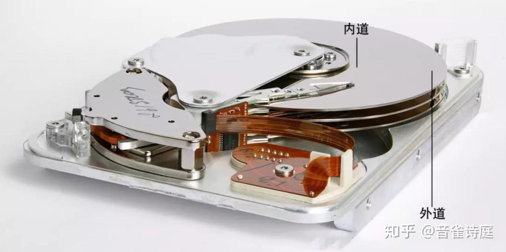
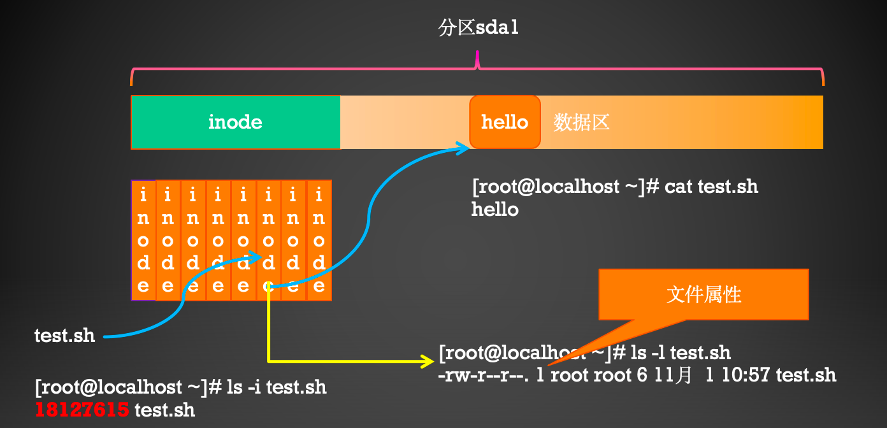

# 漫谈Linux系列之一

# 0、Linux 文件漫步

## 1、如何新建一个文件 hello.sh？


## 2、如何向文件里面添加内容？

三种方法：

- 重定向    >   
- nano 
- 上古神器 vi （参考蓝桥云课免费实践课程）


## 3、那么hello.sh的创建者是谁？大小是多大？什么时候创建的？等信息如何查看？

也就是说一个文件出除了文件内容以外，还有哪些属性？


可以使用如下的命令查看hello.sh的属性：

```shell
[root@lsr ~]# ls -l hello.sh 
-rw-r--r-- 1 root root 12  3月  9 11:55 hello.sh
```

## 4、Linux 文件内容如何查看呢？

使用cat  more  less  head  tail 等命令查看文件内容。


```bash
[root@lsr ~]# cat hello.sh
hello world
```

# 1、Linux文件深度探索？

## 1、hello.sh文件在哪里？

可以使用搜索命令查找hello.sh。

Linux常用的搜索命令如下：


```bash
[root@lsr ~]# find / -name hello.sh 
/root/hello.sh
```

## 2、Linux与Windows的不同：目录结构


Linux是一颗倒置的树形结构。而Windows是很多颗树。


也就是说 Linux 的任何一个文件都是存在于某一个目录里面。目录相当于树根和树枝，文件相当于叶子。

Linux默认的一级子目录的作用。


这些一级子目录都是安装系统时自动生成的，不要轻易改变。

## 3、如何操作Linux的文件和目录？

Linux系统中常见的访问文件和目录的命令主要有以下几个？


上述几个命令必须要熟练的使用。

必备知识：绝对路径和相对路径的理解。


还有就是一个小数点和两个小数点的理解。

- 一个小数点   .      表示当前目录
- 两个小数点   ..     表示当前目录的上一层目录

## 4、一个文件最终是存储在硬盘上的，那么究竟是怎么存储的？



文件存储在硬盘上，就像文字存储在字典上的方法类似。


字典可以分为两个部分：前半部分是索引（索引里面存储了文字的笔画、发音、部首等属性信息），后半部分是存储的文字。（根据前面的索引可以找到该文字在哪一页上存储，从而便于访问）

对于一个文件而言，也是这样，如下图所示。硬盘的前半部分成为 inode区域，后半部分成为数据区。inode区域类似于字典的索引，保存每个文件的属性（大小、日期、创建者、权限等）；后半部分保存的是文件的真正的内容。



每个文件都有一个唯一的 inode编号。inode 里面存储了文件的属性及一个指向数据区域的指针。


那么如何理解呢？比如：一个名为 /data/file1.txt  的文件。我们怎么通过类似查字典的方法找到该文件呢？


## 5、实际操作的角度来探索一下这个好玩的问题。

比如/root/hello.sh 文件。

如何找到其 inode和数据区的内容呢？

探索步骤：

- （1）找到  /  目录的inode  号               ls -id /
- （2）找到 /root 目录的 inode 号          ls -i  /
- （3）找到 /root/hello.sh 文件的 inode 号.    ls  -li  /root/hello.sh
- （4）通过 hello.sh的 inode号找到其对应的数据块的编号   xfs_db -r /dev/vda3
- （5）读取该文件的真正的内容。 inode 93451   cat hello.sh

具体步骤如下所示：


## 6、能看懂这个图么？面试就没有问题了


不懂也没有关系，以后慢慢学。

# 2、inode里面存储了啥？（非常重要）

还是这张图：


其中第一个字段的第一个字符，先来理解一下：


表示的是 Linux 的文件类型。那么 Linux 有几种类型的文件呢？


那么这几种类型分别怎么表示呢？


使用命令的话是这样查看的：


## 1、设备文件（写驱动的必须要熟悉，就业的好方向）

[上帝托梦给我说：一切皆文件](https://mp.weixin.qq.com/s/oXsL83KcObnUyYc-knaZvQ)：漫画图解unix的Everything is file!


常见的字符设备：键盘、鼠标、打印机等。常见的块设备：硬盘、U 盘、SD 卡等。网络接口设备：网卡等。

几乎所有的设备文件都保存在/dev 目录下。

## 2、链接文件（面试必问）


软链接和硬链接的区别？


面试经典问题：给一个文件同时建立一个硬链接和软链接，删除源文件后，还能否访问该文件？


面试能过关了么？

## 3、有趣的管道文件

玩个好玩的游戏：

创建一个管道文件，把第一个终端中的内容，显示在第二个终端中。


管道命令     ｜  

把第一个命令的输出当做第二个命令的输入。


## 7、还有一个面试小题目 Linux 的时钟


## 8、危险的 Linux 命令  不面试但是会让你丢掉工作命令


# 3、一图胜千言


# 4、基础命令总结

## **第 3 章总结**

- 能够通过图形及字符界面登录系统
- 正确的关机方式shutdown 
- Linux 的 7 个不同的启动目标
- 获取帮助man info  help
- shell 基础：命令 选项 参数  
- 连续执行多个命令的两种方法  ；  &&
- 命令替换 %（）       ` `
-  命令别名
- 管道
- 重定向
- 最重要的编辑器vi   参考蓝桥云课平台的 免费课程

## **第 4 章总结**

- Linux 文件类型
-  Linux 目录结构
-  Linux 文件及目录的相关命令 pwd   cd    ls  touch   mkdir  rmdir    cp  mv   rm   wc
-  链接文件ln   ln -s 

## **第 5 章总结**

-  文本文件查看  cat  more  less  head  tail 
-  处理文本内容 sort uniq  cut  comm diff
-  查找 find  grep locate 
-  系统信息显示 uname  hostname free du 
-  日期和时间 cal date hwclock

# 5、非要精简的话，必须掌握这 10 个


# 6、随堂测试（10 分钟内完成）


