[TOC]

# 第8ç«  内存æ¡ä¸­çš„秘密

## 一ã€è¿›ç¨‹ç®¡ç†

### 0ã€å†…存中的进程


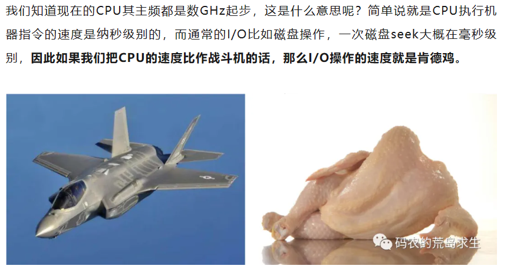

```bash
# 想è¦è¯»å–一个文件，看看计算机在干啥？
```

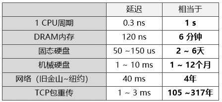

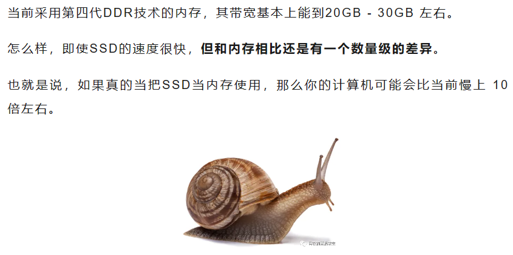

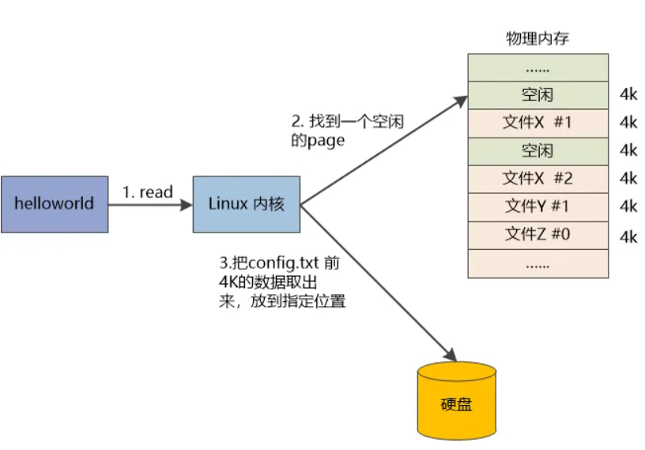


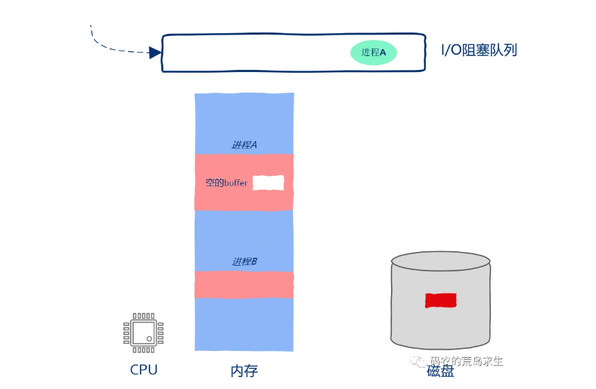


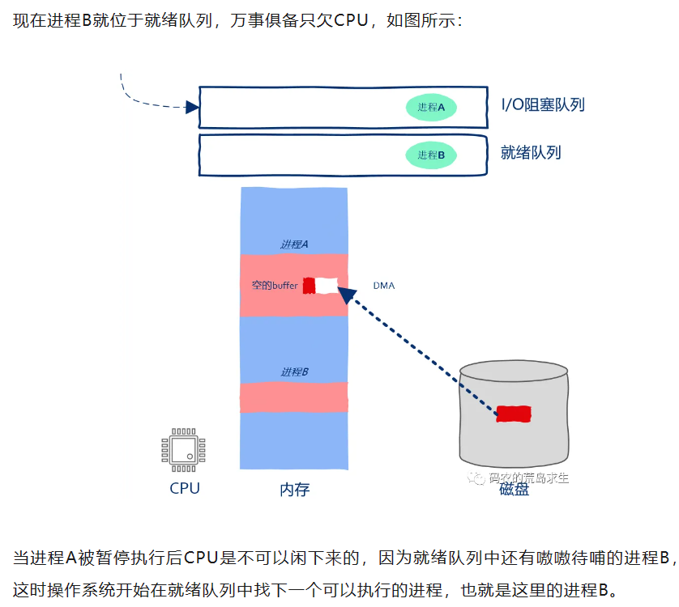


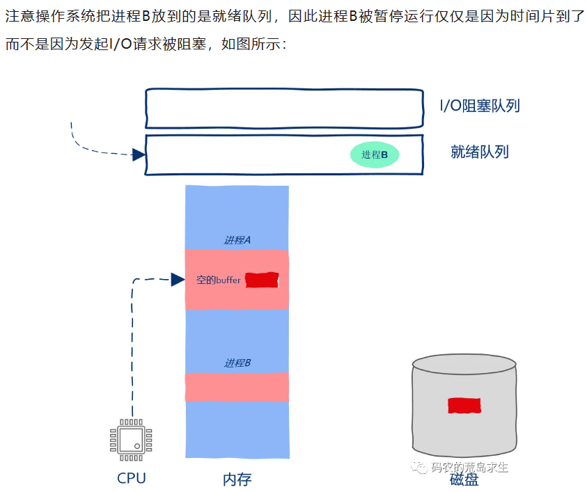


- Linux是一个多任务的æ“作系统，系统上å¯ä»¥åŒæ—¶è¿è¡Œå¤šä¸ªè¿›ç¨‹ã€‚进程è¿è¡Œåœ¨å†…存中，而程åºå­˜åœ¨äºç¡¬ç›˜ä¸Šã€‚

### 1ã€è¿›ç¨‹å’Œç¨‹åºçš„区别

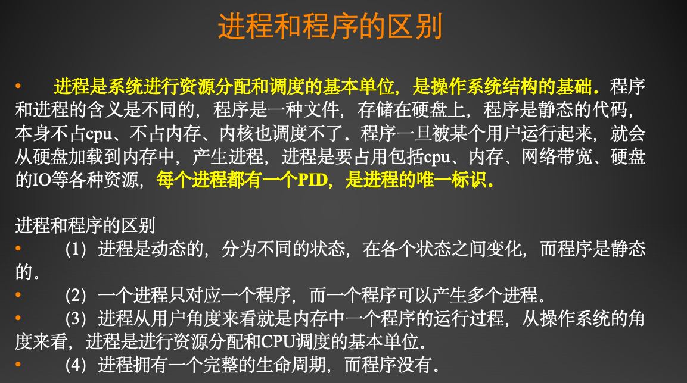

### 2ã€è¿›ç¨‹çš„分类

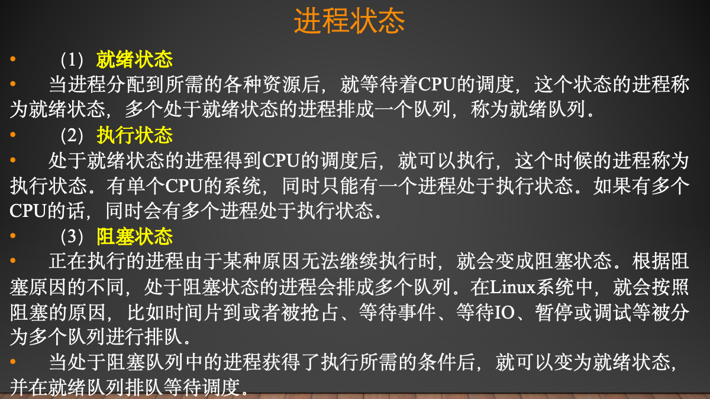


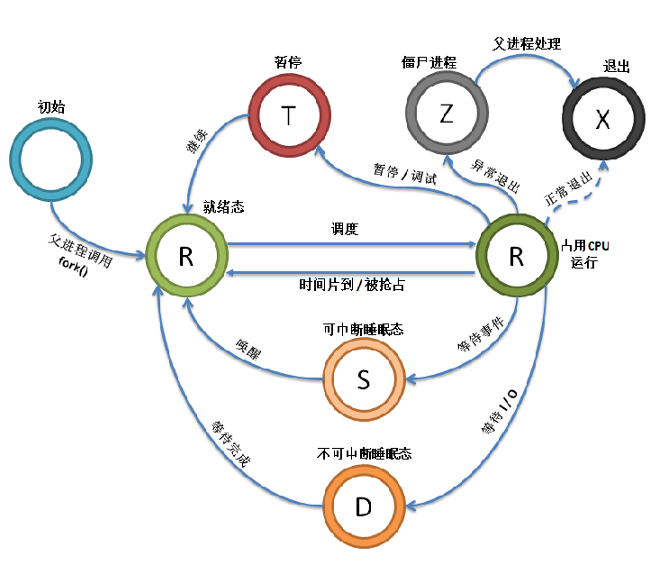

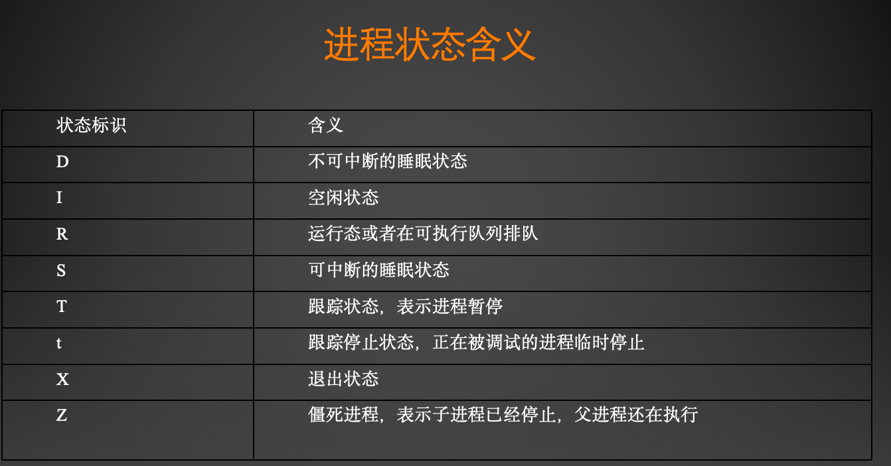

```bash
[root@localhost ~]# pstree -p
systemd(1)─┬─ModemManager(950)─┬─{ModemManager}(953)
           │                   ├─{ModemManager}(954)
           │                   └─{ModemManager}(957)
           ├─NetworkManager(1019)─┬─{NetworkManager}(1022)
           │                      └─{NetworkManager}(1023)
           ├─VGAuthService(920)
           ├─accounts-daemon(906)─┬─{accounts-daemon}(918)
           │                      ├─{accounts-daemon}(919)
           │                      └─{accounts-daemon}(927)
           ├─atd(1352)
           ├─auditd(871)─┬─sedispatch(873)
           │             ├─{auditd}(872)
           │             └─{auditd}(874)
           ├─avahi-daemon(898)───avahi-daemon(924)
           ├─chronyd(923)
           ├─colord(2156)─┬─{colord}(2161)
           │              ├─{colord}(2162)
           │              └─{colord}(2164)
```

### 3ã€æŸ¥çœ‹å†…存中进程ps top htop

```bash
[root@bogon ~]# ps -e
#显示所有用户的所有终端的所有进程
[root@bogon ~]# ps -aux
[root@bogon ~]# ps -u root
[root@bogon ~]# ps -p 1
```


```bash
ps -aux 显示格å¼çš„说æ˜ï¼š
USER：进程的拥有者； 
PID：进程ID； 
%CPU：å ç”¨CPU的百分比； 
%MEM：å ç”¨å†…存的百分比； 
VSZ：å ç”¨è™šæ‹Ÿå†…存的百分比；
RSS：å ç”¨ç‰©ç†å†…存的大å°ï¼ˆbytes）； 
TTY：若为tty1-tty6则为本机用户，若为pts/?则为远程用户执行的程åºï¼›
STAT：进程的状æ€ï¼Œè¿›ç¨‹çŠ¶æ€è§£é‡Šå‚考本章å‰é¢çš„内容；
START：进程开始è¿è¡Œæ—¶é—´ï¼› 
TIME：进程è¿è¡Œäº†å¤šä¹…ï¼›
COMMAND：进程的å称。
```

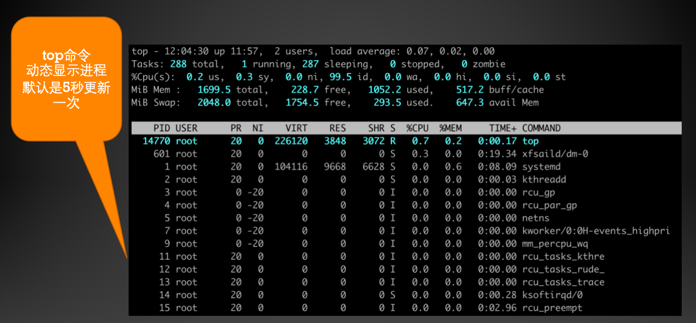

```bash
#上åŠéƒ¨åˆ†è¯´æ˜ï¼Œå…±åˆ†5行：
第一行：分别表示系统è¿è¡Œçš„时间ã€ç”¨æˆ·çš„æ•°é‡åŠç³»ç»Ÿçš„负载。其中系统的负载有三个数æ®ï¼Œåˆ†åˆ«æ˜¯1分钟ã€5分钟ã€10分钟的系统平å‡è´Ÿè½½ï¼Œå¦‚æœå€¼å°äº1，表æ˜ç³»ç»Ÿä¸å¿™ç¢Œã€‚
第二行∶总的进程数，并分别说æ˜è¿›ç¨‹çš„状æ€ï¼Œæ¯”如有1个正在è¿è¡Œï¼Œ302个处äºé˜»å¡çŠ¶æ€ï¼Œå…¶ä¸­zombie表示疆尸进程。
第三行∶CPU的整体负载。us表示用户空间å ç”¨CPU百分比；sy表示内核空间å ç”¨CPU百分比；ni表示用户进程空间内改å˜è¿‡ä¼˜å…ˆçº§çš„进程å ç”¨CPU百分比；id表示空闲CPU百分比；wa等待输入的进程å ç”¨CPU的百分比；hi硬中断å ç”¨CPU百分比；si软中段å ç”¨CPU百分比；st虚拟CPU等待å®é™…CPU的时间的百分比。
第四行：物ç†å†…存的使用情况。
第五行∶虚拟内存（Swap）的使用情况。

#下åŠéƒ¨åˆ†è¯´æ˜ï¼š
PID：进程ID。
USER：进程的拥有者。
PR∶进程的优先级，越å°è¶Šæ—©è¢«æ‰§è¡Œï¼› 
NI∶nice值，ä¸PRå…±åŒæ„æˆè¿›ç¨‹çš„优先级，值越å°è¿›ç¨‹çš„优先级越高。
VIRT：进程使用的虚拟内存总é‡ã€‚
RES：进程使用的物ç†å†…存大å°ã€‚
SHR：共享内存大å°ã€‚
S：进程的状æ€ã€‚
%CPU∶CPUçš„å ç”¨çš„百分比； 
%MEM∶内存å ç”¨çš„百分比
TIME+：进程使用的CPU时间总计。å•ä½æ˜¯1/100秒。
COMMAND：进程å称。 
```

### 3ã€/proc目录


### 4ã€è¿›ç¨‹çš„优先级


进程的优先级

如下所示：PRI表示è€çš„优先级，调整进程优先级用NI的值，最终优先级=PRI+NI #NIçš„å–值范围[-20，19]，所以优先级的范围是[60，99]

```bash
#æ¯æ¬¡è°ƒæ•´éƒ½æ˜¯ä»80开始的。
[root@localhost ~]# ps -l 3965
F S   UID     PID    PPID  C PRI  NI ADDR SZ WCHAN  TTY        TIME CMD
5 S     0    3965    3933  0  79  -1 -  5350 do_sel ?          0:02 sshd: root@pts/0
[root@localhost ~]# renice +2 3965
3965 (process ID) 旧优先级为 -1，新优先级为 2
[root@localhost ~]# ps -l 3965
F S   UID     PID    PPID  C PRI  NI ADDR SZ WCHAN  TTY        TIME CMD
5 S     0    3965    3933  0  82   2 -  5350 do_sel ?          0:02 sshd: root@pts/0
```

### 5ã€ç»“æŸä¸€ä¸ªè¿›ç¨‹

```bash
[root@bogon ~]# kill -9 24411
```

### 6ã€è¿›ç¨‹å‰åå°æ§åˆ¶

```bash
#  &把一个进程放入åå° 
#  fg把一个进程ä»åå°è°ƒåº¦åˆ°å‰å°
[root@localhost ~]# vi test.sh &
[1] 72393
#查看åå°æœ‰å‡ é¡¹å·¥ä½œ
[root@localhost ~]# jobs
[1]+  å·²åœæ­¢               vi test.sh
[root@localhost ~]# fg 1
vi test.sh
#按下按下[Ctrl]加上z键，把该项工作放在åå°
[root@localhost ~]# jobs
[1]+  å·²åœæ­¢               vi test.sh
```

### 7ã€å›¾å½¢ç•Œé¢è¿›ç¨‹ç®¡ç†

系统监视器的使用介ç»ï¼šï¼ˆ1）找到活动->应用程åº->活动监视器。

第一个选项å¡æ˜¯æœ‰å…³è¿›ç¨‹ç®¡ç†çš„ç•Œé¢ï¼Œæ¯ä¸€è¡Œæ˜¾ç¤ºä¸€ä¸ªè¿›ç¨‹çš„相关信æ¯ï¼ŒåŒ…括进程åã€ç”¨æˆ·ã€å ç”¨CPUã€å ç”¨å†…å­˜ã€ä¼˜å…ˆçº§ç­‰å„ç§è¯¦ç»†ä¿¡æ¯ã€‚

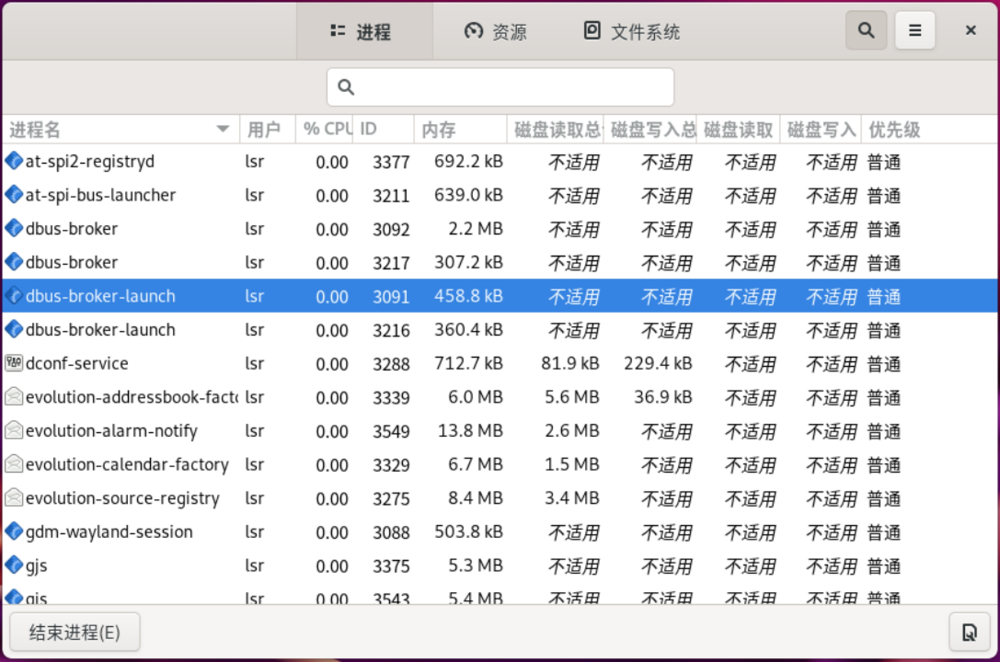

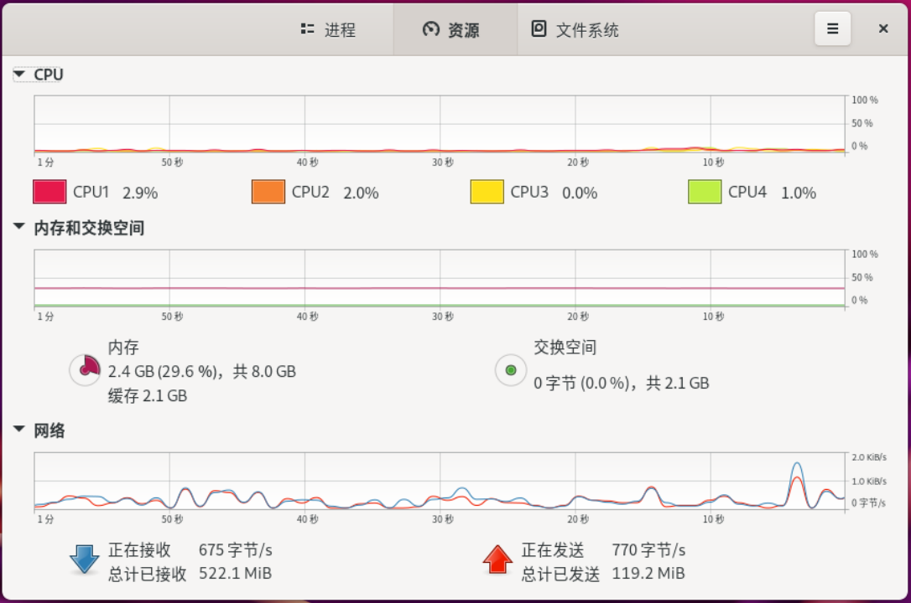

## 二ã€è®¡åˆ’任务

### 1ã€å‘¨æœŸæ€§ä»»åŠ¡

```bash
[root@bogon ~]# systemctl status crond.service
```

- /etc/crontab文件是crondæœåŠ¡çš„é…置文件。改文件如下图所示，其详细格å¼è§è¯¾æœ¬p176。
- 第一ç§æ–¹æ³•ï¼šç›´æ¥ä¿®æ”¹/etc/crontab文件

```bash
[root@bogon ~]# cat /etc/crontab
SHELL=/bin/bash
PATH=/sbin:/bin:/usr/sbin:/usr/bin
MAILTO=root

# For details see man 4 crontabs

# Example of job definition:
# .---------------- minute (0 - 59)
# |  .------------- hour (0 - 23)
# |  |  .---------- day of month (1 - 31)
# |  |  |  .------- month (1 - 12) OR jan,feb,mar,apr ...
# |  |  |  |  .---- day of week (0 - 6) (Sunday=0 or 7) OR sun,mon,tue,wed,thu,fri,sat
# |  |  |  |  |
# *  *  *  *  * user-name  command to be executed

45 4 1，10，22 * * root /root/backup.sh
//在æ¯æœˆçš„1，10，22æ—¥4:45执行/root/backup.sh

30 21 * * * root /root/backup.sh
```

第二ç§æ–¹æ³•ï¼šåœ¨/etc/cron.d目录内创建文件æ¥å®ç°ã€‚å…¶é…置语法格å¼ä¸/etc/crontab文件完全相åŒã€‚

```bash
[root@bogon ~]# ls /etc/cron.d
0hourly  raid-check  sysstat
[root@bogon ~]# cat /etc/cron.d/sysstat
# Run system activity accounting tool every 10 minutes
*/10 * * * * root /usr/lib64/sa/sa1 1 1
# 0 * * * * root /usr/lib64/sa/sa1 600 6 &
# Generate a daily summary of process accounting at 23:53
53 23 * * * root /usr/lib64/sa/sa2 -A
```

第三ç§æƒ…况：root以外的用户å¯ä»¥ä½¿ç”¨crontab命令é…ç½®cron任务。以普通用户自己é…置自己的任务计划。

```bash
[root@bogon ~]# su lsr
[lsr@bogon root]$ crontab -e
no crontab for lsr - using an empty one
crontab: installing new crontab
[lsr@bogon root]$ crontab -l
40 * * * * touch /home/lsr/tt
[lsr@bogon root]$ crontab -r
[lsr@bogon root]$ crontab -l
no crontab for lsr
```

任务安æ’çš„æ ¼å¼ï¼š


周期性任务安æ’举例说æ˜ï¼š

```bash
#æ¯å¤©æ—©ä¸Š6点，执行命令
0 6 * * * echo "morning" >> /dev/null 
#æ¯éš”两个å°æ—¶ï¼Œæ‰§è¡Œå‘½ä»¤
0 */2 * * * echo "Hello" >> /tmp/test.txt
#æ¯ä¸ªæœˆçš„4å·å’Œæ¯å‘¨çš„周一到周三的11点
0 11 4 * 1-3 echo `date`>/tmp/date.txt  
#在æ¯å‘¨ä¸€ï¼Œä¸‰ï¼Œäº”的下åˆ3：00系统é‡æ–°å¯åŠ¨
00 15 * * 1，3，5 shutdown -r +10
æ¯å¤©8点30分执行如下所示的两个指令（æ¯ä¸ªæŒ‡ä»¤ä»¥;分隔） 
30 8 * * * （ls -a;pwd）
```

### 2ã€ä¸€æ¬¡æ€§ä»»åŠ¡


```bash
#确认atdæœåŠ¡å¯åŠ¨
[lsr@bogon root]$ systemctl status atd.service
â— atd.service - Job spooling tools
   Loaded: loaded (/usr/lib/systemd/system/atd.service; enabled; vendor preset: enabled)
   Active: active (running) since 一 2022-10-24 04:55:28 CST; 4h 31min left
 Main PID: 1370 (atd)
   CGroup: /system.slice/atd.service
           └─1370 /usr/sbin/atd -f

10月 24 04:55:28 bogon systemd[1]: Started Job spooling tools.
```

举例：新建一个文件exat.sh  改文件具体内容如图所示。修改其为å¯æ‰§è¡Œæƒé™ã€‚

使用at -f exat.sh now+1 minutes命令æ¥å®‰æ’一次性任务。

```bash
#安æ’在æŸä¸ªæ—¶é—´æ‰§è¡ŒæŸä¸ªShell程åºä¸¾ä¾‹
[root@bogon ~]# touch exat.sh
[root@bogon ~]# ls
abc              exat.sh                            公共  图片  音ä¹
abc.tar          initial-setup-ks.cfg               æ¨¡æ¿  文档  æ¡Œé¢
anaconda-ks.cfg  linuxqq_2.0.0-b2-1089_aarch64.rpm  视频  下载
[root@bogon ~]# chmod 777 exat.sh
[root@bogon ~]# vi exat.sh
[root@bogon ~]# cat exat.sh 
#!/bin/bash
echo `date`>>result.txt
[root@bogon ~]# at -f exat.sh now+1 minutes
job 2 at Mon Oct 24 00:33:00 2022
[root@bogon ~]# atq
2    Mon Oct 24 00:33:00 2022 a root
[root@bogon ~]# ls
abc              exat.sh                            result.txt  视频  下载
abc.tar          initial-setup-ks.cfg               公共        图片  音ä¹
anaconda-ks.cfg  linuxqq_2.0.0-b2-1089_aarch64.rpm  æ¨¡æ¿        文档  æ¡Œé¢
[root@bogon ~]# cat result.txt 
2022年 10月 24日 星期一 00:33:00 CST
```

ç›´æ¥åˆ©ç”¨at命令æ¥å®‰æ’任务，以ctrl+D结æŸå‘½ä»¤ã€‚

```bash
#使用at命令直æ¥å®‰æ’任务举例
[root@bogon ~]# date
2022年 10月 24日 星期一 00:39:15 CST
[root@bogon ~]# at now +2 minutes
at> echo `date` >> result1.txt
at> <EOT>
job 3 at Mon Oct 24 00:41:00 2022
[root@bogon ~]# date
2022年 10月 24日 星期一 00:40:16 CST

#间隔两分钟å，查看result1.txt文件生æˆã€‚
[root@bogon ~]# ls
abc              initial-setup-ks.cfg               公共  文档
abc.tar          linuxqq_2.0.0-b2-1089_aarch64.rpm  æ¨¡æ¿  下载
anaconda-ks.cfg  result1.txt                        视频  音ä¹
exat.sh          result.txt                         图片  æ¡Œé¢
[root@bogon ~]# cat result1.txt
2022年 10月 24日 星期一 00:41:00 CST
```


```bash
#安æ’在æ˜å¤©ä¸‹åˆ18：00执行æŸé¡¹ä»»åŠ¡
[root@bogon ~]# at 18:00 tomorrow 
at> date
at> <EOT>
job 4 at Tue Oct 25 18:00:00 2022
[root@bogon ~]# atq
4    Tue Oct 25 18:00:00 2022 a root

#指定在具体日期执行æŸä»¶äº‹æƒ…，å¯ä»¥å…·ä½“到分钟
[root@localhost ~]# at 24:00 2023-12-20
warning: commands will be executed using /bin/sh
at> /bin/sync
at> <EOT>
job 1 at Thu Dec 21 00:00:00 2023
[root@localhost ~]# atq
1    Thu Dec 21 00:00:00 2023 a root
```

### 3ã€é»‘客喜欢的命令/bin/at

该命令的æƒé™å¦‚下，å¯ä»¥çœ‹åˆ°è¯¥å‘½ä»¤å…·æœ‰SUIDæƒé™ã€‚

```bash
[root@localhost ~]# ls -l /bin/at
-rwsr-xr-x. 1 root root 70056 10月 14  2022 /bin/at
```

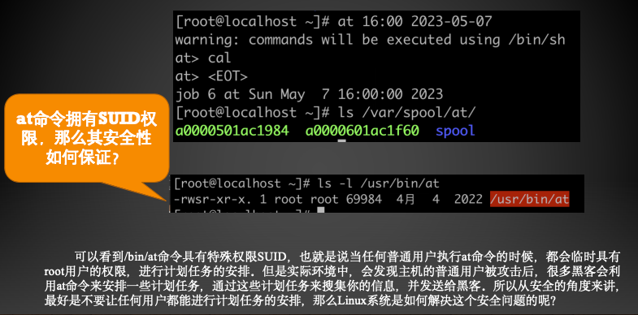

那么如何解决该问题呢？

为了解决上述安全éšæ‚£ï¼ŒLinuxæ供了一ç§å®‰å…¨æœºåˆ¶æ¥å¯¹at命令的使用进行é™åˆ¶ï¼Œåˆ©ç”¨/etc/at.allow ä¸ /etc/at.deny 这两个文件æ¥å†³å®šå“ªäº›ç”¨æˆ·å¯ä»¥ä½¿ç”¨ã€‚

当有用户使用at命令的时候，系统会按照如下的规则æ¥è¿›è¡Œæ§åˆ¶ï¼š


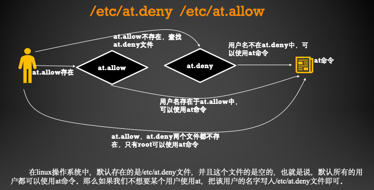

åŒæ ·çš„é“ç†ï¼Œ/bin/crontab命令也具有SUID的特殊æƒé™ï¼Œæ‰€ä»¥ä¹Ÿå­˜åœ¨åŒæ ·çš„安全问题。解决方法也和上é¢çš„命令类似。

```bash
[root@localhost ~]# ls -l /bin/crontab
-rwsr-xr-x. 1 root root 69832 10月 14  2022 /bin/crontab
```

ä¸at命令类似，Linuxæ“纵系统使用/etc/cron.allowå’Œ/etc/cron.deny两个文件æ¥é™åˆ¶ç”¨æˆ·çš„æƒé™ã€‚默认情况下系统åªæœ‰/etc/cron.deny文件。

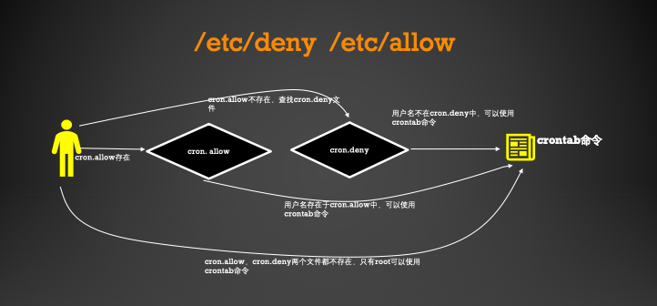

### 4ã€anacron

```bash
#如æœLinux系统ä¸æ˜¯24å°æ—¶å¼€æœºçš„，比如有些æœåŠ¡å™¨æ™šä¸Šæˆ–者周末关机，那么就会出ç°ä¸€ç§æƒ…况，设置的周期性的计划任务刚好处在关机的时间段内，那么这些定时任务就ä¸ä¼šå¾—到执行。比如定时æ¯å‘¨å…­24:00进行系统备份，但是公å¸ä¸ºäº†èŠ‚约用电，周末无人加ç­çš„情况下，关æ‰LinuxæœåŠ¡å™¨ï¼Œå‘¨ä¸€å†å¼€å¯Linux系统。那么这个任务就无法执行了。如æœä¸æƒ³é”™è¿‡è¿™æ ·çš„任务，anacron就是解决这样的问题的。
#anacron以一天ã€ä¸€å‘¨å’Œä¸€æœˆä¸ºæ£€æµ‹å‘¨æœŸï¼Œæ£€æµ‹æ˜¯å¦æœ‰å®šæ—¶ä»»åŠ¡å› ä¸ºå…³æœºçš„åŸå› æ²¡æœ‰è¢«æ‰§è¡Œï¼Œå¦‚æœæœ‰è¿™æ ·çš„任务，anacron会å†ç‰¹å®šçš„时间é‡æ–°æ‰§è¡Œè¿™äº›å®šæ—¶ä»»åŠ¡ã€‚anacron是以天为å•ä½è¿›è¡Œå‘¨æœŸæ€§çš„检测，而crond是以分钟为å•ä½è¿›è¡Œæ£€æµ‹ã€‚

[root@localhost ~]# ll /var/spool/anacron/
æ€»ç”¨é‡ 12
-rw-------. 1 root root 9 11月  6 10:50 cron.daily
-rw-------. 1 root root 9 10月 30 07:42 cron.monthly
-rw-------. 1 root root 9 11月  5 11:14 cron.weekly
[root@localhost ~]# cat  /var/spool/anacron/cron.daily
20231106
[root@localhost ~]# cat  /var/spool/anacron/cron.monthly
20231029
[root@localhost ~]# cat  /var/spool/anacron/cron.weekly
20231105
#在/var/spool/anacron目录中，有cron.daily，cron.monthly，cron.weekly三个文件，这三个文件的内容如上所示，ä¿å­˜çš„是一个日期，该日期表示的是上一次è¿è¡Œanacron的时间。anacronæ¯å¤©ä¼šè¯»å–这些时间，和当å‰çš„系统时间进行比较，如æœä¸¤è€…的时间差值超过了anacroné…置文件中指定的时间差值，就说æ˜æœ‰å®šæ—¶ä»»åŠ¡æ¼æ‰äº†æ²¡æœ‰è¢«æ‰§è¡Œï¼Œè¿™æ—¶anacron就会执行这些æ¼æ‰çš„定时任务。

#anacroné…置文件的指定时间差值如下所示：
[root@localhost ~]# cat /etc/anacrontab
...
# the maximal random delay added to the base delay of the jobs
RANDOM_DELAY=45
# the jobs will be started during the following hours only
START_HOURS_RANGE=3-22
#period in days   delay in minutes   job-identifier   command
1    5    cron.daily        nice run-parts /etc/cron.daily
7    25    cron.weekly        nice run-parts /etc/cron.weekly
@monthly 45    cron.monthly        nice run-parts /etc/cron.monthly
#这里的第一列数æ®ä¸­çš„1ã€7å’Œ@monthly（30），就是指定的时间差值。
#以第一行为例，加以说æ˜ï¼š
1表示如æœå·®å€¼ä¸º1天
5延迟5分钟的时长
cron.daily 任务的唯一标识
nice run-parts /etc/cron.daily 以默认的优先级è¿è¡Œ/etc/cron.daily目录下的定时任务
#那么第一行的å«ä¹‰å°±æ˜¯å¦‚æœæ—¶é—´å·®å€¼è¶…过1天，先强制延迟5分钟å，å†éšæœºå»¶è¿Ÿä¸€æ®µæ—¶é—´ï¼ˆ0-45分钟以内），时间必须在规定时间段（3:00-22:00）内，然å以默认的优先级è¿è¡Œ/etc/cron.daily目录下的定时任务。
#也就是说，åªè¦æŠŠæ¯å¤©ã€æ¯å‘¨å’Œæ¯æœˆéœ€è¦å®šæ—¶æ‰§è¡Œçš„任务分别放置在/etc/cron.dailyã€/etc/cron.weeklyã€/etc/cron.monthly三个目录下，系统就会自动æ¯å¤©ã€æ¯å‘¨å’Œæ¯æœˆè‡ªåŠ¨æ‰§è¡Œè¿™ä»»åŠ¡ï¼Œä»è€Œå¸®åŠ©ç”¨æˆ·è‡ªåŠ¨åŒ–完æˆå¾ˆå¤šå‘¨æœŸæ€§å·¥ä½œä»»åŠ¡ï¼Œå¤§å¤§ä¾¿åˆ©äº†Linux系统管ç†å’Œç»´æŠ¤ã€‚
```

### 5ã€è®¡åˆ’任务总结

Linux系统中三ç§è®¡åˆ’任务的总结如下：

（1）atd是以分钟为周期，定时扫æ/var/spool/at目录，看看有没有任务è¦æ‰§è¡Œï¼›

```bash
[root@localhost ~]# ls /var/spool/at
a0000101b11e20  spool
```

（2）crond也是以分钟周期，æ¯åˆ†é’Ÿéƒ½è¦æ‰«æ一下/etc/cron.d目录，/var/spool/cron目录，以åŠ/etc/crontab文件中有没有è¦æ‰§è¡Œçš„任务；

```bash
[root@localhost ~]# ls /etc/cron.d
0hourly
[root@localhost ~]# ls /var/spool/cron/
```

（3）通过æ¯åˆ†é’Ÿæ‰«æ/etc/cron.d/0hourly文件

```bash
[root@localhost ~]# cat /etc/cron.d/0hourly
# Run the hourly jobs

01 * * * * root run-parts /etc/cron.hourly
```

ä»è¿™é‡Œå¯ä»¥çœ‹åˆ°æ¯ä¸ªå°æ—¶ä¼šæ‰§è¡Œä¸€æ¬¡/etc/cron.hourly目录下的文件。

å¯æ‰§è¡Œæ–‡ä»¶0anacronä½äº/etc/cron.hourly目录下：

```bash
[root@localhost ~]# ls /etc/cron.hourly/0anacron
/etc/cron.hourly/0anacron
```

所以anacron会æ¯å°æ—¶æ‰§è¡Œä¸€æ¬¡ã€‚

（4）anacronæ¯ä¸ªå°æ—¶ä¼šæ‰«æ一次/etc/anacrontab文件，

```bash
[root@localhost ~]# cat /etc/anacrontab

# the maximal random delay added to the base delay of the jobs
RANDOM_DELAY=45
# the jobs will be started during the following hours only
START_HOURS_RANGE=3-22

#period in days   delay in minutes   job-identifier   command
1    5    cron.daily        nice run-parts /etc/cron.daily
7    25    cron.weekly        nice run-parts /etc/cron.weekly
@monthly 45    cron.monthly        nice run-parts /etc/cron.monthly
```

通过计算差值，其差值ä¸1ã€7åŠ@monthly比较，ä»è€Œå®ç°å®šæœŸæ‰§è¡Œæ¯å¤©ã€æ¯å‘¨å’Œæ¯æœˆå®šæ—¶ä»»åŠ¡çš„目的。

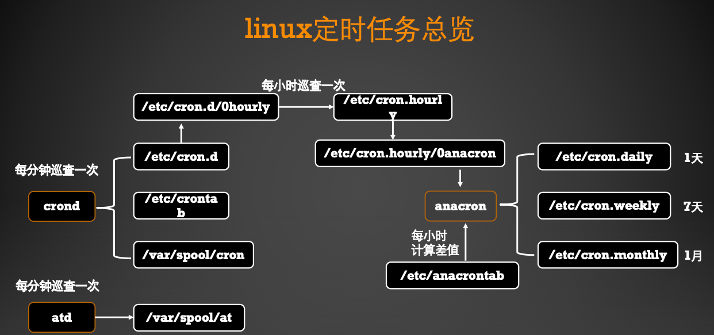

上图中的atdå’Œcrond都是系统æœåŠ¡ï¼Œè€Œanacron是系统命令，其中atdå’ŒcrondæœåŠ¡æ˜¯ç³»ç»Ÿå¼€æœºå¯åŠ¨çš„过程中就会被默认å¯åŠ¨ï¼Œè€Œanacron命令是æ¯éš”å°æ—¶è¢«è°ƒç”¨ä¸€æ¬¡ã€‚ä»è€Œå®Œæˆäº†ç³»ç»Ÿä¸­æ‰€æœ‰ä¸€æ¬¡æ€§è®¡åˆ’任务（atd）和周期性的计划任务(crond)。使用anacron的主è¦ç›®çš„是å¯ä»¥è®©é‚£äº›å› å…³æœºè€Œæ¼æ‰çš„计划任务得到执行。

### 6ã€system-timers定时器，精确计划任务

本例题首先创建了一个任务ping1.sh。然å创建了一个ping1.service指定è¦æ‰§è¡Œçš„任务，最å创建了一个定时器unit，安æ’具体什么时候执行任务。通过这ç§æ–¹å¼ï¼Œå°±å¯ä»¥ä½¿ç”¨systemctl 命令，åƒè°ƒåº¦å…¶ä»–æœåŠ¡ä¸€æ ·å¯åŠ¨å’Œç®¡ç†è¯¥å®šæ—¶å™¨ã€‚具有一定å‚考æ„义。

ping1.service和ping1.timer在/usr/lib/systemd/system/目录下：

==点击下é¢æ–‡ä»¶åå¯ä»¥æŸ¥çœ‹æ–‡ä»¶å†…容==

[ping1.timer](./ping1.timer)

[ping1.sh](./ping1.sh)

[ping1.service](ping1.service)

ping1.sh在/root/temp/目录下


```bash
# systemd 通过一个timerå•å…ƒæ¥åˆ›å»ºä¸€ä¸ªå®šæ—¶ä»»åŠ¡ã€‚首先定义个serviceå•å…ƒï¼Œè¿™ä¸ªserviceå•å…ƒå®šä¹‰äº†æˆ‘们
# 想è¦å®šæ—¶æ‰§è¡Œçš„任务。然åå†å®šä¸€ä¸ªä¸€ä¸ªtimerå•å…ƒã€‚通过这个timerå•å…ƒå»å®šä¹‰å®šæ—¶è§„则å»æ‰§è¡Œå‰é¢çš„serviceå•å…ƒã€‚

# 第一步：定义一个将è¦æ‰§è¡Œçš„任务脚本。å字为ping1.sh
[root@localhost system]# cd /root/temp/
[root@localhost temp]# cat ping1.sh
#!/bin/bash
ping -c1 192.168.14.1 &> /root/temp/1.log
#给脚本赋予å¯æ‰§è¡Œæƒé™
[root@localhost temp]# chmod 777 /root/temp/ping1.sh

# 第二步：创建一个serviceå•å…ƒï¼šping1.service
[root@localhost temp]# cd /usr/lib/systemd/system
[root@localhost system]# cat ping1.service
[Unit]
Description= ping 1

[Service]
Type=simple
ExecStart=/root/temp/ping1.sh

[Install]
WantedBy=multi-user.target

# 创建一个timerå•å…ƒï¼šping1.timer
[root@localhost system]# cd /usr/lib/systemd/system
# 定时任务å¯åŠ¨å60秒开始执行，然åæ¯éš”30秒执行一次任务。
[root@localhost system]# cat ping1.timer
[Unit]
Description=ping 1 every 30s

[Timer]
OnActiveSec=60
OnUnitActiveSec=30
Unit=ping1.service

[Install]
WantedBy=multi-user.target

[root@localhost system]# systemctl daemon-reload   #é‡æ–°åŠ è½½é…置文件
[root@localhost system]# systemctl start ping1.timer   #å¯åŠ¨å®šæ—¶å™¨
[root@localhost system]# systemctl status ping1.timer  #查看定时器的状æ€
â— ping1.timer - ping 1 every 30s
     Loaded: loaded (/usr/lib/systemd/system/ping1.timer; enabled; preset: disabled)
     Active: active (waiting) since Sat 2024-04-06 17:26:56 CST; 12s ago
      Until: Sat 2024-04-06 17:26:56 CST; 12s ago
    Trigger: Sat 2024-04-06 17:27:26 CST; 17s left
   Triggers: â— ping1.service

4月 06 17:26:56 localhost.localdomain systemd[1]: Started ping 1 every 30s.

# 对该æœåŠ¡æ˜¯å¦çœŸæ­£æ‰§è¡Œè¿›è¡ŒéªŒè¯ã€‚
# 查看/root/temp/1.log文件，å¯ä»¥çœ‹åˆ°è¯¥è„šæœ¬å·²ç»è¿è¡Œäº†ï¼Œå…¶ç»“æœå¦‚下所示：
[root@localhost system]# cat /root/temp/1.log
PING 192.168.14.1 (192.168.14.1) 56(84) 比特的数æ®ã€‚
64 比特，æ¥è‡ª 192.168.14.1: icmp_seq=1 ttl=64 时间=0.489 毫秒

--- 192.168.14.1 ping 统计 ---
å·²å‘é€ 1 个包， å·²æ¥æ”¶ 1 个包, 0% packet loss, time 0ms
rtt min/avg/max/mdev = 0.489/0.489/0.489/0.000 ms
[root@localhost system]# cat /root/temp/1.log
PING 192.168.14.1 (192.168.14.1) 56(84) 比特的数æ®ã€‚
64 比特，æ¥è‡ª 192.168.14.1: icmp_seq=1 ttl=64 时间=0.280 毫秒

--- 192.168.14.1 ping 统计 ---
å·²å‘é€ 1 个包， å·²æ¥æ”¶ 1 个包, 0% packet loss, time 0ms
rtt min/avg/max/mdev = 0.280/0.280/0.280/0.000 ms

# 通过上述的示例，å¯ä»¥è‡ªå·±å®šä¹‰å®šæ—¶å™¨unit，指定其è¿è¡Œæ—¶é—´ã€‚ä»è€Œå®ç°äº†ç³»ç»Ÿçš„计划任务安æ’。

```

å°ç»“ 本节主è¦å†…容： 周期性任务安æ’和一次性任务安æ’。

> （1）周期性任务计划：crond.service
>
>   (2)  一次性任务计划：atd.service
>
> （3）anacron:关机å的计划任务如何执行
>
> （4）system-timer:定时器安æ’计划任务

## 三ã€Linuxå¯åŠ¨è¿‡ç¨‹è¯¦è§£


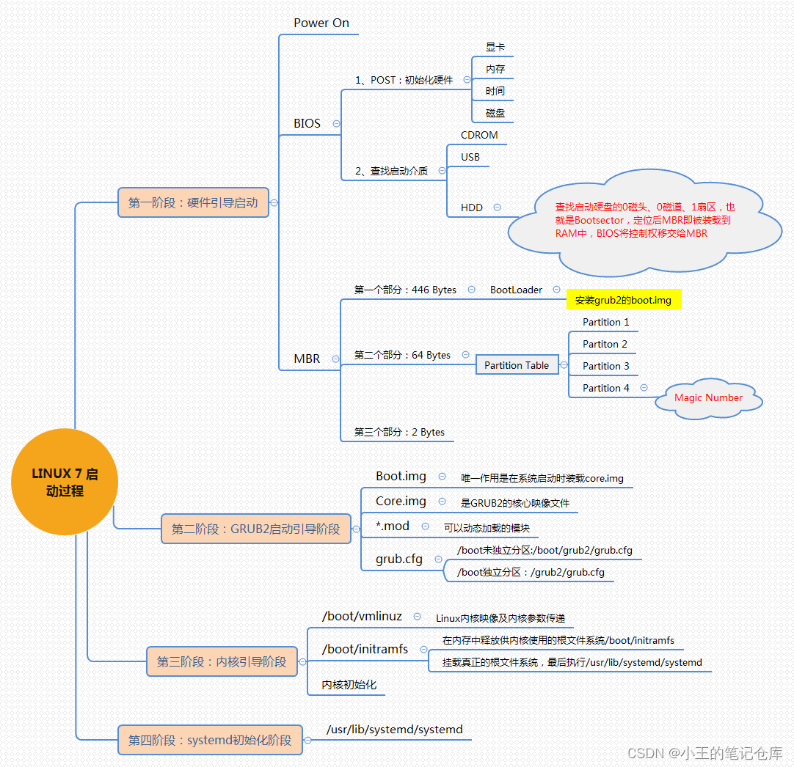

详细介ç»å‚考[èœé¸Ÿæ•™ç¨‹](https://www.runoob.com/linux/linux-system-boot.html)


### 1ã€BIOSå’ŒCMOS


BIOS存储的是设置程åºï¼ŒCMOS里é¢å­˜å‚¨çš„是å‚数。

è¿™å—芯片里的程åºå«åš"基本输入输出系统"（Basic Input/Output System），简称为[BIOS](https://en.wikipedia.org/wiki/BIOS)。


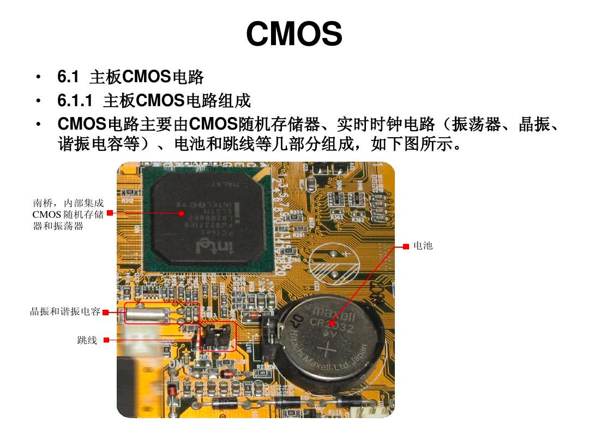

### 2ã€BIOS硬件自检

BIOS程åºé¦–先检查，计算机硬件能å¦æ»¡è¶³è¿è¡Œçš„基本æ¡ä»¶ï¼Œè¿™å«åš"硬件自检"（Power-On Self-Test），缩写为[POST](https://en.wikipedia.org/wiki/Power-on_self-test)。如æœç¡¬ä»¶å‡ºç°é—®é¢˜ï¼Œä¸»æ¿ä¼šå‘出ä¸åŒå«ä¹‰çš„[蜂鸣](https://en.wikipedia.org/wiki/Power-on_self-test#Original_IBM_POST_beep_codes)，å¯åŠ¨ä¸­æ­¢ã€‚如æœæ²¡æœ‰é—®é¢˜ï¼Œå±å¹•å°±ä¼šæ˜¾ç¤ºå‡ºCPUã€å†…å­˜ã€ç¡¬ç›˜ç­‰ä¿¡æ¯ã€‚

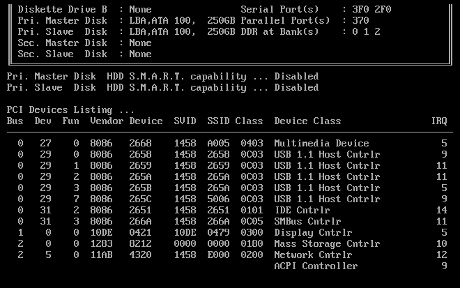

### 3ã€è®¾ç½®å¯åŠ¨é¡ºåº

硬件自检完æˆå，BIOS把æ§åˆ¶æƒè½¬äº¤ç»™ä¸‹ä¸€é˜¶æ®µçš„å¯åŠ¨ç¨‹åºã€‚

这时，BIOS需è¦çŸ¥é“，"下一阶段的å¯åŠ¨ç¨‹åº"具体存放在哪一个设备。也就是说，BIOS需è¦æœ‰ä¸€ä¸ªå¤–部储存设备的æ’åºï¼Œæ’在å‰é¢çš„设备就是优先转交æ§åˆ¶æƒçš„设备。这ç§æ’åºå«åš"å¯åŠ¨é¡ºåº"（Boot Sequence）。

打开BIOSçš„æ“作界é¢ï¼Œé‡Œé¢æœ‰ä¸€é¡¹å°±æ˜¯"设定å¯åŠ¨é¡ºåº"。

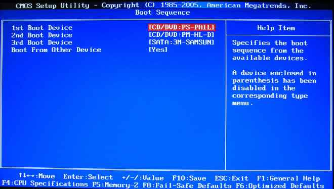

- 第二是找到硬件的一个起点，也就是找到引导设备，也就是说如æœæ“作系统在硬盘上，就把硬盘作为第一个å¯åŠ¨è®¾å¤‡ã€‚BIOS里é¢å¯ä»¥è®¾ç½®å¼€æœºçš„引导顺åºã€‚

- **第二阶段：主引导记录**

  BIOS按照"å¯åŠ¨é¡ºåº"，把æ§åˆ¶æƒè½¬äº¤ç»™æ’在第一ä½çš„储存设备。

  这时，计算机读å–该设备的第一个扇区，也就是读å–最å‰é¢çš„512个字节。如æœè¿™512个字节的最å两个字节是0x55å’Œ0xAA，表æ˜è¿™ä¸ªè®¾å¤‡å¯ä»¥ç”¨äºå¯åŠ¨ï¼›å¦‚æœä¸æ˜¯ï¼Œè¡¨æ˜è®¾å¤‡ä¸èƒ½ç”¨äºå¯åŠ¨ï¼Œæ§åˆ¶æƒäºæ˜¯è¢«è½¬äº¤ç»™"å¯åŠ¨é¡ºåº"中的下一个设备。

  这最å‰é¢çš„512个字节，就å«åš["主引导记录"](https://en.wikipedia.org/wiki/Master_boot_record)（Master boot record，缩写为MBR）。

### 4ã€MBR引导

"主引导记录"åªæœ‰512个字节，放ä¸äº†å¤ªå¤šä¸œè¥¿ã€‚它的主è¦ä½œç”¨æ˜¯ï¼Œå‘Šè¯‰è®¡ç®—机到硬盘的哪一个ä½ç½®å»æ‰¾æ“作系统。

硬盘分区有很多[好处](https://en.wikipedia.org/wiki/Disk_partitioning#Benefits_of_multiple_partitions)。考虑到æ¯ä¸ªåŒºå¯ä»¥å®‰è£…ä¸åŒçš„æ“作系统，"主引导记录"因此必须知é“å°†æ§åˆ¶æƒè½¬äº¤ç»™å“ªä¸ªåŒºã€‚

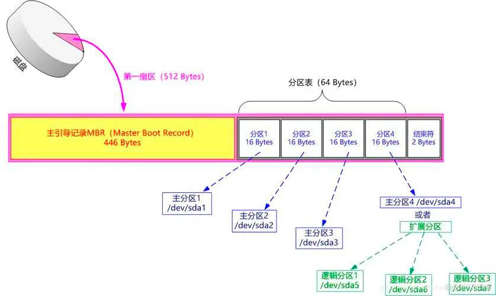

### 5ã€ç¬¬ä¸‰é˜¶æ®µï¼šç¡¬ç›˜å¯åŠ¨

这时，计算机的æ§åˆ¶æƒå°±è¦è½¬äº¤ç»™ç¡¬ç›˜çš„æŸä¸ªåˆ†åŒºäº†ã€‚

这里分为两ç§æƒ…况：

第一ç§ï¼šç›´æ¥æ‰¾åˆ°åˆ†åŒºï¼Œæ¯”如这里的/dev/sda1分区是å¯åŠ¨åˆ†åŒºã€‚然å加载æ“作系统到内存。

第二ç§ï¼šåŒ…æ§åˆ¶æƒäº¤ç»™æŸä¸ªåˆ†åŒºçš„å¯åŠ¨ç®¡ç†å™¨ã€‚（默认Linux就是这样。）


### 6ã€ç¬¬å››é˜¶æ®µï¼šæ§åˆ¶æƒäº¤ç»™äº†å¯åŠ¨ç®¡ç†å™¨ï¼ˆä¾‹å¦‚GRUB2）

在这ç§æƒ…况下，计算机读å–"主引导记录"å‰é¢446字节的机器ç ä¹‹å，ä¸å†æŠŠæ§åˆ¶æƒè½¬äº¤ç»™æŸä¸€ä¸ªåˆ†åŒºï¼Œè€Œæ˜¯è¿è¡Œäº‹å…ˆå®‰è£…çš„["å¯åŠ¨ç®¡ç†å™¨"](https://en.wikipedia.org/wiki/Boot_loader#Modern_boot_loaders)（boot loader），由用户选择å¯åŠ¨å“ªä¸€ä¸ªæ“作系统。

Linuxç¯å¢ƒä¸­ï¼Œç›®å‰æœ€æµè¡Œçš„å¯åŠ¨ç®¡ç†å™¨æ˜¯[Grub](https://en.wikipedia.org/wiki/GNU_GRUB)。


- GRUB引导加载程åºä»‹ç»

grub的概念：当计算机è¦å¼•å¯¼æ“作系统时，bios会读å–MBR，MBR本身è¦åŒ…å«ä¸¤ç±»å†…容：引导加载程åºå’Œåˆ†åŒºè¡¨ã€‚

> GRUB是Linux系统默认的引导加载程åºã€‚
>
> GRUB能用äºå‡ ä¹æ‰€æœ‰çš„æ“作系统。 
>
> centos7采用GRUB2引导加载程åºã€‚ 
>
> GRUB2的主é…置文件

```bash
[root@bogon ~]# cat /boot/efi/EFI/centos/grub.cfg
//该文件会按照顺åºè°ƒç”¨/boot/grub.d目录中的脚本æ¥å®ç°ä¸åŒçš„功能。

[root@bogon ~]# ls -l /etc/grub.d
æ€»ç”¨é‡ 72
-rwxr-xr-x. 1 root root  8702 7月  30 2020 00_header
-rwxr-xr-x. 1 root root  1043 3月  22 2019 00_tuned
-rwxr-xr-x. 1 root root   232 7月  30 2020 01_users
-rwxr-xr-x. 1 root root 10781 7月  30 2020 10_linux
-rwxr-xr-x. 1 root root 10275 7月  30 2020 20_linux_xen
-rwxr-xr-x. 1 root root  2559 7月  30 2020 20_ppc_terminfo
-rwxr-xr-x. 1 root root 11169 7月  30 2020 30_os-prober
-rwxr-xr-x. 1 root root   214 7月  30 2020 40_custom
-rwxr-xr-x. 1 root root   216 7月  30 2020 41_custom
-rw-r--r--. 1 root root   483 7月  30 2020 README

[root@bogon ~]# cat /etc/default/grub
GRUB_TIMEOUT=5   //默认å¯åŠ¨é¡¹çš„时间 5秒
GRUB_DISTRIBUTOR="$(sed 's, release .*$,,g' /etc/system-release)"
GRUB_DEFAULT=saved
GRUB_DISABLE_SUBMENU=true 
GRUB_TERMINAL_OUTPUT="console" //选择终端输出设备
GRUB_CMDLINE_LINUX="crashkernel=auto rd.lvm.lv=cl_fedora/root rd.lvm.lv=cl_fedora/swap rhgb quiet"
GRUB_DISABLE_RECOVERY="true"  //是å¦åˆ›å»ºä¿®å¤æ¨¡å¼èœå•
```

grub2加密简介

- GRUB2作为系统中的第一é“å±éšœçš„安全性é常é‡è¦ï¼Œå¯¹å…¶è¿›è¡ŒåŠ å¯†å¯ä»¥å®ç°å®‰å…¨æ€§ã€‚
- 支æŒä¸¤ç§åŠ å¯†æ ¼å¼ï¼š

1. æ˜æ–‡å¯†ç ï¼šå¯†ç æ•°æ®æ²¡æœ‰ç»è¿‡åŠ å¯†ï¼Œå®‰å…¨æ€§å·®ã€‚
2. PBKDF2加密密ç ï¼šå­˜å‚¨çš„是加密å的密ç ï¼Œå®‰å…¨æ€§é«˜ã€‚

具体加密方法è§è¯¾æœ¬185页和186页。GRUB2解é”方法è§è¯¾æœ¬186页。

11.6 GRUB2é…置案例

- 破解root用户密ç 

具体破解方法è§è¯¾æœ¬P187-188。

- 修改网å¡å称

具体修改方å¼è§è¯¾æœ¬P88。

### 7ã€ç¬¬å››é˜¶æ®µï¼šåŠ è½½æ“作系统

æ§åˆ¶æƒè½¬äº¤ç»™æ“作系统å，æ“作系统的内核首先被载入内存。

以Linux系统为例，先载入/boot目录下é¢çš„kernel。内核加载æˆåŠŸå，第一个è¿è¡Œçš„程åºæ˜¯/sbin/init。它根æ®é…置文件（Debian系统是/etc/initab）产生init进程。这是Linuxå¯åŠ¨å的第一个进程，pid进程编å·ä¸º1，其他进程都是它的å代。然å，init线程加载系统的å„个模å—，比如窗å£ç¨‹åºå’Œç½‘络程åºï¼Œç›´è‡³æ‰§è¡Œ/bin/login程åºï¼Œè·³å‡ºç™»å½•ç•Œé¢ï¼Œç­‰å¾…用户输入用户å和密ç ã€‚

==至此，全部å¯åŠ¨è¿‡ç¨‹å®Œæˆã€‚==

### 8ã€åŠ è½½æ“作系统内核

```bash
#查看å¯åŠ¨åˆ†åŒº/boot
[root@localhost ~]# ls /boot
config-5.14.0-284.11.1.el9_2.aarch64
config-5.14.0-284.30.1.el9_2.aarch64
dtb
dtb-5.14.0-284.11.1.el9_2.aarch64
dtb-5.14.0-284.30.1.el9_2.aarch64
efi
#这是引导程åºçš„grub2çš„é…置文件
grub2
initramfs-0-rescue-2718a270716541a98d2a6da774bbef78.img
#这里是一个虚拟的文件系统
initramfs-5.14.0-284.11.1.el9_2.aarch64.img
initramfs-5.14.0-284.11.1.el9_2.aarch64kdump.img
initramfs-5.14.0-284.30.1.el9_2.aarch64.img
initramfs-5.14.0-284.30.1.el9_2.aarch64kdump.img
loader
symvers-5.14.0-284.11.1.el9_2.aarch64.gz
symvers-5.14.0-284.30.1.el9_2.aarch64.gz
System.map-5.14.0-284.11.1.el9_2.aarch64
System.map-5.14.0-284.30.1.el9_2.aarch64
vmlinuz-0-rescue-2718a270716541a98d2a6da774bbef78
#这是Linux的内核
vmlinuz-5.14.0-284.11.1.el9_2.aarch64
vmlinuz-5.14.0-284.30.1.el9_2.aarch64
```

> vmlinuz-5.14.0-284.11.1.el9_2.aarch64
>
> Linux内核，[Linux之父将爱刻进Linux内核代ç é‡Œ](https://www.toutiao.com/article/6893508078491140612/?channel=&source=search_tab)

### 9ã€æŠŠçˆ¶çˆ±åˆ»è¿›Linux内核代ç é‡Œ

==魔力数--父爱深沉==


Linux内核主è¦ä½¿ç”¨C语言编写的，还有少é‡çš„汇编语言编写的代ç ã€‚ä½ å¯ä»¥ä»Linux官网自由下载å…费使用。我们æ¥çœ‹ä¸€æ®µæœ‰æ„æ€çš„代ç ï¼Œè¿™æ®µä»£ç åœ¨Linuxé‡å¯ä»£ç reboot.h中，.h文件表示对函数或å˜é‡çš„声æ˜ã€‚

Linux内核中é‡å¯ä»£ç çš„å®ç° [reboot.h](./reboot.h)

Linux内核中é‡å¯å˜é‡çš„å£°æ˜ [reboot.c](./reboot.c)

> *特别说æ˜ï¼šä¸ºäº†æ¼”示方便。*
>
> *本系统中已将把linux-5.9.7.tar.xz内核下载至/root目录，并解å‹è‡³/root/linux-5.9.7，*
>
> **Linux-5.9.7一共有4723 directories, 69738 files**
>
> *åŒæ—¶ä¹Ÿå·²ç»æŠŠéœ€è¦çš„文件linux-5.9.7/include/uapi/linux/reboot.hå¤åˆ¶åˆ°/root/reboot.h*
>
> *linux-5.9.7/kernel/reboot.cå¤åˆ¶åˆ°/root/reboot.c*
>
> *当然也å¯ä»¥æŒ‰ç…§å¦‚下所示的步骤自己æ¥æ“作一é。*
>
> [带你一文看懂Linux内核ï¼Linux内核æ¶æ„和工作åŸç†è¯¦è§£](https://zhuanlan.zhihu.com/p/634838582?utm_id=0)
>
> [深度解读：一文看懂Linux内核](http://www.360doc.com/content/19/1103/16/36367108_870849346.shtml)
>
> 最æƒå¨çš„Linux内核文档：[The Linux Kernel documentation — The Linux Kernel documentation](https://www.kernel.org/doc/html/latest/)


注：该图片æ¥æºäºï¼š[Linux kernel diagram (makelinux.github.io)](https://makelinux.github.io/kernel/diagram/) 该图是利用Linuxæºä»£ç ç”Ÿæˆçš„，通过该网站，该图å¯ä»¥ç‚¹å‡»æ¯ä¸€ä¸ªèŠ‚点查看æ¯ä¸€ä¸ªèŠ‚点的详情。ğŸ‘ğŸ‘ğŸ‘

```bash
#第一步：ä»å®˜ç½‘下载一个内核æ¥çœ‹çœ‹ï¼Œä¸‹è½½å¿«æ…¢å–决äºä½ çš„网络速度，内核大å°ä¸º110Må·¦å³ã€‚
[root@localhost ~]# curl --url https://cdn.kernel.org/pub/linux/kernel/v5.x/linux-5.9.7.tar.xz --output ./linux-5.9.7.tar.xz

#第二步：下载完æˆå，使用xzå’Œtar命令解å‹ç¼©å†…æ ¸
[root@localhost ~]# xz -cd linux-5.9.7.tar.xz |tar xvf -

#Linux-5.9.7一共有4723 directories, 69738 files
[root@localhost ~]# tree  linux-5.9.7 
linux-5.9.7
├── arch
│   ├── alpha
│   │   ├── boot
│   │   │   ├── bootloader.lds
│   │   │   ├── bootp.c
│   │   │   ├── bootpz.c
│   │   │   ├── head.S
│   │   │   ├── main.c
│   │   │   ├── Makefile
│   │   │   ├── misc.c
│   │   │   ├── stdio.c
│   │   │   └── tools
│   │   │       ├── mkbb.c
│   │   │       └── objstrip.c
   
4723 directories, 69738 files


#第三步：查看reboot.h文件，使用grep过滤reboot.h中魔力数MAGICå˜é‡å€¼
[root@localhost ~]# cat linux-5.9.7/include/uapi/linux/reboot.h
/* SPDX-License-Identifier: GPL-2.0 WITH Linux-syscall-note */
#ifndef _UAPI_LINUX_REBOOT_H
#define _UAPI_LINUX_REBOOT_H

/*
 * Magic values required to use _reboot() system call.
 */

#define    LINUX_REBOOT_MAGIC1    0xfee1dead
#define    LINUX_REBOOT_MAGIC2    672274793
#define    LINUX_REBOOT_MAGIC2A    85072278
#define    LINUX_REBOOT_MAGIC2B    369367448
#define    LINUX_REBOOT_MAGIC2C    537993216


/*
 * Commands accepted by the _reboot() system call.
 *
 * RESTART     Restart system using default command and mode.
 * HALT        Stop OS and give system control to ROM monitor, if any.
 * CAD_ON      Ctrl-Alt-Del sequence causes RESTART command.
 * CAD_OFF     Ctrl-Alt-Del sequence sends SIGINT to init task.
 * POWER_OFF   Stop OS and remove all power from system, if possible.
 * RESTART2    Restart system using given command string.
 * SW_SUSPEND  Suspend system using software suspend if compiled in.
 * KEXEC       Restart system using a previously loaded Linux kernel
 */

#define    LINUX_REBOOT_CMD_RESTART    0x01234567
#define    LINUX_REBOOT_CMD_HALT        0xCDEF0123
#define    LINUX_REBOOT_CMD_CAD_ON        0x89ABCDEF
#define    LINUX_REBOOT_CMD_CAD_OFF    0x00000000
#define    LINUX_REBOOT_CMD_POWER_OFF    0x4321FEDC
#define    LINUX_REBOOT_CMD_RESTART2    0xA1B2C3D4
#define    LINUX_REBOOT_CMD_SW_SUSPEND    0xD000FCE2
#define    LINUX_REBOOT_CMD_KEXEC        0x45584543

#查看reboot.c看如何使用这几个å˜é‡
[root@localhost ~]# cat linux-5.9.7/kernel/reboot.c
...çœç•¥
/*
 * Reboot system call: for obvious reasons only root may call it,
 * and even root needs to set up some magic numbers in the registers
 * so that some mistake won't make this reboot the whole machine.
 * You can also set the meaning of the ctrl-alt-del-key here.
 *
 * reboot doesn't sync: do that yourself before calling this.
 */
SYSCALL_DEFINE4(reboot, int, magic1, int, magic2, unsigned int, cmd,
        void __user *, arg)
{
    struct pid_namespace *pid_ns = task_active_pid_ns(current);
    char buffer[256];
    int ret = 0;

    /* We only trust the superuser with rebooting the system. */
    if (!ns_capable(pid_ns->user_ns, CAP_SYS_BOOT))
        return -EPERM;

    /* For safety, we require "magic" arguments. */
    if (magic1 != LINUX_REBOOT_MAGIC1 ||
            (magic2 != LINUX_REBOOT_MAGIC2 &&
            magic2 != LINUX_REBOOT_MAGIC2A && #The first daughter
            magic2 != LINUX_REBOOT_MAGIC2B && #The second daughter
            magic2 != LINUX_REBOOT_MAGIC2C))  #The third daughter
        return -EINVAL;

    /*
...çœç•¥


[root@localhost ~]# grep LINUX_REBOOT_MAGIC linux-5.9.7/include/uapi/linux/reboot.h
#define    LINUX_REBOOT_MAGIC1    0xfee1dead
#define    LINUX_REBOOT_MAGIC2    672274793
#define    LINUX_REBOOT_MAGIC2A    85072278
#define    LINUX_REBOOT_MAGIC2B    369367448
#define    LINUX_REBOOT_MAGIC2C    537993216

#第四步：使用printf将上述四个å˜é‡å®šä¹‰çš„值由å六进制转化为å进制
[root@localhost ~]# printf "%x\n" 672274793
28121969
[root@localhost ~]# printf "%x\n" 85072278
5121996
[root@localhost ~]# printf "%x\n" 369367448
16041998
[root@localhost ~]# printf "%x\n" 537993216
20112000
```

1996年12月5日，这个日期是什么呢？是Linus大女儿的生日。

把时光倒退å›1993年，那时Linus还是24å²çš„棒å°ä¼™ï¼Œåº”该是大学毕业ä¸ä¹…å§ï¼Œå½“时知é“Linux的还ä¸å¤šã€‚有一天，Linus亲自æˆè¯¾ï¼Œå®£ä¼ Linux的用法。课程结æŸæ—¶ï¼ŒLinus留了一个课å测验，è¦æ±‚å‚加者åšå¥½äº†ä»¥é‚®ä»¶å½¢å¼äº¤å·ã€‚结æœï¼Œæœ‰ä¸€ä½ä¸Šè¯¾çš„ç¾å¥³åœ¨äº¤æµ‹éªŒç»“æœçš„åŒæ—¶å‘Linuså‘出了一个约会的邀请，äºæ˜¯ä¸€åœºåŸ¹è®­æˆå°±äº†ä¸€æ®µç¾å¦™çš„姻缘，这个女生（Tove）æˆäº†Linus的太太。值得一æ的是，Linus太太武功高强，曾ç»6次夺得芬兰国家级别的跆拳é“比赛冠军。

照片中，Tove深情地看ç€Linus。Linus抱ç€çš„就是他们的大女儿，åå«Patricia Torvalds。Linus把她称作Linus v2.0。


```bash
#第五步：解释其å«ä¹‰
28121969-----------linus的生日
5121996 -----------the first daughter
16041996-----------the seconde daughter
20112000-----------the third daughter
æ¯å½“é‡å¯Linux系统时，这四个魔术值都会被调用，
如æœé¿å¼€è¿™å››ä¸ªé­”术值，系统将无法正常å¯åŠ¨ï¼Œé‡å¯å°±æ˜¯é‡ç”Ÿçš„æ„æ€ã€‚
unix之父肯汤普森和Linux之父Linus，两ä½å¤§ç¥æ²¡æœ‰å°†è‡ªå·±çš„劳动æˆæœå½“æˆæ‘‡é’±æ ‘，
而是无ç§å¥‰çŒ®ç»™äº†å…¨äººç±»ï¼Œä»–们至今过ç€æ™®é€šäººçš„生活。
```


> **当你在Linux内核的代ç é‡Œçœ‹åˆ°äº†ä¸€ä¸ªçˆ¶äº²å¯¹å¥³å„¿çš„爱，你的内心是å¦å·²ç»è¢«è¿™æ®µåˆ»åˆ°ä»£ç é‡Œçš„爱所感动。**

**Linux内核加载的死循ç¯ï¼š**

Linux在å¯åŠ¨è¿‡ç¨‹ä¸­ï¼Œè¦å…ˆæŒ‚载根目录，挂载根目录è¦èƒ½è¯†åˆ«ç¡¬ç›˜ã€‚Linux内核为了å‡å°è‡ªå·±çš„体积，设备驱动程åºæ˜¯æ²¡æœ‰è¢«ç¼–译进å»ï¼Œè€Œæ˜¯å°†å¤§éƒ¨åˆ†çš„设备驱动程åºç¼–译æˆå•ç‹¬çš„模å—，动æ€åŠ è½½è®¾å¤‡é©±åŠ¨ã€‚设备驱动模å—一般都放置在/lib/modules目录下。

è¦æƒ³åŠ è½½å†…核，就需è¦æŒ‚载硬盘，但是内核中没有硬盘的设备驱动程åºï¼Œè¯¥æ¨¡å—放置在/lib目录中，此时硬盘没有挂载，就无法读å–该目录。无法读å–该目录，就无法加载硬盘设备驱动，没有设备驱动，就无法加载硬盘，好åƒä¸€ä¸ªæ— æ³•è§£å†³çš„死循ç¯ã€‚

也就是说内核需è¦ç¡¬ç›˜é©±åŠ¨æ‰èƒ½è¯†åˆ«ç¡¬ç›˜ï¼Œä½†æ˜¯ç¡¬ç›˜é©±åŠ¨ç¡®åœ¨ç¡¬ç›˜é‡Œé¢ã€‚æ€ä¹ˆåŠå‘¢ï¼Ÿ

**也就是你需è¦æˆ¿é—¨é’¥åŒ™æ‰èƒ½å¼€é—¨ï¼Œä½†æ˜¯æˆ¿é—¨é’¥åŒ™åœ¨ä½ çš„房间里，æ˜ç™½äº†ä¹ˆï¼Ÿ**

为了解决这个问题，Linux在å¯åŠ¨é˜¶æ®µé‡‡ç”¨äº†è™šæ‹Ÿæ–‡ä»¶ç³»ç»Ÿæ¥å¤„ç†è¿™ä¸ªé—®é¢˜ã€‚

上é¢çš„initramfs-5.14.0-284.30.1.el9_2.aarch64.img文件就是虚拟文件系统，这个文件的特色是能够通过grubæ¥åŠ è½½åˆ°å†…存中æ¥ï¼Œç„¶å这个文件会被解å‹ç¼©å¹¶ä¸”在内存中仿真æˆä¸€ä¸ªæ ¹ç›®å½•ï¼Œå¹¶ä¸”能够æ供一个程åºæ¥åŠ è½½å¼€æœºè¿‡ç¨‹ä¸­æ‰€éœ€è¦çš„内核模å—，比如USB,RAID,LVM,SCSI等文件系统ä¸ç£ç›˜æ¥å£çš„驱动等。等这些模å—加载完æˆå，会执行内核的第一个进程systemd。


### 10ã€systemd所有进程的父进程

```bash
#查看系统的进程å·ä¸º1的进程
[root@localhost ~]# ps -aux
USER         PID %CPU %MEM    VSZ   RSS TTY      STAT START   TIME COMMAND
root           1  0.0  0.5 170892  9652 ?        Ss   05:37   0:01 /usr/lib/systemd/systemd rhgb
root           2  0.0  0.0      0     0 ?        S    05:37   0:00 [kthreadd]
root           3  0.0  0.0      0     0 ?        I<   05:37   0:00 [rcu_gp]
root           4  0.0  0.0      0     0 ?        I<   05:37   0:00 [rcu_par_gp]
root           5  0.0  0.0      0     0 ?        I<   05:37   0:00 [slub_flushwq]
root           6  0.0  0.0      0     0 ?        I<   05:37   0:00 [netns]


[root@localhost ~]# pstree -p
systemd(1)─┬─ModemManager(931)─┬─{ModemManager}(935)
           │                   └─{ModemManager}(938)
           ├─NetworkManager(1001)─┬─{NetworkManager}(1004)
           │                      └─{NetworkManager}(1005)
           ├─VGAuthService(893)
           ├─accounts-daemon(887)─┬─{accounts-daemon}(902)
           │                      └─{accounts-daemon}(905)
           ├─atd(1139)
           ├─auditd(851)─┬─sedispatch(853)
           │             ├─{auditd}(852)
           │             └─{auditd}(854)
           ├─avahi-daemon(878)───avahi-daemon(895)
           ├─chronyd(913)
           ├─colord(2001)─┬─{colord}(2005)
           │              └─{colord}(2007)
           ├─cpolar(1007)─┬─cpolar(44681)─┬─{cpolar}(44682)
           │              │               ├─{cpolar}(44683)
           │              │               ├─{cpolar}(44684)
```

### 11ã€systemd引导整个内核的å¯åŠ¨

```bash
#systemdè¦å¯åŠ¨çš„第一个目标是default.target,该文件其å®æ˜¯ä¸€ä¸ªå¿«æ·æ–¹å¼
[root@localhost ~]# ls -l  /usr/lib/systemd/system/ |grep default.target
lrwxrwxrwx. 1 root root      16  8月  3 04:15 default.target -> graphical.target

#查看graphical.targetè¦å¯åŠ¨æ‰€æœ‰ç›®æ ‡
[root@localhost ~]# systemctl list-dependencies graphical.target
graphical.target
◠├─accounts-daemon.service
◠├─gdm.service
○ ├─nvmefc-boot-connections.service
◠├─power-profiles-daemon.service
◠├─rtkit-daemon.service
◠├─switchersoo-control.service
○ ├─systemd-update-utmp-runlevel.service
◠├─udisks2.service
◠├─upower.service
◠└─multi-user.target
◠  ├─atd.service
◠  ├─auditd.service
◠  ├─avahi-daemon.service
◠  ├─chronyd.service
◠  ├─cpolar.service
...çœç•¥
```

总结如下：


### 12ã€ç”¨æˆ·ç™»å½•

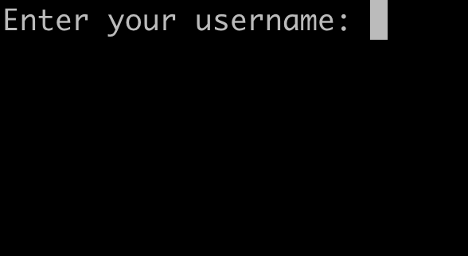

用户输入用户å和密ç ç™»å½•ã€‚

系统核对/etc/passwdå’Œ/etc/shadow，如æœæ­£ç¡®ï¼Œå°±å‡ºç°ç™»å½•ç•Œé¢ã€‚


Linuxä»ç‚¹äº®ç”µæºåˆ°ç”¨æˆ·ç™»å½•è¿‡ç¨‹ç»“æŸã€‚

## å››ã€æ¼«ç”»Linux内核进程


### 1ã€Linux地基


### 2ã€Linux一层

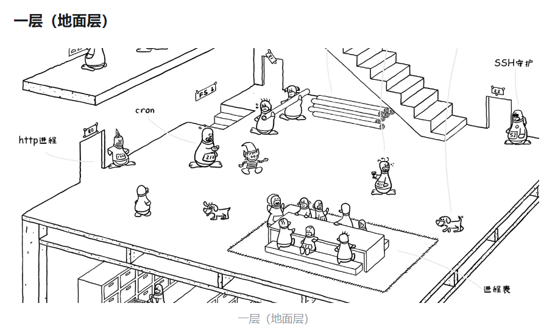


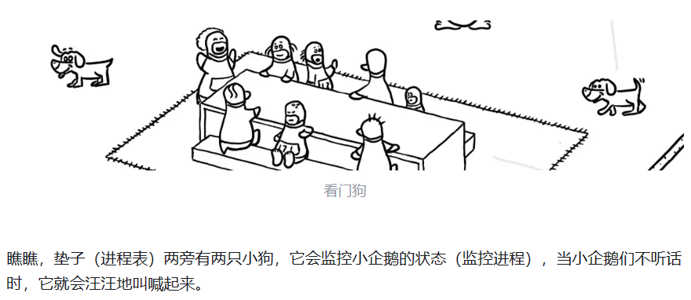


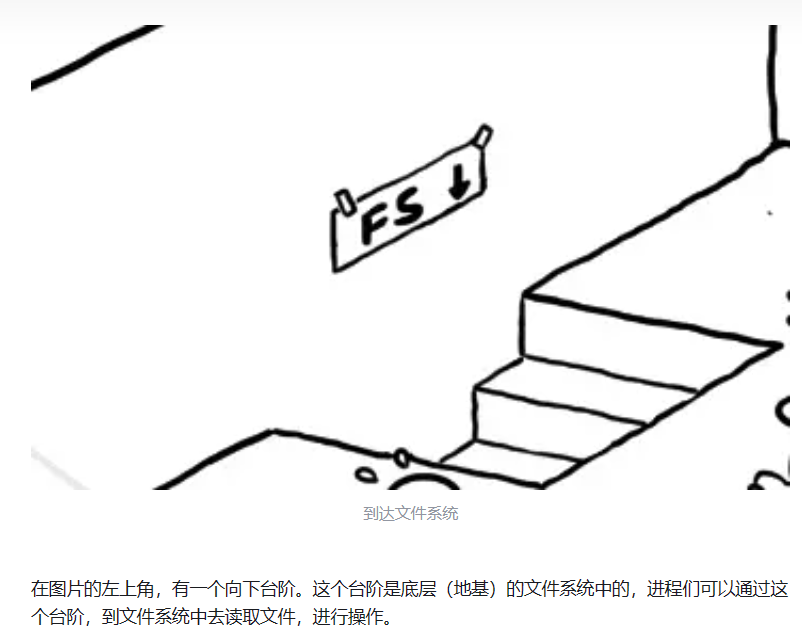

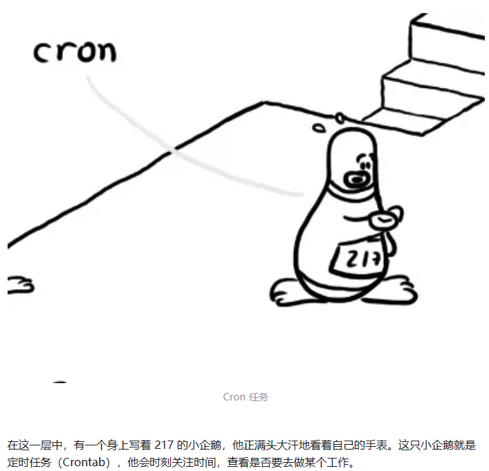


### 3ã€Linux跃层

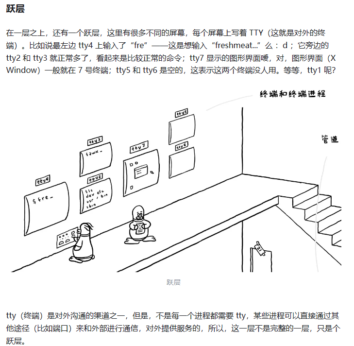


==ä½ ç†è§£Linux内存æ¡ä¸­çš„进程了么？==

## 五ã€ç³»ç»Ÿç®¡ç†å·¥å…·

### 1ã€cockpit管ç†å·¥å…·

```bash
[root@localhost ~]# dnf install cockpit
[root@localhost ~]# systemctl start cockpit
[root@localhost ~]# systemctl status cockpit
â— cockpit.service - Cockpit Web Service
     Loaded: loaded (/usr/lib/systemd/system/cockpit.service; static)
     Active: active (running) since Sun 2023-11-05 13:38:52 CST; 1s ago
TriggeredBy: â— cockpit.socket
       Docs: man:cockpit-ws(8)
    Process: 25776 ExecStartPre=/usr/libexec/cockpit-certificate-ensure --for-cockpit-tls (code=exi>
   Main PID: 25800 (cockpit-tls)
      Tasks: 1 (limit: 10553)
     Memory: 1.2M
        CPU: 2.810s
     CGroup: /system.slice/cockpit.service
             └─25800 /usr/libexec/cockpit-tls

11月 05 13:38:49 localhost.localdomain systemd[1]: Starting Cockpit Web Service...
11月 05 13:38:52 localhost.localdomain systemd[1]: Started Cockpit Web Service.
[root@localhost ~]# netstat -atulnp |grep :9090
tcp6       0      0 :::9090                 :::*                    LISTEN      1/systemd
#如æœéœ€è¦åœ¨é˜²ç«å¢™ä¸­å¼€æ”¾9090端å£ã€‚开放方法å‚加Linux防ç«å¢™
```

在æµè§ˆå™¨ä¸­è¾“å…¥https://192.168.14.137:9090，输入Linux的用户å和密ç ç™»å½•å³å¯ã€‚


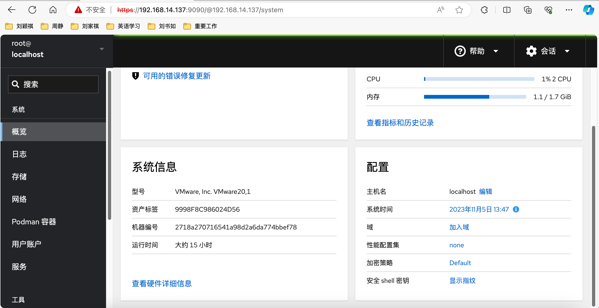

### 2ã€webmin管ç†å·¥å…·

webmin官网：[Downloading and Installing | Webmin](https://webmin.com/download/)，进入官网å¯ä»¥æ‰¾åˆ°æœ€æ–°çš„版本åŠå®‰è£…指å—。

```bash
#新建一个repo库文件
[root@localhost ~]# vi /etc/yum.repos.d/webmin.repo
[Webmin]
name=Webmin Distribution Neutral
#baseurl=http://download.webmin.com/download/yum
mirrorlist=http://download.webmin.com/download/yum/mirrorlist
enabled=1
#导入验è¯å¯†é’¥
[root@localhost ~]# wget http://www.webmin.com/jcameron-key.asc
[root@localhost ~]# rpm --import jcameron-key.asc
#安装
[root@localhost ~]# dnf install webmin

#在防ç«å¢™ä¸­å¼€æ”¾10000端å£
[root@localhost ~]# firewall-cmd --permanent --zone=public --add-port=10000/tcp
success
[root@localhost ~]# firewall-cmd --permanent --zone=public --add-port=10000/udp
success
[root@localhost ~]# firewall-cmd --reload
success
[root@localhost ~]# firewall-cmd --zone=public --list-all
public (active)
  target: default
  icmp-block-inversion: no
  interfaces: ens160
  sources:
  services: cockpit dhcpv6-client ssh
  ports: 10000/tcp 10000/udp
  protocols:
  forward: yes
  masquerade: no
  forward-ports:
  source-ports:
  icmp-blocks:
  rich rules:
      
#然å在æµè§ˆå™¨ä¸­å°±å¯ä»¥è¾“å…¥https://IP:10000访问webmin的管ç†é¡µé¢ã€‚
```


这里输入rootè´¦å·åŠå¯†ç ã€‚在该页é¢ä¸­é€‰æ‹©â€œlanguage and localeâ€ï¼Œè®¾ç½®ç®€ä½“中文。

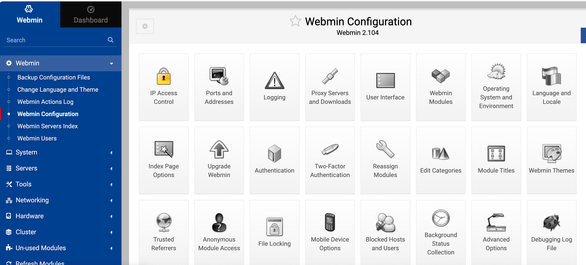


```bash
#对webminæœåŠ¡è¿›è¡Œç®¡ç†
[root@localhost ~]# systemctl start webmin
[root@localhost ~]# systemctl status webmin
#确认10000端å£å¤„äºç›‘å¬çŠ¶æ€
[root@localhost ~]# netstat -atulnp |grep :10000
tcp        0      0 0.0.0.0:10000           0.0.0.0:*               LISTEN      25361/perl
tcp6       0      0 :::10000                :::*                    LISTEN      25361/perl
udp        0      0 0.0.0.0:10000           0.0.0.0:*                           25361/perl

```

### 3ã€å†…网穿é€cpolar

为什么è¦è¿›è¡Œå†…网穿é€ï¼Ÿ

[cpolar官网-安全的内网穿é€å·¥å…· | 无需公网ip | 远程访问 | æ­å»ºç½‘ç«™](https://www.cpolar.com/)

#### 1ã€é¦–先在官网注册一个账户

```bash
#第一步：安装cpolar
[root@localhost ~]#curl -L https://www.cpolar.com/static/downloads/install-release-cpolar.sh | sudo bash
[root@localhost ~]# cpolar version
cpolar version 3.3.12  #è¯æ˜å®‰è£…æˆåŠŸ
#第二步：token认è¯
[root@localhost bin]# ./cpolar authtoken  这里是å¤åˆ¶è¿‡æ¥çš„token
```


#### 2ã€å¯åŠ¨cpolaræœåŠ¡


```bash
#å¯åŠ¨cpolaræœåŠ¡
[root@localhost bin]# systemctl enable cpolar.service
[root@localhost bin]# systemctl start cpolar.service
[root@localhost bin]# systemctl status cpolar.service
â— cpolar.service - Cpolar Service
     Loaded: loaded (/etc/systemd/system/cpolar.service; enabled; preset: disabled)
     Active: active (running) since Thu 2023-11-09 18:08:39 CST; 1 day 3h ago
       Docs: https://www.cpolar.com/docs
   Main PID: 1007 (cpolar)
      Tasks: 17 (limit: 10553)
     Memory: 45.6M
        CPU: 1min 19.237s
     CGroup: /system.slice/cpolar.service
             ├─ 1007 "cpolar: master process"
             └─44681 "cpolar: worker process"

11月 09 18:08:39 localhost systemd[1]: Started Cpolar Service.
```

#### 3ã€è¿›å…¥Linuxæµè§ˆå™¨ï¼Œ[**https://127.0.0.1:9200**](https://dashboard.cpolar.com/status)

这一步，是创建隧é“，也就是本地想è¦å¯¹å¤–暴露的端å£å·ã€‚

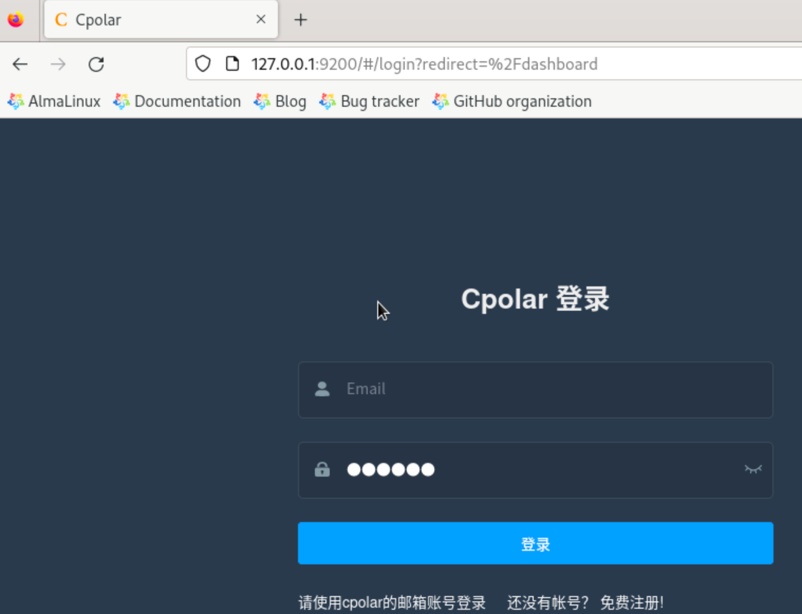


如图所示，点击创建å³å¯ã€‚

#### 4ã€é˜²ç«å¢™æ”¾å¼€ç«¯å£

```bash
[root@localhost bin]# firewall-cmd --zone=public --add-service=ssh --permanent
[root@localhost bin]# firewall-cmd --list-services
cockpit dhcpv6-client ssh vnc-server
```

#### 5ã€ç™»å½•cpolar官网，输入用户å和密ç ç™»å½•


#### 6ã€åˆ©ç”¨ä¸Šå›¾ä¸­URLå³å¯åœ¨å¤–网访问Linux系统。

详细情况å¯ä»¥å‚考官网的文档。

加入上é¢åˆ›å»ºçš„是tcp/9090隧é“，那么就å¯ä»¥é€šè¿‡å¤–网访问：


#### 7ã€å¸è½½cpolar

```bash
#å¸è½½cpolar
[root@localhost bin]#curl -L https://www.cpolar.com/static/downloads/install-release-cpolar.sh | sudo bash -s -- --remove

```

------

------

[TOC]

