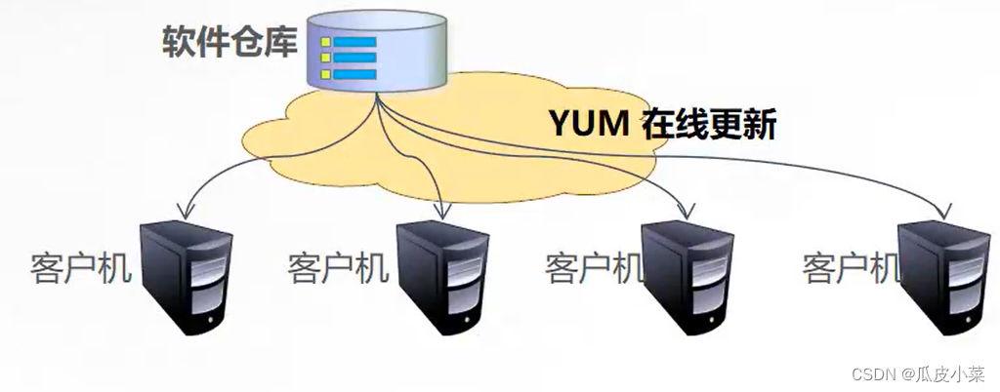

# 第9章 Linux软件安装

[TOC]

## 0、网页里面的电脑博物馆

[网页里的电脑博物馆 (compumuseum.com)](http://www.compumuseum.com/index.html)

可以看到各种老式的经典电脑

《高山流水》
<center>
<audio controls height="100" width="100">
	<source src="gsls.mp3" type="audio/mpeg">
	<embed height="50" width="100" src="horse.mp3">
</audio>
</center>


## 1、RPM软件包管理器

rpm软件包管理器（red hat package manager）是一种开放的软件包管理系统，可以运行在各种Linux系统上。rpm简化了Linux系统安装、卸载、更新和升级的过程。对于开发者来说，rpm允许把软件包装成源码包和程序包。 Linux系统上所有软件都可以被分成可被安装、升级或卸载的rpm软件包。

[QQ Linux版-从心出发·趣无止境](https://im.qq.com/linuxqq/download.html) 以安装QQ为例。

RPM是”Redhat Package Manager”的缩写，根据名字也能猜到这是Redhat公司开发出来的。RPM 是以一种数据库记录的方式来将你所需要的套件安装到你的Linux 主机的一套管理程序。也就是说，你的linux系统中存在着一个关于RPM的数据库，它记录了安装的包以及包与包之间依赖相关性。RPM包是预先在linux机器上编译好并打包好的文件，安装起来非常快捷。但是也有一些缺点，比如安装的环境必须与编译时的环境一致或者相当；包与包之间存在着相互依赖的情况；卸载包时需要先把依赖的包卸载掉，如果依赖的包是系统所必须的，那就不能卸载这个包，否则会造成系统崩溃。


### **（1）rpm用法举例**

```bash
#rpm [选项]  [rpm软件包文件名称]  
[root@localhost examplesh]# rpm --help
[root@localhost examplesh]# wget --help
GNU Wget 1.21.1，非交互式的网络文件下载工具。
用法： wget [选项]... [URL]...
[root@localhost examplesh]# wget https://down.qq.com/qqweb/LinuxQQ/linuxqq_2.0.0-b2-1089_aarch64.rpm


例：运用rpm包安装、查询和卸载QQ
#安装rpm -ivh
[root@bogon ~]# rpm -ivh linuxqq_2.0.0-b2-1089_aarch64.rpm
#查询rpm -q
[root@bogon ~]# rpm -q linuxqq
#删除rpm -e
[root@bogon ~]# rpm -e linuxqq
例：升级和刷新软件包：
#升级软件包
[root@bogon ~]# rpm -Uvh linuxqq_2.0.0-b2-1089_aarch64.rpm 
#刷新软件包
[root@bogon ~]# rpm -Fvh linuxqq_2.0.0-b2-1089_aarch64.rpm
#查询软件包的依赖关系
[root@localhost ~]# rpm -qR linuxqq

```

```bash
例：查询已经安装的所有软件包
[root@bogon ~]# rpm -ivh linuxqq_2.0.0-b2-1089_aarch64.rpm
#查看系统里面安装的所有的软件包
[root@bogon ~]# rpm -qa
例：查询rpm软件包的依赖关系
[root@bogon ~]# rpm -qR linuxqq

例：查询软件包所包含的文件列表
[root@bogon ~]# rpm -ql linuxqq

例：查询文件属于哪一个软件包
[root@bogon ~]# rpm -qf /usr/local/lib/tencent-qq/
linuxqq-2.0.0-b2.aarch64
```


### **（2）常用rpm包站点**

以下是一些重要的rpm站点，应该可以找到几乎所有的rpm软件包。

> 1. http://rpmfind.net
> 2. http://rpm.pbone.net/
> 3. https://freshrpms.net/

注意：

rpm有两个缺点：

> - 第一个是有依赖关系需要自己手动解决。
> - 第二个是rpm和具体的Linux发行版有关系，不通用。

## 2、DNF管理软件包

### （1）yum


yum可以实现自动化的升级、安装和删除软件，检查依赖性并且一次安装所有依赖的软件包。

yum需要配置软件仓库。



- yum软件仓库的配置

​      仓库文件的配置存储在/etc/yum.repos.d目录中。

```bash
[root@bogon ~]# ls /etc/yum.repos.d/
CentOS-aarch64-kernel.repo  CentOS-Debuginfo.repo  CentOS-Sources.repo
CentOS-Base.repo            CentOS-fasttrack.repo  CentOS-Vault.repo
CentOS-CR.repo              CentOS-Media.repo
```

- yum仓库文件的配置格式

```bash
[base]
name=CentOS-$releasever - Base  //定义了软件仓库的名称
//指定了rpm软件包的来源支持的协议有ftp http file本地仓库文件,可以利用本地光盘建立仓库。
mirrorlist=http://mirrorlist.centos.org/?release=$releasever&arch=$basearch&repo=os&infra=$infra
gpgcheck=1    //1表示启用软件仓库源
//定义用于校验的gpg密钥
gpgkey=file:///etc/pki/rpm-gpg/RPM-GPG-KEY-CentOS-7
       file:///etc/pki/rpm-gpg/RPM-GPG-KEY-CentOS-7-aarch64
```

- yum仓库源

1、第一种来自网络的yum仓库

正常的安装系统以后，yum仓库已经配置好了，如果需要添加其他的源，可以参考如下的网站。

国内常用的yum仓库：

> [阿里巴巴开源镜像站-OPSX镜像站-阿里云开发者社区 (aliyun.com)](https://developer.aliyun.com/mirror/)
>
> [清华大学开源软件镜像站 | Tsinghua Open Source Mirror](https://mirrors.tuna.tsinghua.edu.cn/)
>
> [欢迎访问网易开源镜像站 (163.com)](https://mirrors.163.com/)
>
> [Extra Packages for Enterprise Linux (EPEL) :: Fedora Docs (fedoraproject.org)](https://docs.fedoraproject.org/en-US/epel/#_el9)

具体的配置方法参考各个网站。

2、第二种是本地自建yum仓库

使用光盘自建仓库。

YUM命令：

```bash
//安装软件
[root@bogon ~]# yum -y install bind
//查询
[root@bogon ~]# yum info bind
[root@bogon ~]# yum info installed
//查看依赖关系
[root@bogon ~]# yum deplist bind
//查看软件仓库配置
[root@bogon ~]# yum repolist
//删除软件
[root@bogon ~]# yum remove bind
```

### （2）dnf


==dnf 安装cockpit举例==

```bash
#先搜索某一个软件
[root@localhost ~]# dnf search cockpit
上次元数据过期检查：0:49:54 前，执行于 2023年11月10日 星期五 09时33分29秒。
==================================== 名称 精准匹配：cockpit =====================================
cockpit.aarch64 : Web Console for Linux servers


#安装该软件
[root@localhost ~]# dnf isntall cockpit
#查询该软件的详细信息
[root@localhost ~]# dnf info cockpit
上次元数据过期检查：0:50:51 前，执行于 2023年11月10日 星期五 09时33分29秒。
已安装的软件包
名称         : cockpit
版本         : 286.2
                                                                            
#删除一个软件
[root@localhost ~]# dnf remove cockpit

#列出所有已经安装的软件
[root@localhost ~]# dnf list installed

#找出该软件的依赖关系
[root@localhost ~]# dnf deplist cockpit
上次元数据过期检查：0:55:42 前，执行于 2023年11月10日 星期五 09时33分29秒。
package: cockpit-286.1-1.el9.aarch64
  dependency: cockpit-bridge

#清除缓存  
[root@localhost ~]# dnf clean
```


## 3、源代码方式安装软件

### **（1）验证一个文件是否被篡改**

从网络上下载的文件如何验证其有没有被篡改过？

例如：

[centos-7.9.2009-isos-x86_64安装包下载_开源镜像站-阿里云 (aliyun.com)](https://mirrors.aliyun.com/centos/7.9.2009/isos/x86_64/?spm=a2c6h.25603864.0.0.7d84f5adjNcISU)


可以下载这里的sha256sum.txt，该文件内容的如下：

校验码：689531cce9cf484378481ae762fae362791a9be078fda10e4f6977bf8fa71350  

文件名：CentOS-7-x86_64-Everything-2009.iso

```bash
centos-7.9.2009-isos-x86_64安装包下载_开源镜像站-阿里云 (aliyun.com)
[root@localhost examplesh]# sha1sum --help
用法：sha1sum [选项]... [文件]...
[root@localhost examplesh]# md5sum --help
用法：sha1sum [选项]... [文件]...
[root@localhost examplesh]# sha256sum --help
用法：sha256sum [选项]... [文件]...
#计算一个文件的指纹
[root@localhost examplesh]# sha256sum linuxqq_2.0.0-b2-1089_aarch64.rpm
4e844005bf4f615f8fa1637c9dd6d0dcef3cd4ed8224c4831515d158f2ad27c5  linuxqq_2.0.0-b2-1089_aarch64.rpm

```

### （2）源代码安装软件举例


用源代码的方式安装apahce服务器：（为了演示方便，httpd-2.4.58.tar.gz已经下载至/root目录内）

到该网站找到最新的apache版本：[Download - The Apache HTTP Server Project](https://httpd.apache.org/download.cgi#apache24)


**（1）下载源代码文件**

```bash
#下载apache的源代码
[root@localhost ~]$ wget https://dlcdn.apache.org/httpd/httpd-2.4.58.tar.gz
#下载源代码的指纹
[root@localhost ~]# wget https://downloads.apache.org/httpd/httpd-2.4.58.tar.gz.sha512
#查看指纹
[root@localhost ~]# cat httpd-2.4.58.tar.gz.sha512
5c11faf0572035ef67b27775d975999411c689cb774553175299a9e99b63d3d7138b0c7f15048ec28038494d8513689f916202c2289d557947d8b190d46ca9f3 *httpd-2.4.58.tar.gz
#使用加密算法计算指纹，和下载的指纹进行比对。
[root@localhost ~]# sha512sum httpd-2.4.58.tar.gz
5c11faf0572035ef67b27775d975999411c689cb774553175299a9e99b63d3d7138b0c7f15048ec28038494d8513689f916202c2289d557947d8b190d46ca9f3  httpd-2.4.58.tar.gz
#解压缩
[root@localhost ~]# tar -zxvf httpd-2.4.58.tar.gz
[root@localhost ~]# ls
anaconda-ks.cfg  file1                httpd-2.4.58.tar.gz.sha512  test_lv
dir              httpd-2.4.58         jcameron-key.asc            test.sh
examplesh        httpd-2.4.58.tar.gz  raid

#进入该目录
[root@localhost ~]# cd httpd-2.4.58/
```

**（2）进行配置**

安装前首先查看安装说明：

```bash
[root@localhost ~]# cat httpd-2.4.58/INSTALL

  APACHE INSTALLATION OVERVIEW

  For complete installation documentation, see [ht]docs/manual/install.html or
  http://httpd.apache.org/docs/2.4/install.html

     $ ./configure --prefix=PREFIX
     $ make
     $ make install
     $ PREFIX/bin/apachectl start
```

开始具体的安装步骤：

```bash
#./configure 软件配置与检查 抓药完成以下三个任务：
#第一：监测环境是否符合安装要求
#第二：定义需要的功能选项。通过./configure--prefix=安装路径，可以指定安装目录。
#可以使用./configure --help 查看支持的具体功能选项
#第三：把系统环境的监测结果和定义好的功能选项写入makefile文件。
[root@localhost httpd-2.4.58]# mkdir /root/apache_test

#进行配置
[root@localhost httpd-2.4.58]# ./configure --prefix=/root/apache_test
...省略
checking for APR... no
#第一次出错。
configure: error: APR not found.  Please read the documentation.

#解决方法
[root@localhost httpd-2.4.58]# dnf install apr*

#再次进行配置
[root@localhost httpd-2.4.58]# ./configure --prefix=/root/apache_test
checking for -pcre2-config... no
checking for -pcre-config... no
checking for pcre2-config... no
checking for pcre-config... no
#这里继续报错
configure: error: pcre(2)-config for libpcre not found. PCRE is required and available from http://pcre.org/
[root@localhost httpd-2.4.58]# dnf install pcre*

#再次配置，成功
[root@localhost httpd-2.4.58]# ./configure --prefix=/root/apache_test
...省略
config.status: executing default commands
configure: summary of build options:

    Server Version: 2.4.58
    Install prefix: /root/apache_test
    C compiler:     gcc
    CFLAGS:
    CPPFLAGS:        -DLINUX -D_REENTRANT -D_GNU_SOURCE
    LDFLAGS:
    LIBS:
    C preprocessor: gcc -E

```

**（3）make编译**

```bash
#安装apache
[root@localhost httpd-2.4.58]# make install
```

**（4）make install安装**

```bash
#安装apache
[root@localhost httpd-2.4.58]# make install
```

**（5）安装后运行程序**

```bash
#进入安装目录
[root@localhost ~]# cd /root/apache_test/
[root@localhost apache_test]# ls
bin  build  cgi-bin  conf  error  htdocs  icons  include  logs  man  manual  modules
[root@localhost apache_test]# cd bin
[root@localhost bin]# ls
ab         apxs      dbmmanage  envvars-std  htcacheclean  htdigest  httpd      logresolve
apachectl  checkgid  envvars    fcgistarter  htdbm         htpasswd  httxt2dbm  rotatelogs

#运行apache可执行程序
[root@localhost bin]# ./apachectl
AH00558: httpd: Could not reliably determine the server's fully qualified domain name, using localhost.localdomain. Set the 'ServerName' directive globally to suppress this message
#查看是否开启80号端口，服务运行成功
[root@localhost bin]# netstat -atunpl |grep :80
tcp6       0      0 :::80                   :::*                    LISTEN      38878/httpd

```

**（6）删除这个程序**

```bash
#删除该目录，即可删除apache程序。
[root@localhost ~]# cd ~
[root@localhost ~]# rm -rf apache_test/
```


## 3、Linux打包和压缩

### **（1）归档和打包程序tar**


```bash
[root@bogon ~]# mkdir abc
[root@bogon ~]# tar -cvf /root/abc.tar /root/abc    //打包
[root@bogon ~]# tar -tvf /root/abc.tar /root/abc    //查看包
[root@bogon ~]# tar -xvf /root/abc.tar /root/abc    //解开包
[root@bogon ~]# tar rvf /root/abc.tar /root/abc/d   //把文件d追加进包中 
```

[程序员需要了解的硬核知识之压缩算法-今日头条 (toutiao.com)](https://www.toutiao.com/article/6902026593863008781/?channel=&source=search_tab)

[90 岁程序员：他的压缩算法改变了世界-今日头条 (toutiao.com)](https://www.toutiao.com/article/6955141707784520199/?channel=&source=search_tab)

```bash
#第一个例子：打包并比较两个文件的大小。
#创建一个100M的文件
[root@localhost test]# dd if=/dev/zero of=100Mfile bs=1M count=100
记录了100+0 的读入
记录了100+0 的写出
104857600字节（105 MB，100 MiB）已复制，0.127655 s，821 MB/s
[root@localhost test]# ls -lh
总用量 100M
-rw-r--r-- 1 root root 100M 11月 27 19:18 100Mfile
#对该文件进行打包
[root@localhost test]# tar -cvf my.tar 100Mfile
100Mfile
#比较一下文件的体积有没有发生变化
[root@localhost test]# ls -lh 100Mfile my.tar
-rw-r--r-- 1 root root 100M 11月 27 19:18 100Mfile
-rw-r--r-- 1 root root 101M 11月 27 19:19 my.tar

#第二个例子：打包并使用gzip进行压缩
[root@localhost test]# tar -zcvf my.tar.gz 100Mfile
100Mfile
[root@localhost test]# ls -lh
总用量 201M
-rw-r--r-- 1 root root 100M 11月 27 19:18 100Mfile
-rw-r--r-- 1 root root 101M 11月 27 19:19 my.tar
-rw-r--r-- 1 root root 100K 11月 27 19:20 my.tar.gz

#第三个例子：打包并使用bzip2进行压缩
[root@localhost test]# tar -jcvf my.tar.bz2 100Mfile
100Mfile
[root@localhost test]# ll -h
总用量 201M
-rw-r--r-- 1 root root 100M 11月 27 19:18 100Mfile
-rw-r--r-- 1 root root 101M 11月 27 19:19 my.tar
-rw-r--r-- 1 root root  195 11月 27 19:27 my.tar.bz2

#第四个例子：打包并使用xz进行压缩
[root@localhost test]# tar -Jcvf my.tar.xz 100Mfile
100Mfile
[root@localhost test]# ll -h
总用量 201M
-rw-r--r-- 1 root root 100M 11月 27 19:18 100Mfile
-rw-r--r-- 1 root root 101M 11月 27 19:19 my.tar
-rw-r--r-- 1 root root  195 11月 27 19:27 my.tar.bz2
-rw-r--r-- 1 root root 100K 11月 27 19:20 my.tar.gz
-rw-r--r-- 1 root root  16K 11月 27 19:30 my.tar.xz
```

### **（2）压缩命令gzip**

```bash
[root@bogon ~]# tar -zcvf /root/abc.tar.gz /root/abc
[root@bogon ~]# tar -ztvf /root/abc.tar.gz 
[root@bogon ~]# tar -zxvf /root/abc.tar.gz
```

### **（3）压缩命令bzip2**

```bash
[root@bogon ~]# tar -jcvf /root/abc.tar.bz2 /root/abc
[root@bogon ~]# tar -jtvf /root/abc.tar.bz2 
[root@bogon ~]# tar -jxvf /root/abc.tar.bz2
```

### **（4）压缩命令xz**

```bash
[root@bogon ~]# tar -Jcvf /root/abc.tar.xz /root/abc
[root@bogon ~]# tar -Jtvf /root/abc.tar.xz
[root@bogon ~]# tar -Jxvf /root/abc.tar.xz
```

[TOC]

