# 第11讲 Linux网络

[TOC]


## 1、Linux网络配置


### （1）计算机联网的必要配置

三个必要的参数：

- IP地址
- 网关
- DNS服务器地址

**IP地址是：**连接在因特网的每一台计算机都有一个 IP 地址。这个 IP 地址在世界范围内必须是惟一的。路由器根据分组首部中的目的 IP 地址查找出下一跳路由器的地址。

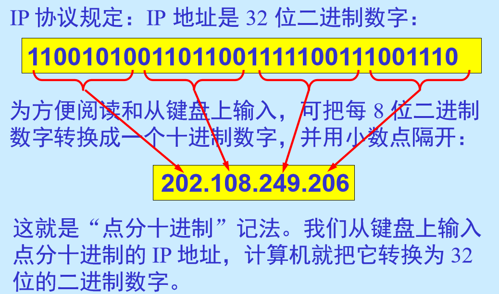　


**网关：**

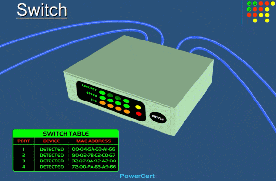　


**DNS服务器**：完成域名和IP地址的解析

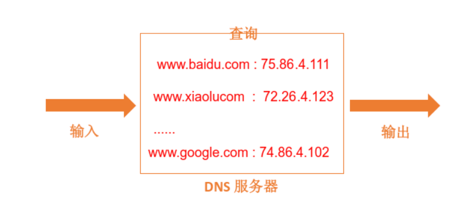

郑州轻工业大学域名解析过程：www.zzuli.edu.cn  解析为：202.102.224.68

```bash
[root@almalinux examplesh]# nslookup www.zzuli.edu.cn
Server:         202.102.224.68
Address:        202.102.224.68#53

Non-authoritative answer:
Name:   www.zzuli.edu.cn
Address: 202.196.0.13
Name:   www.zzuli.edu.cn
Address: 2001:250:4802:1008:500::13
```

www.zzuli.edu.cn www是主机名；.zzuli在郑州轻工业大学内部管理；.edu是教育部管理；.cn中国；. 根域名服务器（全世界只有13台）

根域名服务器为什么只能是13台？

> 通过UDP协议传输的互联网域名系统消息，最大长度需要限制在512字节。
>
> 而512字节只够返回包含13个根域名服务器的NS记录和A记录的响应。
>
> 
>
> 13台根服务器中，有10台位于美国本土，其余3台分布在英国、瑞典和日本。
>
> **此外还有一些镜像服务器部署在其他国家和地区**，例如中国就有28个根镜像服务器。


------

第一种方式：DHCP配置。


==网络系统需要有DHCP服务器，如下图所示：==


第二种方式：手工静态配置。

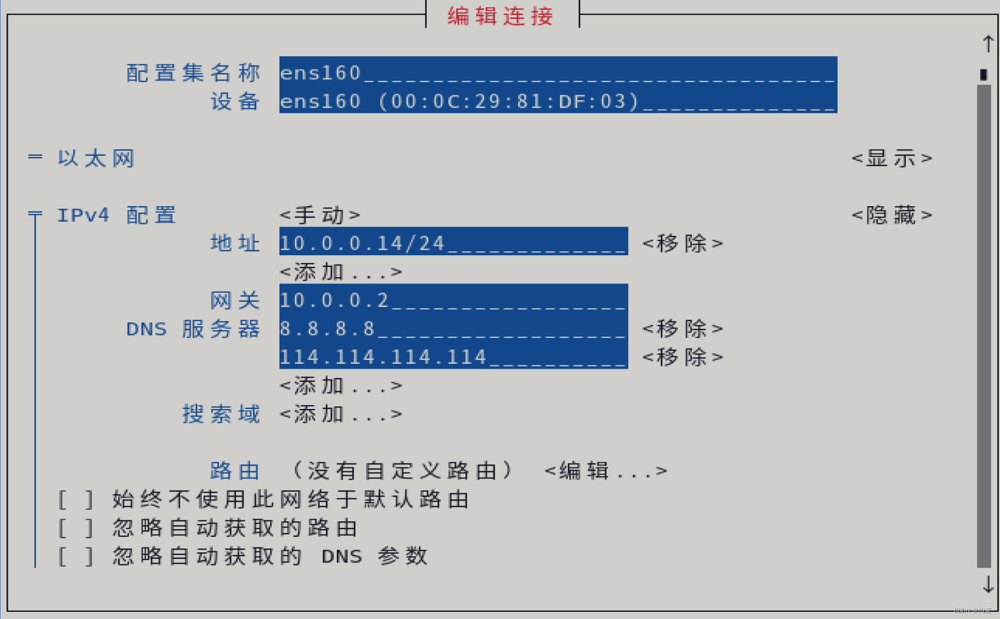


### （2）和网络配置有关的四个文件

| 文件名                               | 作用                               |
| ------------------------------------ | ---------------------------------- |
| /etc/sysconfig/net-work/ifcfg-ens160 | *网卡配置文件*                     |
| */etc/resolv.conf*                   | *DNS服务器配置文件*                |
| */etc/services*                      | *端口和服务一一对应的关系*         |
| */etc/hosts*                         | 存储了主机名和IP之间的对应解析关系 |


- 网卡配置文件

```shell
#这里的网络配置方式，都是采用dhcp方式，自动配置网络参数，一般的局域网都采用这种方式。
//网卡参数配置文件,centos7版本，
[root@bogon ~]# cat /etc/sysconfig/network-scripts/ifcfg-ens160 
TYPE=Ethernet     //表示网络类型
PROXY_METHOD=none
BROWSER_ONLY=no
BOOTPROTO=dhcp   //表示网卡采用dhcp方式配置网络参数
DEFROUTE=yes
IPV4_FAILURE_FATAL=no
IPV6INIT=yes
IPV6_AUTOCONF=yes
IPV6_DEFROUTE=yes
IPV6_FAILURE_FATAL=no
NAME=ens160
UUID=8dfa9c91-29dc-4c73-ab2b-21dd93fe9487   //网卡的UUID
DEVICE=ens160
ONBOOT=yes      //启用该网卡

#9.0版本，网络配置文件变成了如下：
[root@localhost ~]# cat /etc/NetworkManager/system-connections/ens160.nmconnection
[connection]
id=ens160
uuid=698712da-f2ad-3de9-8bd7-d5def6591a2f
type=ethernet
autoconnect-priority=-999
interface-name=ens160
timestamp=1698612915
[ethernet]
[ipv4]
method=auto
[ipv6]
addr-gen-mode=eui64
method=auto
[proxy]

```

- DNS服务器配置文件

```bash
# 域名解析用到的一个文件
[root@bogon ~]# cat /etc/resolv.conf 
# Generated by NetworkManager
search localdomain
nameserver 192.168.14.2     //域名服务器的ip地址
```

- 服务和对应端口

```bash
# /etc/services 是一个服务名和对应服务端口的数据库文件
[root@bogon ~]# head -n 30 /etc/services 
# Each line describes one service, and is of the form:
#
# service-name  port/protocol  [aliases ...]   [# comment]

tcpmux          1/tcp                           # TCP port service multiplexer
tcpmux          1/udp                           # TCP port service multiplexer
ssh             22/tcp                          # The Secure Shell (SSH) Protocol
ssh             22/udp                          # The Secure Shell (SSH) Protocol
```

- DNS本机解析

```bash
# /etc/hosts文件存储了
# 一般来说，当用户在电脑浏览器里输入网址(域名)后，系统需要通过查询网络上的 DNS 服务器，才能将域名解析成对应的 IP 地址，浏览器通过 IP 地址才能找到该网站所在的服务器并进行访问。
# 而操作系统的 hosts 文件则是有着“类似本地 DNS 服务器”的作用，而且比网络上的 DNS 具有更高的优先级。如果你在 hosts 里面配置了某个域名和IP的对应关系 ，这时不会再去查询网络上的 DNS 服务器。速度较快。
[root@almalinux ~]# cat /etc/hosts
127.0.0.1   localhost localhost.localdomain localhost4 localhost4.localdomain4
::1         localhost localhost.localdomain localhost6 localhost6.localdomain6
14.215.177.38 www.baidu.com              #下次系统访问baidu的时候，就不需要DNS服务器进行查询了。
```

### （3）常用网络命令

#### （1）路由追踪traceroute

```bash
[root@almalinux ~]# traceroute www.whitehouse.gov
traceroute to www.whitehouse.gov (192.0.66.168), 30 hops max, 60 byte packets
 1  bogon (192.168.0.1)  0.329 ms  0.246 ms  0.358 ms
 2  100.64.0.1 (100.64.0.1)  3.276 ms  3.258 ms  3.020 ms
 3  hn.kd.jz.adsl (221.15.169.81)  3.597 ms  3.768 ms  3.475 ms
...省略
```

#### （2）查看网络接口ifconfig

```bash
[root@almalinux ~]# ifconfig
ens160: flags=4163<UP,BROADCAST,RUNNING,MULTICAST>  mtu 1500
        inet 192.168.0.107  netmask 255.255.255.0  broadcast 192.168.0.255
        inet6 fe80::20c:29ff:fe6b:ba26  prefixlen 64  scopeid 0x20<link>
        ether 00:0c:29:6b:ba:26  txqueuelen 1000  (Ethernet)
        RX packets 239986  bytes 213844269 (203.9 MiB)
        RX errors 0  dropped 0  overruns 0  frame 0
        TX packets 181178  bytes 19863848 (18.9 MiB)
        TX errors 0  dropped 0 overruns 0  carrier 0  collisions 0

```

#### （3）测试网络连通性ping

```bash
[root@almalinux ~]# ping www.jingdong.com
PING mfn-df-sched.jcloudimg.com (123.6.77.65) 56(84) 比特的数据。
64 比特，来自 hn.kd.ny.adsl (123.6.77.65): icmp_seq=1 ttl=57 时间=1.63 毫秒
64 比特，来自 hn.kd.ny.adsl (123.6.77.65): icmp_seq=2 ttl=57 时间=1.91 毫秒
64 比特，来自 hn.kd.ny.adsl (123.6.77.65): icmp_seq=3 ttl=57 时间=1.94 毫秒
64 比特，来自 hn.kd.ny.adsl (123.6.77.65): icmp_seq=4 ttl=57 时间=2.21 毫秒
^C
--- mfn-df-sched.jcloudimg.com ping 统计 ---
已发送 4 个包， 已接收 4 个包, 0% packet loss, time 3002ms
rtt min/avg/max/mdev = 1.631/1.923/2.214/0.206 ms
# 最小值、平均值、最大值、方差。方差用来评估其偏离平均值的程度。
```
<font color="red" size="3">
**有意思的极限测试**
</font>

```bash
# -f 参数 可以短时间内构造大量的数据包
[root@almalinux ~]# ping -f www.whitehouse.gov
PING wh46.go-vip.net (192.0.66.168) 56(84) 比特的数据。
...............^C
--- wh46.go-vip.net ping 统计 ---
已发送 445 个包， 已接收 430 个包, 3.37079% packet loss, time 5412ms
rtt min/avg/max/mdev = 183.455/183.989/186.456/0.351 ms, pipe 16, ipg/ewma 12.188/183.948 ms
```

### （4）nmcli命令

nmcli是一个命令行工具，用于控制NetworkManager和报告网络状态。

在NetworkManager里主要有两个对象：connection和device，这是多对一的关系，一个设备可以配置多个连接，每个连接可以理解为ifcfg配置文件。同一时刻，一个设备只能有一个连接处于活跃状态。

nmcli可以完成网卡上的所有配置工作，并且可以写入网卡配置文件，永久生效。

nmcli命令使用方法如下：

```bash
[root@localhost ~]# nmcli --help

用法：nmcli [选项] 对象 { 命令 | help }
```

这里的对象和参数可以使用全称也可以使用简称，对象中最常用的是device和connection，device是网络接口，是物理设备，connection是连接，是逻辑上的网络连接，同一个device可以有多个connection，但同一时间只能启用其中一个connection，可以对同一个网络接口device，配置多个网络连接，比如静态IP和动态IP，在实际工作中根据需要启动相应的网络连接即可。下面举例说明如何使用nmcli命令进行网络配置。

#### （1）【例题】查看系统的网络接口。

```bash
[root@localhost ~]# nmcli device status

DEVICE  TYPE    STATE  CONNECTION 
ens160  ethernet   已连接   ens160   
lo    loopback   未托管   --  
```

这里可以看到该Linux系统中网络接口的物理设备有两个，一个是ens160网络接口，类型为以太网，对应的网络连接名称为ens160。另一个是回环网络接口，用于回环地址测试，其对应的IP地址是127.0.0.1。那么对应于网络接口的网络连接有哪些呢？可以使用如下方式查看：

```bash
[root@localhost ~]# nmcli connection show

NAME   UUID                  TYPE    DEVICE 
ens160  b055750d-80a0-30f2-b10e-243f9dc608ac     ethernet   ens160
```

对应于物理网络接口ens160的网络连接名称是ens160，也可以该看到该网络连接的UUID和网络类型。可以使用如下命令查看网络连接ens160的详细信息。

```bash
[root@localhost ~]# nmcli connection show ens160 
connection.id:              ens160
connection.uuid:             b055750d-80a0-30f2-b10e-243f9dc608ac
省略
```

#### （2）【例题】添加一个通过DHCP获取网络参数的网络连接mynet1。

添加网络连接，也就是说同一个物理网络接口可以配置多个网络连接。

```bash
[root@localhost ~]# nmcli connection add con-name mynet1 ifname ens160 type ethernet autoconnect yes
连接 "mynet1" (d68ac60b-acb6-4593-9abf-823731172376) 已成功添加。

[root@localhost ~]# nmcli connection show
NAME   UUID                  TYPE    DEVICE 
ens160  b055750d-80a0-30f2-b10e-243f9dc608ac     ethernet   ens160 
mynet1  d68ac60b-acb6-4593-9abf-823731172376     ethernet   --
```


通过命令nmcli connection add可以添加一个网络连接，con-name是新的网络连接名称，ifname指的使用的网络接口，type是网络类型，autoconnect是指设置开机自动启动。添加mynet1网络连接以后，会自动在/etc/NetworkManager/system-connections/目录下生成一个名称为“网络接口名.nmconnection”的网络配置文件，如下所示：

```bash
[root@localhost ~]# cat /etc/NetworkManager/system-connections/mynet1.nmconnection 

[connection]
id=mynet1  #网络连接名称
uuid=d68ac60b-acb6-4593-9abf-823731172376 #网络连接的UUID
type=ethernet #网络连接的类型
interface-name=ens160 #网络连接对应的网络接口设备
[ethernet]

[ipv4]
method=auto #采用DHCP的方式自动获取IP等网络参数
[ipv6]
addr-gen-mode=default
method=auto #采用DHCP的方式自动获取IP等网络参数
[proxy]
```

#### （3）【例题】再添加一个手动指定IP地址、子网掩码、网关和DNS的网络连接mynet2。

```bash
[root@localhost ~]# nmcli connection add con-name mynet2 ifname ens160 type ethernet autoconnect no ipv4.addresses 192.168.14.140/24 ipv4.gateway 129.168.14.2 ipv4.dns 192.168.14.2 ipv4.method manual
连接 "mynet2" (2fabbf9d-f564-423c-8c59-d9157fe6f7d2) 已成功添加。

[root@localhost ~]# nmcli connection show
NAME   UUID                  TYPE    DEVICE 
ens160  b055750d-80a0-30f2-b10e-243f9dc608ac     ethernet   ens160 
mynet1  d68ac60b-acb6-4593-9abf-823731172376     ethernet   --   
mynet2  2fabbf9d-f564-423c-8c59-d9157fe6f7d2     ethernet   --
```


==添加一个名称是mynet2的网络连接，使用的物理网络接口是ens160，网络类型为以太网，禁止开机自动启动，指定IP地址和子网掩码是192.168.14.140/24，网关是192.168.14.2，DNS是192.168.14.2，设置手工配置方式。通过nmcli connection show查看网络连接，又多了一个网络连接mynet2。同样道理/etc/NetworkManager/system-connections/目录下会生成一个名称为“网络接口名.nmconnection”的网络配置文件，如下所示：==

```bash
[root@localhost ~]# cat /etc/NetworkManager/system-connections/mynet2.nmconnection 
[connection]
id=mynet2  #网络连接名称
uuid=2fabbf9d-f564-423c-8c59-d9157fe6f7d2  #网络连接的UUID
type=ethernet  #网络连接类型
autoconnect=false  #禁止开机自动启动
interface-name=ens160  # 使用的网络接口设备
[ethernet]
[ipv4]
address1=192.168.14.140/24,129.168.14.2 #IP地址、掩码和网关
dns=192.168.14.2;  #DNS设置
method=manual  
[ipv6]
addr-gen-mode=default
method=auto
[proxy]
```

#### （4）【例题】根据不同的需求，启用不同的网络连接。

==比如可以启用上题中的ens160，mynet1，mynet2三个网络连接中的任意一个。首先启用mynet1网络连接，并查看该连接的详细情况。==

```bash
#查看系统所有网络连接
[root@localhost ~]# nmcli connection show 
NAME   UUID                  TYPE    DEVICE 
ens160  b055750d-80a0-30f2-b10e-243f9dc608ac   ethernet     ens160
mynet1  d68ac60b-acb6-4593-9abf-823731172376    ethernet    --   
mynet2  1a249810-a1fb-40bc-8d36-7cf095905be0    ethernet    --   
#启用mynet1网络连接
[root@localhost ~]# nmcli connection up mynet1
连接已成功激活（D-Bus 活动路径：/org/freedesktop/NetworkManager/ActiveConnection/10）
#再次查看网络连接mynet1的变化
[root@localhost ~]# nmcli connection show

NAME   UUID                  TYPE    DEVICE 
mynet1  d68ac60b-acb6-4593-9abf-823731172376   ethernet     ens160
ens160  b055750d-80a0-30f2-b10e-243f9dc608ac    ethernet     --   
mynet2  1a249810-a1fb-40bc-8d36-7cf095905be0    ethernet     -- 
#查看目前网络连接的IP地址

[root@localhost ~]# ifconfig | head -n 2
ens160: flags=4163<UP,BROADCAST,RUNNING,MULTICAST>  mtu 1500
​    inet 192.168.14.136  netmask 255.255.255.0  broadcast 192.168.14.255

#查看目前的网络接口所使用的网络连接是哪一个
[root@localhost ~]# nmcli device status

DEVICE  TYPE    STATE  CONNECTION 
ens160  ethernet    已连接   mynet1
lo    loopback   未托管   --  
#如果需要手工指定的IP的网络参数，就可以使用网络连接mynet2，接下来，进行网络连接mynet2的启用试验，并对其启用情况进行观察。
#启用网络连接mynet2
[root@localhost ~]# nmcli connection up mynet2
连接已成功激活（D-Bus 活动路径：/org/freedesktop/NetworkManager/ActiveConnection/11）
#查看网络连接mynet2的IP地址
[root@localhost ~]# ifconfig |head -n 2
ens160: flags=4163<UP,BROADCAST,RUNNING,MULTICAST>  mtu 1500
​    inet 192.168.14.140 netmask 255.255.255.0  broadcast 192.168.14.255
#查看哪一个网络连接处于活跃状态
[root@localhost ~]# nmcli connection show
NAME   UUID                  TYPE    DEVICE 
mynet2  1a249810-a1fb-40bc-8d36-7cf095905be0  etherne   ens160 
ens160  b055750d-80a0-30f2-b10e-243f9dc608ac    ethernet    --   
mynet1  d68ac60b-acb6-4593-9abf-823731172376    ethernet    --   

#查看网络接口
[root@localhost ~]# nmcli device status 
DEVICE  TYPE    STATE  CONNECTION 
ens160  ethernet    已连接   mynet2  
lo    loopback    未托管   -- 

#启用网络连接mynet2后，该网络连接的IP地址是指定的192.168.14.140，通过查看网络连接和网络接口情况，都可以看出mynet2网络连接已经在起作用。
#试验完成后，恢复到原来网络连接ens160，并删除网络连接mynet1和mynet2。

#启用默认的网络连接ens160
[root@localhost ~]# nmcli connection up ens160 
连接已成功激活（D-Bus 活动路径：/org/freedesktop/NetworkManager/ActiveConnection/12）

#删除网络连接mynet1和mynet2
[root@localhost ~]# nmcli connection delete mynet1
成功删除连接 "mynet1" (d68ac60b-acb6-4593-9abf-823731172376)。
[root@localhost ~]# nmcli connection delete mynet2
成功删除连接 "mynet2" (1a249810-a1fb-40bc-8d36-7cf095905be0)。

#查看当前的网络连接和网络接口信息
[root@localhost ~]# nmcli connection show
NAME   UUID                  TYPE    DEVICE 
ens160  b055750d-80a0-30f2-b10e-243f9dc608ac     ethernet   ens160 
[root@localhost ~]# nmcli device status
DEVICE  TYPE    STATE  CONNECTION 
ens160  ethernet    已连接   ens160   
lo      loopback    未托管   --     
```


## 2、端口扫描

什么是端口？


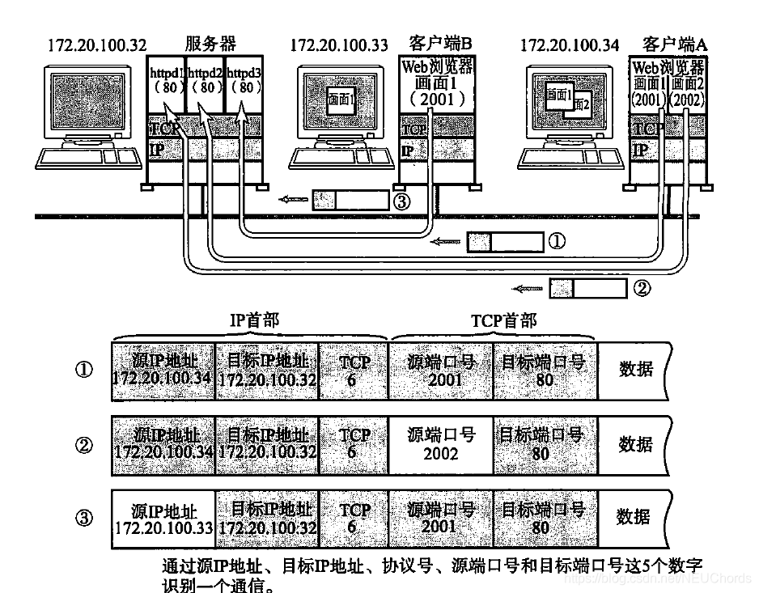

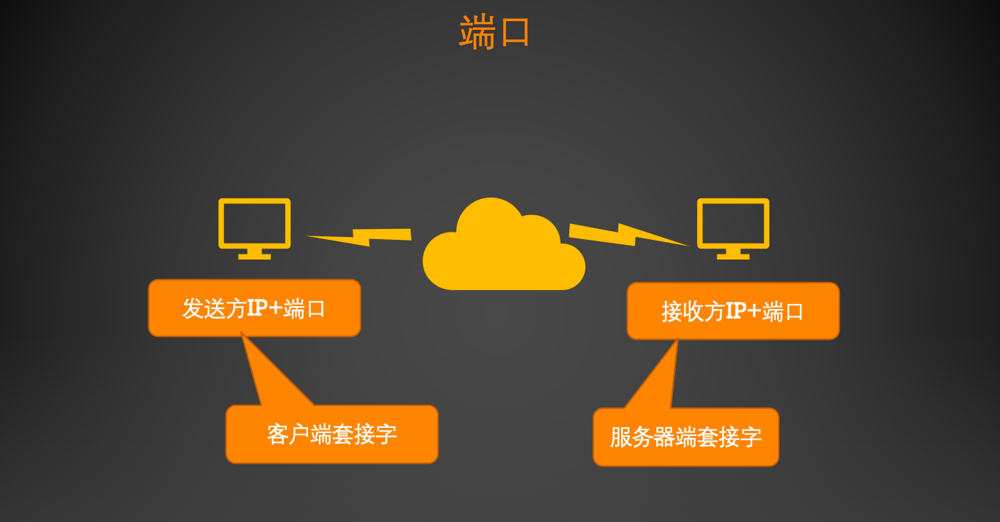

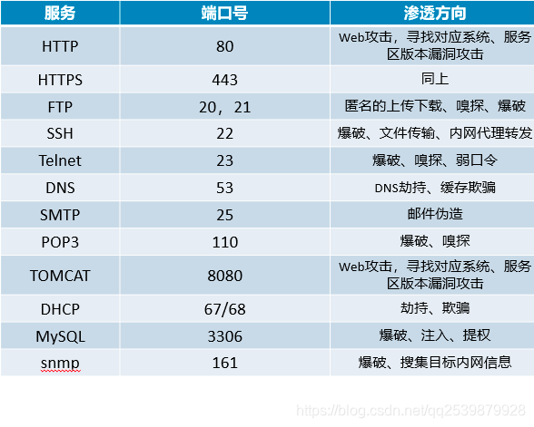

### （1）查看本机开放的端口netst

```bash
[root@almalinux ~]# netstat -atulnp
Active Internet connections (servers and established)
Proto Recv-Q Send-Q Local Address           Foreign Address         State       PID/Program name
tcp        0      0 127.0.0.1:5910          0.0.0.0:*               LISTEN      38733/Xvnc
tcp        0      0 0.0.0.0:10000           0.0.0.0:*               LISTEN      2181/perl
tcp        0      0 192.168.0.107:22        192.168.0.109:56463     ESTABLISHED 131448/sshd: root [
tcp6       0      0 :::3389                 :::*                    LISTEN      1300/xrdp
tcp6       0      0 :::22                   :::*                    LISTEN      1000/sshd: /usr/sbi
tcp6       0      0 :::80                   :::*                    LISTEN      1289/httpd
...
```

### （2）端口扫描之王nmap


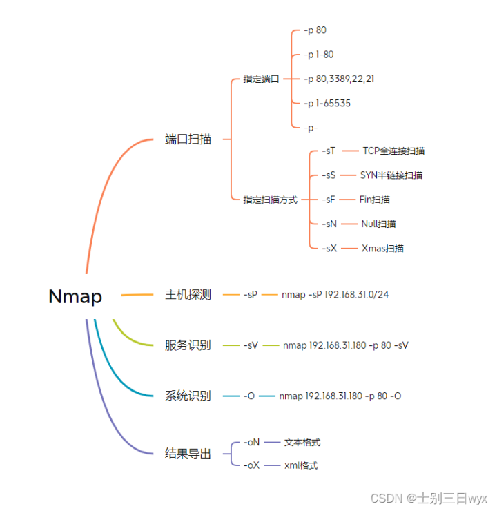

```bash
[root@almalinux ~]# nmap www.zzuli.edu.cn
Starting Nmap 7.92 ( https://nmap.org ) at 2024-05-01 20:43 CST
Nmap scan report for www.zzuli.edu.cn (202.196.0.13)
Host is up (0.025s latency).
Other addresses for www.zzuli.edu.cn (not scanned): 2001:250:4802:1008:500::13
Not shown: 997 filtered tcp ports (no-response), 1 filtered tcp ports (host-prohibited)
PORT    STATE SERVICE
80/tcp  open  http
443/tcp open  https

Nmap done: 1 IP address (1 host up) scanned in 17.21 seconds
```

[端口扫描神器 - Nmap - 知乎 (zhihu.com)](https://zhuanlan.zhihu.com/p/406055774)

```bash
# 扫描一个局域网范围内的主机
[root@almalinux ~]# nmap 192.168.0.1-108

# --script指定常见漏洞
[root@almalinux ~]# nmap 192.168.230.128 --script=auth,vuln

```

### （3）端口监听与抓包tcpdump

tcpdump 是Linux系统中强大的网络数据采集分析工具之一。 

可以将网络中的数据包的头完全截获下来进行分析。

## 3、刘老师教你破解密码

### （1）配置环境

```bash
# 安装telnet客户端和服务器端
[root@localhost ~]# dnf -y install telnet-server  
[root@localhost ~]# dnf -y install telnet
# 启动23号端口
[root@almalinux ~]# systemctl start telnet.socket
[root@almalinux ~]# netstat -atulnp | grep :23
tcp6       0      0 :::23                   :::*                    LISTEN      1/systemd
# 防火墙放开23号端口
[root@almalinux ~]# firewall-cmd --add-port=23/tcp --permanent
[root@almalinux ~]# firewall-cmd --reload
[root@almalinux ~]# firewall-cmd --list-ports
23/tcp 80/tcp 3389/tcp 10000/tcp
```

### （2）开始破解实验

```bash
# 开启监听窗口，监听lo网卡的23号端口的数据包。
[root@almalinux ~]# tcpdump -i lo -nn -X 'port 23'
# 取其中的一个数据包
21:43:52.514879 IP 192.168.0.107.37036 > 192.168.0.107.23: Flags [P.], seq 10:11, ack 16, win 512, options [nop,nop,TS val 3979057716 ecr 3979056995], length 1
        0x0000:  4510 0035 2373 4000 4006 9519 c0a8 006b  E..5#s@.@......k
        0x0010:  c0a8 006b 90ac 0017 6aed 66e8 b547 6aa2  ...k....j.f..Gj.
        0x0020:  8018 0200 824e 0000 0101 080a ed2b 9a34  .....N.......+.4
        0x0030:  ed2b 9763 36                             .+.c6
  
# 开启另一个终端，使用telnet协议登录Linux，在登录过程中，需要输入用户名和密码。 
[root@almalinux ~]# telnet 192.168.0.107
#按照提示输入用户名和密码，这是在上面的监听终端里，就会捕获到所有的数据包。
```

### （3）数据包内容解析


==捕获的数据包有两种格式：==


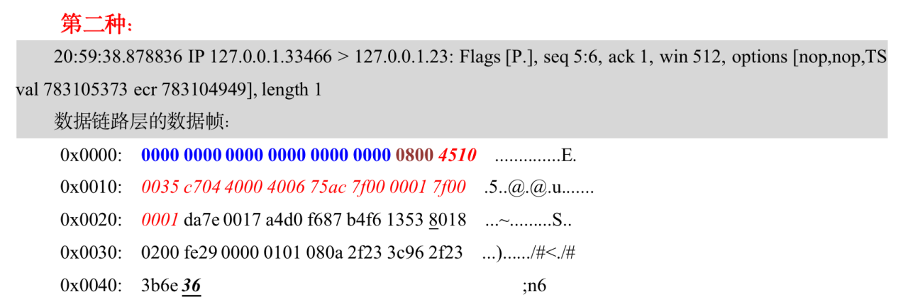

==**数据链路层占14个字节。**==


==**IP首部占20个字节：计算方法：5*4=20个字节。**==

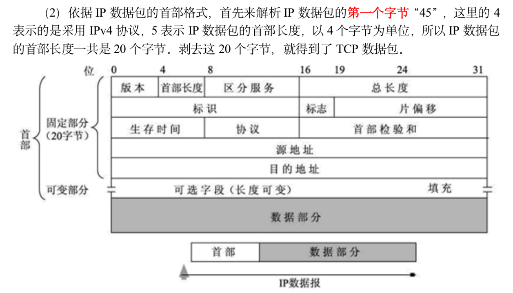

==TCP首部占32个字节，计算方法：8*4=32个字节，其中第13个字节的前4个比特表示TCP首部的长度。==

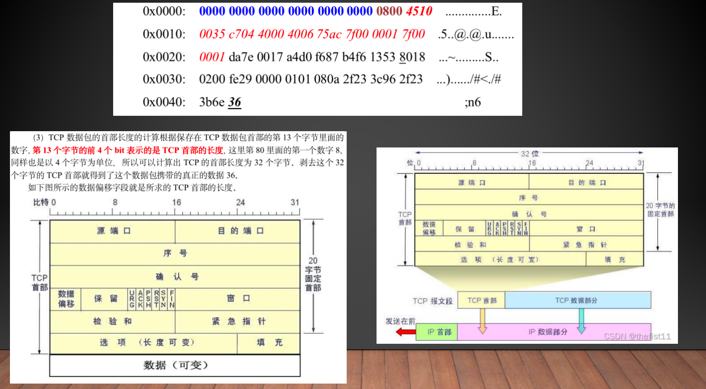

==除去数据链路层首部+IP首部+TCP首部以后，该数据包的内容是36。==

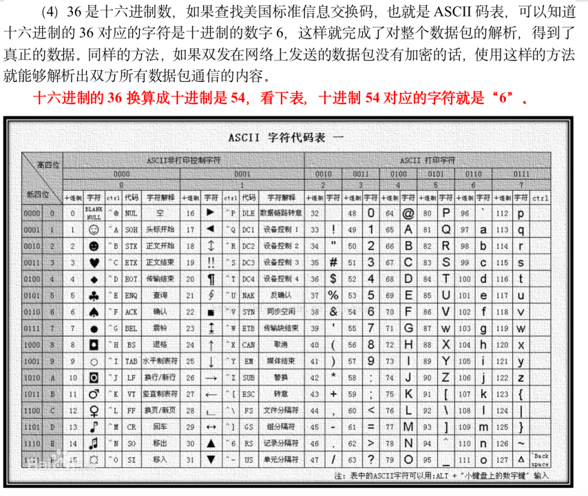

### （4）第二种解析方法，使用wireshark解析

```bash
[root@bogon ~]# yum -y install wireshark
[root@bogon ~]# yum -y install wireshark-gnome
//然后在图形界面下找到该软件即可。
```


==注意：这里能够破解的前提telnet在客户端和服务器端传输的数据都是明文传输的。如果是加密的就无法使用这种方法进行破解了。==

## 4、systemctl管理服务

可以使用systemctl命令来管理各类服务。

### （1）例如：管理sshd服务。

启动、查看、关闭、重新启动、开机自动启动、查询是否开机自动启动、停止开机自动启动。查看所有的服务。

```bash
#启动sshd服务
[root@bogon ~]# systemctl start sshd.service
#查看sshd服务状态
[root@bogon ~]# systemctl status sshd.service
#停止sshd服务
[root@bogon ~]# systemctl stop sshd.service
#重新启动sshd服务
[root@bogon ~]# systemctl restart sshd.service

#使sshd服务开机自动启动
[root@bogon ~]# systemctl enabled sshd.service
#查询sshd服务是否开机自启动
[root@bogon ~]# systemctl is-eabled sshd.service
#禁止sshd服务开机自启动
[root@bogon ~]# systemctl disable sshd.service

#列出系统中所有的service
[root@bogon ~]# systemctl list-units -t service
```

==SSH服务，22端口==

```bash
# 查看本机22端口
[root@almalinux ~]# netstat -atulpn  |grep :22
tcp        0      0 0.0.0.0:22              0.0.0.0:*               LISTEN      1000/sshd: /usr/sbi

```

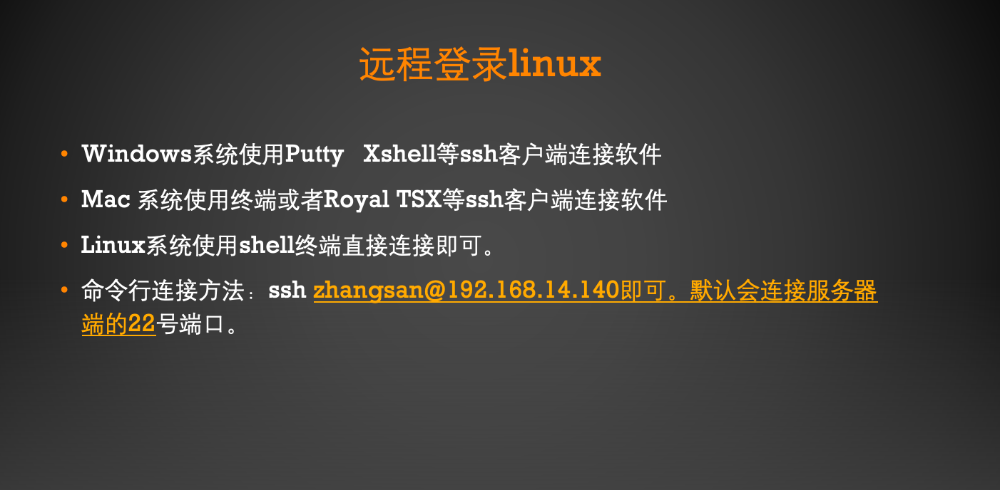

在Windows下使用MobaXterm登录（SSH）：


==scp命令利用22号端口进行文件和目录的上传和下载==

```bash
# mac客户端从Linux服务器上下载文件，如果是一个目录加上-r选项
lsr@bogon ~ % scp root@192.168.14.133:/etc/passwd /Users/lsr/Downloads

#把mac端的文件或者目录上传道linux服务器上，如果是一个目录加上-r选项
lsr@bogon ~ % scp a.png root@192.168.14.133:/root
```

### （2）使用XRDP远程访问Linux桌面

```bash
# 使用RDP协议，使用Windows远程桌面控制客户端来连接Linux。
# 也可以使用MobaXterm进行远程登录

# 服务器端需要安装xrdp，启动服务后，监听在3389号端口。
```

==XRDP协议介绍==


==安装xrdp，并启动==


==服务端监听在3389端口==


第一种方式：==Windows远程桌面登录Linux==


第二种方式：==使用MobaXterm==

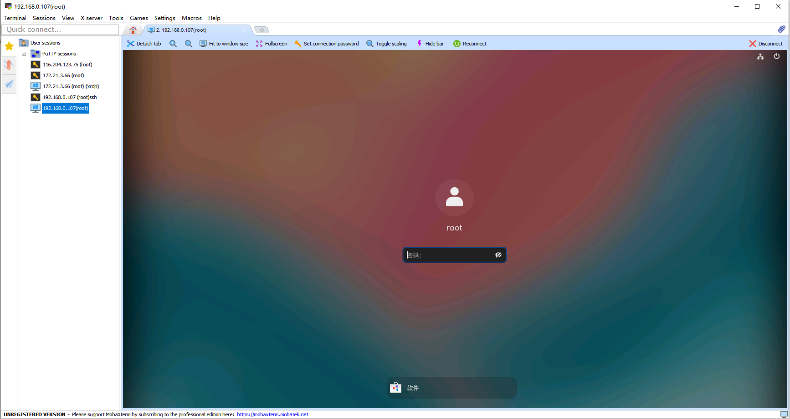

### （3）使用VNC远程桌面

参见课本13.4节，P225.有具体详细的配置方法。

```bash
# 服务器端安装tigthvnc-server
# 启动服务后，监听在5901端口

# 在Linux客户端安装 tightvnc后，连接VNC服务器

# 在Windows客户端使用VNC viewer连接服务器
```

### （4）webssh：在浏览器中使用ssh客户端连接linux

webssh是使用python开发的，官网地址：[webssh · PyPI](https://pypi.org/project/webssh/)

该工具可以实现在浏览器web页面中登录linux服务器。

操作步骤如下：

```bash
#安装
[root@localhost ~]# pip3 install webssh
#运行
# 第一种方法：直接运行wssh，使用默认8888端口
[root@localhost ~]# wssh

#也可使用下面的方法，来绑定ip地址和端口
# 通过绑定IP地址和端口启动
#[root@localhost ~]# wssh --address='192.168.83.129' --port=8888
#[root@localhost ~]#wssh --address='0.0.0.0' --port=8888
# 通过绑定IP地址和端口启动，只允许本地地址访问
#[root@localhost ~]# wssh --address='127.0.0.1' --port=8888

#另外启动一个shell终端，确认监听在8888端口
[root@localhost ~]# netstat -atulnp |grep 8888
tcp        0      0 0.0.0.0:8888            0.0.0.0:*               LISTEN      72521/python3
#防火墙放开8888端口
[root@localhost ~]# firewall-cmd --add-port=8888/tcp --permanent
[root@localhost ~]# firewall-cmd --reload
```

在客户端的浏览器中http://192.168.14.137:8888/   IP+端口，就可以进行ssh连接了，如下图所示：


在该页面中输入，Linux服务器的ip地址、端口、用户名和密码就可以在网页中连接到linux服务器了。

​    ![0](data:image/png;base64,iVBORw0KGgoAAAANSUhEUgAAAjAAAABnCAYAAAAe5XgJAAAAAXNSR0IArs4c6QAAIABJREFUeF7tnQnYVVXVx/dblmkTmUaDVCpqTmVRlDYYOQARSc6mpQIWWioODZZBpZVQ2gAFFZUSRVqKEwYGKaSG2SgqagNp4YRRSWqZxff81vet+x0O59yzz73n3vc97/tfz+OD6Llnr/3f++z132utvVfPY489tiFIhIAQEAJCQAgIASFQIwR6sgjMhg3/y2n8zxr1R6oKASEgBISAEBACAwCBTQjMf//738A///nPf4zA8A9/F5kZALNBXRQCQkAICAEhUBMEGgTGicq///3v8POf/zwsXrw4XH/99WHlypXhkUceqUl3pKYQEAJCQAgIASEwEBAwAgN5eeKJJ8L69evDt771rfCxj31MHpec0d9yyy3D5MmTw4UXXhjWrFkzEOaI+igEhIAQEAJCoM8h0PPoo49ugLzceuutYcKECWHVqlVdUXLrrbcOT37yk8MDDzzQcnvvf//7w/nnnx96enqMcO27777hJz/5Scvvi/nhoYceGi6++OLwxS9+0YhMb8vmm28e3v72t4c777zTSOiDDz4YHnrooVJqVTEWpRrs0sOnnHJKeO973xsGDRoULrnkkvCJT3xiE2yOP/74MH78+PDSl740LFmyJEydOjX84Q9/KK3hq1/96sC73vKWt4RPfvKT4dvf/vYm73jlK18ZPvKRj4Q3vOENNk8//elPh1//+tel2tp9993Dl770pbDZZps1fvf73/8+HHfccRu9p5ttPfvZzw4LFiwIu+22m60jBx10UPj73/9eql88HDNeMW3FvKeqcUfvXXfdNXzve98LO+ywQ3jKU54SVq9eHXbeeefS/e/WD2Lm6oEHHhimT58ewHvFihXhiCOOCP/85z83UjEG55g+xejDe5773OeGr3zlK4Hnn/WsZ4UzzjjDNpIuVcx53hWrD8+ee+654eijjw5HHnlkS7Ynpq2iuXrwwQfbt5MWbBTrXn+WnkceeWQDExMS8JznPKfR18svvzyMGzeuY30nTPWMZzwjvOxlL2u5jRe84AU2eV784hcHyAwDeemll7b8vpgfYkDABvJy5ZVXxvykI88wVsuWLQvow9i5YIT333//Um22OxannnqqEcmk/OMf/wgXXHBBOOmkk0rpUtXDs2fPNvKCl+x3v/tdeNOb3hQeffRRWwT/9a9/WTMjR44MixYtCvfff3+ABOy11172PPOpjDCP8V4SfsWAff7znw+nnXbaRq94+ctfbmQFXBij/fbbz+b/nnvuGW655Zbo5j7wgQ+YYVm3bl3jN+gPeXDpZlu0ec8994QXvehF4aabbgqvfe1rw5///Ofwkpe8JLpPPBgzXjFtxbynqnH3DtJf1qKFCxcacWMOYPD7osTO1d/85jfh8ccft28Hggaph6C5xOAc0/8YfXgP3+a1115r2PL9/PKXvwxf/vKXba4hVc35WH1okzGn/Sc96UmBNfALX/hCTJcbz8S0FTNXly9fbvgkN67Pf/7zbaOTRWxKKdnHH+55+OGHN7CAMimmTJliO/n58+eHH/zgB+H222/PVZ+JxILdTJo9Q5vsjMsai6z2tttuO/vAiggME42E5G4IbSGdam/p0qW22//MZz5j5OH0008PH/7wh8OvfvWr8KpXvWqTLnZyLPDgkC/FAocHY5dddgljxowxQvz9738/HHbYYZvow8eLMW91/hSN4bx58wwHFl/kq1/9anjPe94TDjnkkMauBO/V3nvvbQsj8vWvfz1MnDjRyECzuZ/VNhiwgOAJzCIw7BxPOOEE29394he/CMOGDbNcs6997WtGtGIFAjNt2jRbNPOkm21BWNihoxPzjx3phz70ISMyP/vZz2K7FWLGK6atmPdUOe50kAMPbCb4HmMEzzO/yZKiNeppT3tawxNCP5yMx7TrzxTNVTaB73jHO8IrXvEKI9ekFRx77LHhzW9+s/UTicE5VqcifXiPk+Thw4fb95OWquY8743Rh+fwokLcsT+tEJiYtmLmKpt4HxP+ZHP0ox/9yNbhO+64I3YYavlcz7p16zacc845ZgRh3LiccIdlydChQ8M111wTtt12W2PCf/vb32zR/+AHP9h4nAH94Q9/aJ4VnuED40/cYN/85jeNKcMKMSRPfepTjSghtI17vZWQUjMCw2TEiL7+9a83PSBdGFtCQX/5y18aevMBYGiZMOyUn/e859kuEp1PPPHEwMJBeAadMVLssPDEuOA2J2wAYbn55pvtYyekw2KQtRvDmBK6wEvBbqassAPHc/bCF76w8VO8CbT5tre9zf5b0XhVORZgccABB4QtttjC2mYhvu2228yVTniGBQh3NPNrn332sRAIWP30pz8NuKt9LHjmsssuszALzzAv8IqAO/OuVcHd/NnPfja8613vssU3S/BsQBC23357CwO0IkUEBjzuuuuusNNOO9lmYebMmZt4qZrNDScweJJ23HHHwE45bcR8Me9GW076+M4YQ/SCyJUlZmmss8arlbY6Oe54AJjzfGd44Hzt+sY3vmFEDsE7xkYNTPBoM/+HDBliBGb06NG2cSxao3i3fwuETtissQFgjSLkjxe2lY1S3lyFIOAZhGghfJ98k8yr973vfZmfRQzORd9Tnj5ukPFw+dqWfleZOV+kh///PH34/9gT7AieXTwgrRKYmLaS+sasUWxuGT++xf4uPWvXrt2AmwqXXBGB4WOFjcPu2D0ymVkk2Wl7zBuCg4F697vfbR8vRuM1r3lN+PjHP245COxCzz77bPsNoQ93hfNBQwJuuOGG0pjnERiM6L333msfOqTCvQHsgiEjGH8+/CuuuCKMHTvWFiBcprB8yM59990X3vrWtzbyFNhZDh482CYrpGbWrFkNXX0RgrgQqsBIvu51rzPCxp+415NCf9GPj8SNeZmOc0qMUBE64F2ALKR3dUXjVeVYpAkMffEds3/cv/3tb22xv+qqqyxngtwdFse7777bSA7Cv+OV409CdG984xttJwgxY0xaERZi5iLkCCKaXuwhE+QwEEOnTfRqVfIWPdogP+Sxxx6zTYCTPeZHepfUbG54CCmpH3kA7JBdutkW83DEiBFGMF1YR/Bqsa60InnjVbatTo87Gy48jbjv//rXvzbGEQLDxgdhXAgn7rHHHjbvmNc33nijzWvWEDZ7RWsUuVKsPaxNhDrBlc0L6xabLv7OnCoreXOVdZINpr/XPTBskCBdaSnCOVavPH1mzJhhKQJsggiN4LnF48zmr5U5364+vk5B2PHyonenCUzsGoVNYW5cdNFFtlnr79Jz//33b8B40OkiAgMYuOQBBuOEsHixqH7uc5+zv0Ns+Fg/+tGP2gfHbpOPAYOeTI7sRgjpmGOOsUmOwYSguGCkYPIsLnhNMI7oA2tF8CIR22ShgWknBQOIEUoTGJ6hz3izMIC0gTeHZ7/zne9sMplYiNjpp2PLsRMOIoD3AuKE8BGhL7v3ZPijaLz4bRVjkUVgWNjAlsWcRRCXK21NmjSp0U2ML54EyAM7UxZlnmNn4wJhxiPj3p1YjPw5yDnvJ1SDZyAtjDEfPOMOyYLgPvzww2WbaYxDVgiJhYXxghy7EHqhX2ni2WxuYCzZFOC1W7t2rXlwmAsk8fqC3s226AMEMzk2zHk8QxD3ViRvvMq21a1xZ93M87TSf88X4RvA65qUmDWK74E5wboCUWGt5pvi0AWkiNyLdM5VDO55hAFPJx5INlZsMLfaait7XZoox35fMbr4Gpb17Xi4HE/j1VdfbRs3PFDJjWGZOd+uPqyxbBo9RNMNAhO7RjEn5syZY+td2QMCsbj0ped67rvvvg0kIyFZBAbWywfILoAFmEkDA2aC484kzEIeBrsRBIPJB+eTnv9G2IYdR9ILUYXRdCDzPDDuVuR00o9//OMG7sSq+Sj4/xAvSESyDzzIh4t7thUCk0yqxf3LbjRrV7/NNtuYEWpFPI7OYsOuCEIGSUsSsZjxou0qxiKLwPi4nHnmmdZFMM4SP0GGV4I8imSeij/fLG+gGX6MOyQbl77rkfe8f/wQUeZ7K5JnFM466yzzPH7qU58yTyT/oA9XFkB60xI7Nxj/P/3pTzbHPAejm20RWsALkfSO8b3j7m/lEECz8SrTVjfHPYbAQDDZ0KQlZo0677zzGgSGjRFzzDeNtA2ZSW4KYudtsxAJmytOsTAPIdjkimV5GcrgXKRXnj7eBt8nffX8sWR+Xdk5X6RLM0KFxwz75rlzo0aNMg8vRJJcsFak2Vgk31e0RrGWY5PxNg8E6bn33ns3eB5FFoFhNwXzxoVJzktydwzLY5eTNP4MIknAsD/IDrtZ4nb8nYnnQrIp7RKSaVfyCAwhLnao6Z2Pu0Q5IcP/ZxfDpOQ9LL5+zLVVD0wMgSF8Q8IouqBDGXHPjufQ+G8Jv4E5xp4JHDNe/LaKscgiMHie3vnOd1pSLDlRxP9955jVX57lN+RFkaPkgteLMSFfoIyABwsvBBy8i8TJAF4gQlutSLNFmPCihwvZMeKduu666zZJ/iwzNzzcBiEnVwBhwe9WW4SGSdz2hE9CYnhfPGRcBsOi8Yptq+g9aZ3aHfd2CEzMGoXXwT0w3SIwSYw8gZZQfDJvMBbn2Pmc9+0QJoegsVEjjMXGmZQFvKaeX9iJOZ+nD7kvfjgAnEiHwCuGZyZ9fUK7fS8zV8GFNZ/1M+vgRJlvsS7P9qxZs2YD4SDIBW5QvCQQDhcmCUYWY8+NvOSOEH/EoGBAudiNfAYGj0Q1JhYGlhALeQUYVEIALLDssF2I/RJjxfXJ79h1e+5M7PFkdgksmLj+IQF4U/ioiEeTLY+bkbwW4vNMLGLTkAaytll0IE94k/wDgcigCx8qkiQwhJcItdE3+sW7CE0xcXHrsgMlydDDa5zAwGhD3MhPoe/Jj7+dHBgPzdAHTguQG4AHhh0Jfadf6BMzXvSz3bFgDrAbASM8TYSESASHPKAbOxRwo//8ya5z7ty5NocgKuRI4aHD8DG/GDdIBEmSzAl2m+D19Kc/Pfq78rwmvGvMX4R5ixFkZ4kwbnz0hF7Id2LeE2tOhmNiG0RPFjK+BfBEd0IePuZ4WfDsMA/xVnJXDO1keYaazQ10J8eKRYpxZsMA3pA/Ng5IN9tirAi3kcdDvhjGlnkPrkWnzJLYxoxXTFsx76lq3JkrbOK++93vWo4d4Q/WEN7vx6kJd7DGMT+clJMHw6YBiVmj8HCx5jB38eIxPwgTEBJl/WFtzcpNyZu7RXPVf0e4kk0HHnq8QCTqusTg7M8WrXVF+kAwIVF//OMfbX2FMIMrqQrklVU553lXkT7eL8YO7z6eQcYDG5m+K6fdvpeZq6wpeHSzci5j17G6PWcEhsU76R1JdwJ3Nx8PnhYmsV+iRYiCnRcGzO+NISRC9nPSC8H7AZVJ6MLOEe+NZ0rz4bPgYwCThr4ZoOR6EIdMC8wZA87kYYHBne1hMp5FHxYFX0T4b+yEIDf0BQNEEjLvx8giEANOE2QJGHASAO8BghcH0kQeDeQKcfLkv/eEVvKEMEBlxRNRHWf6DL4wbz++GjNetNvuWHAnDou3C7q4547kO9cVbxxj4QSR5/ngWSTJBWC82NmwyyIfBuG3kBDylcokeOeNFzsiP/XFQojrOXkpHMboqKOOKjUc7nVI/wij4yf68LhA5PGM+FFZSDZek3RScbO5wYKWvOcHrInHJz1M3WzLv52kFzErP6wI0Jjximkr5j1VjTvueoxoWthIQbr90sv0/2eXnLxzq2iNStahYz3Ca8ecpW084qxLyfW2GdYxcxVDCNl2LyFG0U9V+btjcI5Z62L04T1sPsj98n7y7fAtuVQ152P1cZ0895O/u0c/iX+zbzmmrTJzlXWStRViNVDECIwb2ZhOM1Hw2EA+su4gwBjygUIgIBd85M0SIklC5QPEkHdSWDCYMOjDx9dMPPzS7NheFbr6fQOtvOvwww83bxkTlvtX8Fpl7XiLxivZdhVjkbynIq9fxNUhfOzaIZNZArFlJw9JbuWIaBlMmRd483ANl73FuEw7PMt3AQGBzDS7R6nZ3OAdbAiIw2PM8m697WZbeFzYuWJYWk2AjsWyqra6Oe4xfSuzRsW8r9VnmHt4FvAcu4ej1Xf579pZ6/wdGGYIPwdD8u5pqmLOt9vX9O+r6HvMXCUFgk1g0lFQdV/62vtKE5i+1oGq9CHMQRgMg08y5DOf+UzL8vfjkFW1o/cIASEgBISAEBAC7SMgAvN/GOI25UI+CAy7cEJmWUdu24dcbxACQkAICAEhIATaRUAEpl0E9XshIASEgBAQAkKg6wiIwHQdcjUoBISAEBACQkAItIuACEy7COr3QkAICAEhIASEQNcREIHpAORknXOvDSe1ylTk7YAqemWFCHDPCSeVOn3KpkKV9SohIASEQL9FoFICw10eXObG3R4cdRyIcvDBB9uFctzdQEIw94xwfbwL96JQ+Zv7DPwKfe5y6C0p0qc3xhQCyGV9rVQm7xSOHA/nAjnu9+BSr7JShHPZ9+l5ISAEhMBAR2AjAsM9BFwi55cFcfMpi3asYHi4IZRCfBjvgSjcfssNvtz1QVl67sXh3hMXLtTjJmD+O0YNwsMNyL0lRfr0xphSEJQ7H7gHptPCxYWMGQKh5P6Z9D1Bfk25fxfcS8N9FF4LJUbHIpxj3qFnhIAQEAJC4P8R2IjAeE0QPAgcK27lEiOK4FGQDwLjJKbZRWRcPNTsQi9UjXlPzKDGtBXzTJ4+FH4kxMBFf4SOwBAsuJU3LXn1m9LP+a2tzfoXo3PRM830KTum7epcRXHJmPngz3Cp3pQpU+zmVAqhJS+CosTB8uXL7eI5vGkctYd0UoOFMhtlJXbci8arbLt6XggIASHQ3xDIJDDpuhfe6VNOOcXCIcmr17n5j2KPXB+OYOyosuuFviAnLPRcze8ydOhQqxcCYWKh5uZeQk8YB+Sggw6ymjEQH2qMcGU0he+yStZTV4fr86mxQ90hbqbFCHEBHTpxyzClAdjN0xa3B/Pn8ccf37ikrip9MIKUXeBqcGrhDB8+3EIhWd6oZoYMrwckEkLkhgxihIH1MgvcFkwNDq4WZzyoi7RmzRojS+CKFPUrOZmLCEzRmMboXDQW3DbJHCN/iH7gzUPoG/WDOhlS4ppyymSkCQy1htDJixWiD9eq83xsyYtYnIvw6W+Lj/ojBISAEGgHgVIEBoNC0UAWdYS6RZQLSFYPdgKDW37evHlWpI/6NkkDQGFDCuyxqyVcQB2inXfe2eqDcC26G0OICyEs3sPV6Ri4ZKEqLyiGYaMUAYQBg8/19CRcQmggSl4kkpLnGB6KByar5ValDySMonorV660ENHFF18cTj755FIEBrJDZWyIGOTNS8ZTR4hCh1TwhthREM4rEVNGAJzBGKIHBkhRv2INa9GYxupcNBbU86FYHfOAcM26detMRUgypLZMLSS8YBTR22KLLaw6M7W6+HfCdnjF0om4eQSGgn2UPEAH3kF9KUKDrUozoliET6tt6ndCQAgIgf6IQCkCw1X75LeQw0FxLQpZURAR4+phIjd21NLAcJBjQI0eihni9XCB1HjlZv7biBEjLEHSi2NRTIyqupAkDDQeFgoEUjCR33mhMcINVEFG2MFSQDFZRRqCRNEz3gfJoY4GO3xIEcWvqtKH91C8j9wIyhBg6O68807Tt4wHhqRZqiNT6Xrs2LEN/cAA8khRQww75I3kX8bDBUKIRwZDHdsvfy7GA5M3pjE646WLHYt2Q0gQYEgtnpt0FWuIC/ko6dyuPAIDPlTlZRzBCKE+E+Um0pVnYxaIZjjH4hPTjp4RAkJACPR3BEoRGAeDHSwGmoV877333gijZL6E/w+IBwaXAoRuAPCkQGxWr15tJ5Zw3fNOQgWIE5hkldX169db4iSkxg1B8jf8DuO+atUqC78gECUMPYXvXAhr4bGgGGJV+vAeyNekSZOMGFFhGiNKvygUSD+TkmfICInhiXCy4L/BYC5dujTw/zHCjAFEjErOSSFkhdGO7Zf/tojAeF5T1pjG6IyXLWYseH+7BAbCCKn2I+zMr9GjR9t8I5yYlZOVR2AgQyT3Ei6CIM+dO9fIC3hMmzat9PrQDOdYfEo3qh8IASEgBPohAqUJDImMuPnxrmBkSWjEWHu59SIC45Wek94Dcka4M6UMgWEsMESEWzAKkBK8D7w36YEh3DV//nwLJ0GaMGzTp0+3vw8bNixUqQ/kZdasWVYdmlwY3k3I58ADD7T8lBgCg6GfOXOmhdjGjx/f+Al/x/tCyXZIGh6BZOiOBznqCwZLliyJ7lcVBCZGZ/pUNBauC149cBs8eHDXPrk8AsO8ZH6RQwUhhWRQpXfOnDkbeRRjFW1GYGLxiW1LzwkBISAE+jMCpQgMyYwsspzS4N8RTtoQMmFhxoCyQ8UzQJ4JuQIs+JAF3OPsgnHdkx9DPgdhKAwuhppQ04IFC6wiNJ4W8kk8xMROGgPCezAe5HawI4YsQBogMhRgJG8ESRIYcmoIP5HQS4gHEkOoBW8G7yFfpCp96AO6z5gxI0yePDlz3uCNIZeH3TxGHa8NuR0c3V22bJkdH8ZQksRKIjOht4kTJ1rYjpAIRh2yBn48i2eLhGHyfAjBecgkpl9gVqRPzJjSZpHOeD+KxsIBw0sycuRIy2FBR+aT5zERSuuE5BEY5hy5RXhhII548ugvcy193LqZXkU489tYfDrRf71TCAgBIVA3BEoRGM/DSHfSCQM5Ll7BGWMLcSBx1nfSEA6IBJ4WTnz4aSZCURgJCACJkiS/4mFAMNYYc3JbMPqIG3X+nd0/Bp7fYvg47XT77bcbMULWrl1rd3skQ1Ek+UJk/LhslfqgN4m8ixcvNoOE4Z4wYUIDMnQj8TktGEhIB8YRj9TChQstV8MFnceMGWM5RwjEcNGiRWHIkCH2d0gcoSu8NJ7sWtSvcePGGVbN9IFcxoxpjM4xY0FfSE7G88G4ed9WrFhhocNWTv7EfJR5BAbiDNaENOkjpIp5zGm2MlKEM+Mei0+ZdvWsEBACQqC/IlCKwFQJAnkKnBTBUJU1Bnl6eDgI40/CqxtDjmlDDjDU5FdkXQVfpT54qTg1A6ng2DnepFaE0zh4a9A5b7ePkcfIQgKzcjuq7FdMH5rpDDGJGQtvh/yTQYMGWfJ1p6VZEi9tz5492zyCXO7YKSmLT6f00HuFgBAQAnVAIJPAsMvHE0IeR1+XUaNGWdgJQ01yJeEsPB7cAyMRAjEITJ061fKU8LCk74Hx3xPuJN8rnbQe8349IwSEgBAQAtUjsBGBId8BVzfHcAkBcTdLK0dFq1cz/43k4HABHgSGfAnud/GQRzf1UFv1RIA5z3F3wpScliNc1NfnfD2RltZCQAgIgWoRqLSYY7Wq6W1CQAgIASEgBISAEMhGQARGM0MICAEhIASEgBCoHQIiMLUbMiksBISAEBACQkAIiMB0YA5weoa7Szhh5bfBdqAZvbLLCFBfi6KaWafYuqyKmhMCQkAIDHgEKiUw1MThyDBJkFzfPhCFkyoUYOReFxKLubmYo9QuFBM8//zz7V4anuE2Y24P7i0p0qc3xhQCSEmETlafLos3yb5cwshlgVRrlwgBISAEhEDvIrARgeEODy4K80vfuPMiXfSumboYHq63p8BgVgHD3u1qd1rnVl8u9tt///3tJmLu9thmm20ajXM5Hbfq8t8hDxCeSy+9tDvKZbRSpE9vjCm3NnPLMPfbdFq4AJExQyCU3KuTvnOHshlURvfvgvt2KNpJXS6JEBACQkAI9A4CmffA4EHgePKtt95aWqtkLSQnMVkXrPmLuWCO23abScx7YhSNaSvmmTx9KCBJiIEL+ggdgSFF/ziim5ZmNXGSz9JWM/x4NkbnomdiiznGjEW7OrdbzDFmLiSf2X333cOUKVPCoYceusk9MBT9XL58uZWfwJvGkX1I5xFHHBEuuuiisk3peSEgBISAEKgIgVI38VL/iHCIlwBAB65Av/DCC61EAAKBOfPMM+06ey79gpyw0HPFv8vQoUPDNddcE7bddlszvtzOSugJ44Bwiy11gDDcN998s+1+n3jiCfNUYDiSQiXkww47zMoWULeGGjVcRsZFduhE+QFKDLCbpy1u/eVPyh74ZXdV6YMR5PI/LkSjPtHw4cMtFJLljWpGGPB6QCIhRE48IEYYWL9Kn1uHL7vsMiuZwHhwbw8FIyFL4IoU9SuJYxGBKRrTGJ2LxoJbh5lj5A/RD7x5CH2jSnknQ0p5N/FyqzI6UeoCYoVQuJTnO1XWoKJvW68RAkJACPRrBEoRGAwKV/SzqCPUpuF6/mRVZCcwuOXnzZsX2MFyOVjSAFBEkerK7GoJF1DPiEvzCGFRP8iNIcSFEBbvoXYRBo4/b7rpJmufQoZjx441w8Z18xAGDD51g0i4hNBAlLwQIHWZMDwUmuTCO79puCp9IGHUQVq5cqWFiKjpdPLJJ5ciMJAdKmxDxCBvEBkIGlW0KeBIlWaI3d13321t8Cc1qsAZjCF6YIAU9assgckb01idi8bihBNOsErnzAPCNRRPdJIMqfUaTzFfJF4w6hZxKSMhIG6W5t8J2+EVSyfi5hGYnXbaKdxxxx1G1HkH9aUIDUqEgBAQAkKgdxEoRWC4sp/8FnI4uFqdSsqUHcC4epjDCQzJqRgOcgwoaEgBRrweLpAarzbNfxsxYoQlSPJOhOJ555xzjpEkDDQeFm5KpVgiv8NoYqzZFe+55572G3b4FH1MVqOGIO2xxx72PkjOXXfdZTt8SBHFD6vSh/dQ7ZrcCMoZYOi44RV9y3hgSJq94IILwlVXXWXkzMULaVKsEcMOeSP5l/FwgRDikcFQx/bLn4vxwOSNaYzOeOlix6LdEBIEGFKL58arc3s/IS7k/aRzu5rVQtprr71sHMEIoe4UZSt0Y2/vLl5qXQgIgYGNQCkC41Cxg8XiEIUEAAAHvklEQVRAs5Cna8Mkc2D8eYgHBvfwww9vGAA8KRCb1atX24klwj68k1BBksAkq0ivX7/eEichNW5wk7/hdxj3VatWWfgFgShh6LfaaqvGSBPWwmPhnhz60a4+vBzyNWnSJCNGO+64oxlR+rX99ttbP5OSRxgIieGJcLLgv8FgLl26NPD/McKMAUTskksu2ei9hKww2m5oi/oVS2BoL0nEkmMaozNetpixQJ92CQx6Qqr9CDvza/To0TbfCCdm5RTlERjIEMm9hIsgyHPnzjXyAh7Tpk0b2KuHei8EhIAQ6EUEShMYEhlx8+NdwciS0IixJi8AKSIwXjE66T0gZ4Q7U8oQGNrCEBFugQxASvA+8N6kB4Zw1/z58y2chDHHsE2fPt3+PmzYsFClPpCXWbNmhR122MHCU7ybkA+FAslPiSEwGPqZM2daiG38+PGNn/B3vC8nnXSSkTQ8AsnQHQ9y1BcMlixZEt2vKghMjM70qWgsXBe8euA2ePDgrn0aeQSGecn8IocKQgoJu+2228KcOXM28ih2TVE1JASEgBAQAoZAKQJDMiNG6J577rHERoSTNoRMWOQxoOxQ8QyQZ0KuAAs+ZIHwAbtgXPfkUpDPQRgKg4uhJtS0YMECqyyNp4V8Eg8xsZPGgPAejAe5HeyIIQuQBogMhRzJG0GSBIacGsJPJPQS4oHEEGrBm8F7yBepSh/6gO4zZswIkydPzpxieGPI5WE3j1HHa0NuB0d3ly1bZseHMZQksZLITOht4sSJFrYjJIJRh6yBH8/i2SJhmDwfQnAeMonpF5gV6RMzprRZpDPej6KxcMDwkowcOdJyWNCR+eR5TITSOiF5BIY5R24RXhiII548+stcSx+37oReeqcQEAJCQAhkI1CKwHgeRvpVThjIcfFK0BhbiAOJs76ThnBAJPC0nHHGGY3TTIRwMBIQABIlSX7Fw4BgrDHm5LZg9BE36vw7u38MPL/F8HHaiYraECNk7dq1drdHMhRFki9EBiKGVKkPepPIu3jxYjPYGO4JEyY0IEM3Ep/TgoGEdGAc8UgtXLjQcjVc0HnMmDGWc4RADBctWhSGDBlif4fEEbrCS+PJrkX9GjdunGHVTB/IZcyYxugcMxb0heRkPB+Mm/dtxYoVFjrs1MmfPAIDcQZrcqjoI6SKecxpNokQEAJCQAj0HgKlCEyVapKnwEkRDFVVxsDDQRh/Tku5MeSYNuQAQ01+RdZV8FXqg5eKUzOQCo6d401qRTiNg7cGnfN2+xh5jCwkMCu3o8p+xfShmc4Qk5ix8HbIPxk0aJAlX3damiXx0vbs2bPNI8jljhIhIASEgBDofQQyCQy7fDwhfsy499XM12DUqFEWdsJQk1xJOAuPh9/x0pd1l259A4GpU6danhIeFpKu3TOX1I5wJ/le6aT1vtEDaSEEhIAQGHgIbERgyHcgpMAxXEJA3M3S14+KkoPDBXgQGPIluN/FQx4DbzjV47IIMOc57k6YkpNVhIv6+pwv20c9LwSEgBDojwhUWsyxPwKkPgkBISAEhIAQEAJ9DwERmL43JtJICAgBISAEhIAQKEBABEZTRAgIASEgBISAEKgdAiIwtRsyKSwEhIAQEAJCQAiIwGgOCAEhIASEgBAQArVDQASmdkMmhYWAEBACQkAICAERGM0BISAEhIAQEAJCoHYIiMDUbsiksBAQAkJACAgBISACozkgBISAEBACQkAI1A4BEZjaDZkUFgJCQAgIASEgBERgNAeEgBAQAkJACAiB2iEgAlO7IZPCQkAICAEhIASEgAiM5oAQEAJCQAgIASFQOwREYGo3ZFJYCAgBISAEhIAQEIHRHBACQkAICAEhIARqh4AITO2GTAoLASEgBISAEBACIjCaA0JACAgBISAEhEDtEBCBqd2QSWEhIASEgBAQAkJABEZzQAgIASEgBISAEKgdAiIwtRsyKSwEhIAQEAJCQAiIwGgOCAEhIASEgBAQArVDQASmdkMmhYWAEBACQkAICAERGM0BISAEhIAQEAJCoHYIiMDUbsiksBAQAkJACAgBISACozkgBISAEBACQkAI1A4BEZjaDZkUFgJCQAgIASEgBERgNAeEgBAQAkJACAiB2iEgAlO7IZPCQkAICAEhIASEgAiM5oAQEAJCQAgIASFQOwREYGo3ZFJYCAgBISAEhIAQEIHRHBACQkAICAEhIARqh4AITO2GTAoLASEgBISAEBACIjCaA0JACAgBISAEhEDtEBCBqd2QSWEhIASEgBAQAkJABEZzQAgIASEgBISAEKgdAiIwtRsyKSwEhIAQEAJCQAiIwGgOCAEhIASEgBAQArVDQASmdkMmhYWAEBACQkAICAERGM0BISAEhIAQEAJCoHYIiMDUbsiksBAQAkJACAgBISACozkgBISAEBACQkAI1A4BEZjaDZkUFgJCQAgIASEgBERgNAeEgBAQAkJACAiB2iEgAlO7IZPCQkAICAEhIASEgAiM5oAQEAJCQAgIASFQOwREYGo3ZFJYCAgBISAEhIAQEIHRHBACQkAICAEhIARqh4AITO2GTAoLASEgBISAEBACIjCaA0JACAgBISAEhEDtEBCBqd2QSWEhIASEgBAQAkJABEZzQAgIASEgBISAEKgdAv8D30VIZtjrnKkAAAAASUVORK5CYII=)

是不是很方便？赶快来试一试吧？

这里还有详细的教程：[WebSSH - 网页上的SSH终端，好用果断装一个！ - 简书 (jianshu.com)](https://www.jianshu.com/p/af2a765c4c4c)

webssh也可以使用容器的方式进行部署。尝试一下。

<center><font color="red" size="6">
本讲小结
</font></center>

------

------

[TOC]

------

------

