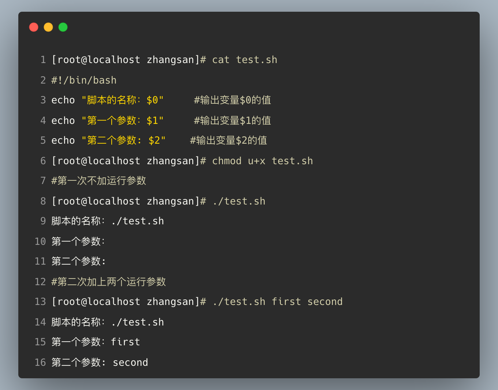
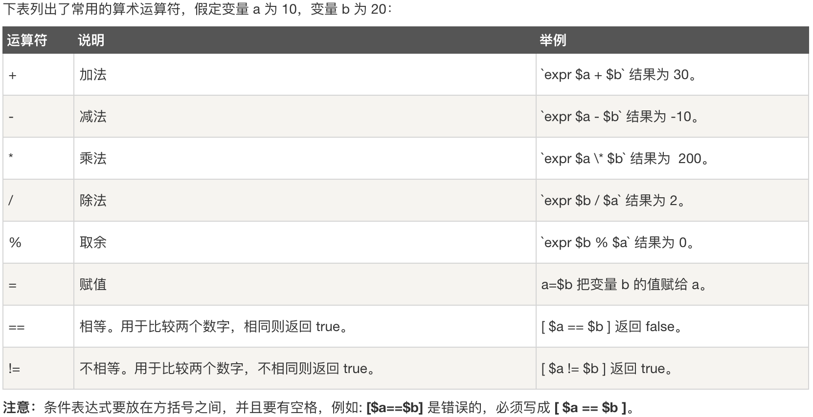
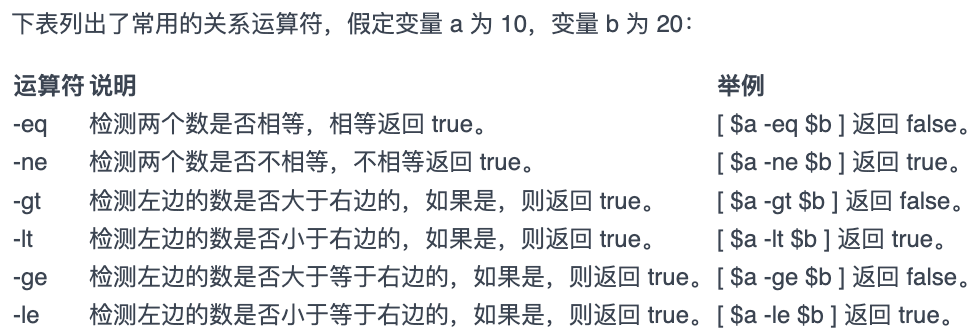
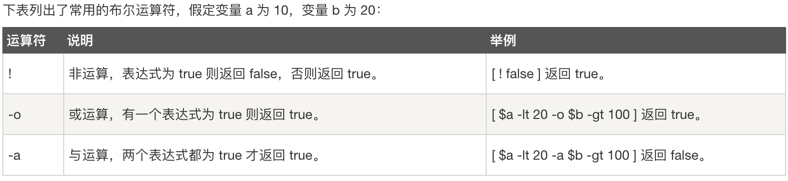
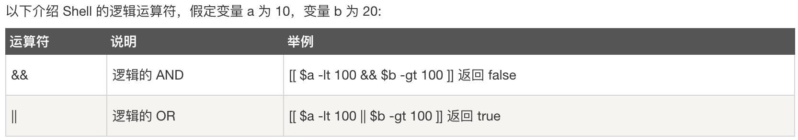
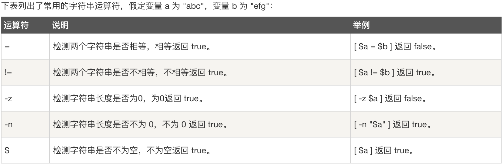
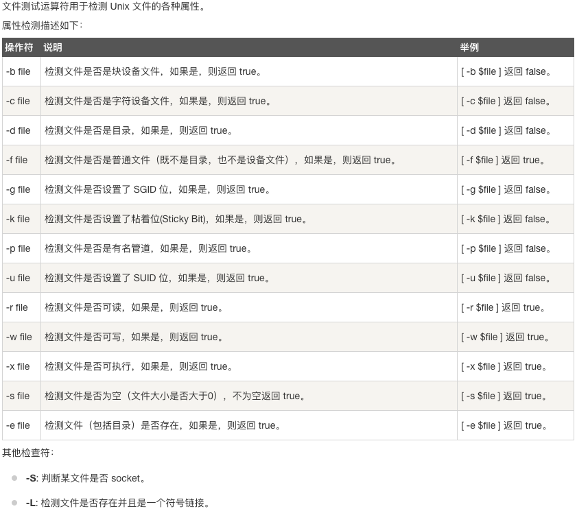
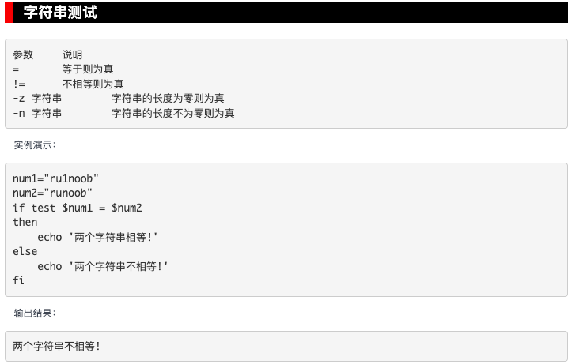
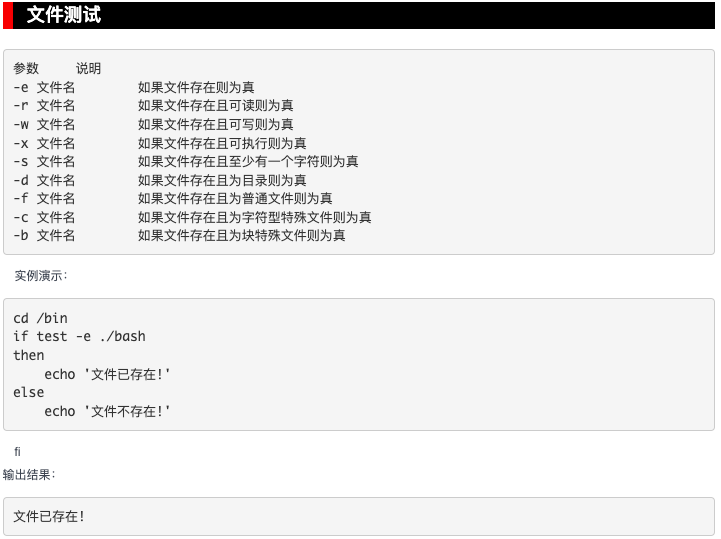
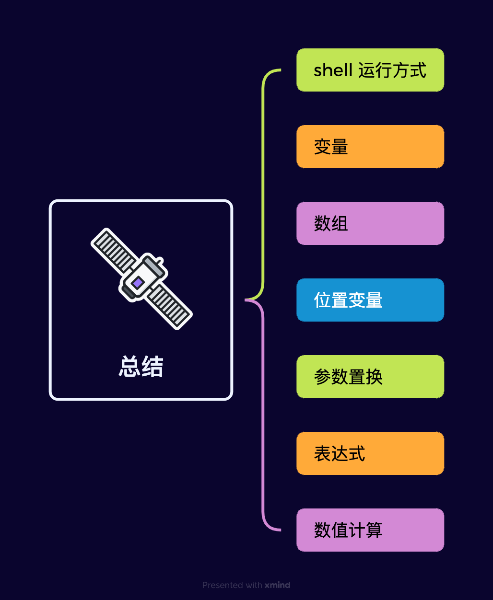

# Linux漫谈系列--shell 编程（1）

本节主要介绍 Linux 系统中的 shell 编程的基础知识。包括：变量、数据类型、数组、字符串、位置参数、参数置换变量、表达式等基础知识。

## 0、Linux 的色彩

在 Linux 终端中，通常可以看到不同颜色的文件，那么其含义是什么？

黄颜色代表该文件具有可执行权限。

## 1、Linux 的可执行权限

- Windows 依赖文件扩展名：

​		myprogram.exe 

- Linux 依赖可执行权限

  

你需要了解 Linux 系统的可执行的含义。

## 2、第一个 hello.sh

编辑器的问题

- gedit
- vi
- nano

如上图所示：shell 程序有三种运行方法。

- （1）直接使用bash hello.sh 运行
- （2）赋予 hello.sh 可执行权限，chmod u+x hello.sh 然后用 ./hello.sh 运行
- （3）把 hello.sh 的所在的目录加入环境变量PATH，然后可以直接在终端中输入hello.sh 运行

## 3、变量

- （1）系统环境变量

  

- （2）用户定义变量

  变量的设置规则

  全局变量和局部变量 export

  

  删除变量 unset

  只读变量 readonly

  

- （3）单引号''和双引号""的区别

- （4）斜引号``或者$() 的用法

- （5）变量的累加赋值

  

- （6）一个特殊的变量 $?

  

- （7）从键盘读入数值赋给变量

- （8）变量的 5 种赋值方法（参考：**/root/temp/jichu01.sh脚本**）

- （9）变量的声明（默认变量是字符串类型）

## 4、参数置换变量

- （1）变量=${var:-"new hello"} 如果 var 设置了值，那么变量的值就是var 的值；如果var 没有定义，变量的值就是new hello。

  但是var 的值不改变。（不修改原变量）

- （2）变量=${var:="new hello"} 如果 var 设置了值，那么变量的值就是var 的值；如果var 没有定义，变量的值就是new hello。

  但是var 的值会也会被改变为new hello（也就是说会修改原变量）

- （3）变量=${var:?"new hello"} 如果 var 设置了值，那么变量的值就是var 的值；如果var 没有定义，则显示 new hello 并退出 shell。这种方式通常用于出错提示。

- （4）变量=${var:+"new hello"} 如果 var 设置了值，那么变量的值就是new hello；如果var没有定义，则不给变量赋值。

## 5、位置参数

在程序运行的时候，向程序的内部传递参数。每次运行都可以设置不同的参数。

参考：/root/examplesh/test.sh

上述例子说明了三个变量的用法：$0  $1   $2

参考：/root/examplesh/test7.sh

这里演示了$1,   $#,   $*三个变量的用法。

总结一下：

命令行示例：
┌───────────────────────────────┐
│ ./script.sh    苹果    香蕉    "蓝莓  汁"      100 │
└─────────────────┬─────────────┘
                  ▼
┌───────┬──────┬───────┬─────────────┬─────┐
│  $0        │  $1     │  $2    │     $3           │ $4                                │
├───────┼──────┼───────┼─────────────┼─────┤
│script.sh │ 苹果  │ 香蕉│ "蓝莓  汁"   │ 100                              │
└───────┴──────┴───────┴─────────────┴─────┘

关键说明：
1. $0 始终是脚本/程序名称
2. 参数按空格分割，用引号可保留空格（如$3）
3.  $#表示总共有几个位置变量
4. $*可以代表所有的变量，参考上图使用for循环输出所有变量。

## 6、shell编程之数学运算

shell编程本身不擅长数学运算，但是很多程序中要用到数学运算。常见的数学运算方法必须要掌握。

参考：/root/temp/jichu02.sh

## 7、数组

### 例1

参考：/root/temp/sh02.sh 一般数组和关联数组的定义和使用。

上述程序的运行结果为：

### 例2

第2个示例，读取一个文件，把该文件的每一行赋值给数组的一个元素。

参考：/root/temp/sh03.sh

### 例3

第3个数组有关的示例，和上述要求一样，但是这次采用while循环来读取文件内容，然后赋值给数组。

参考：/root/temp/sh04.sh

提示：运行该程序时，需要自己从键盘输入需要读取的文件。

### 例4

下面在举一个使用数组进行统一的例子。

参考：/root/temp/sh05.sh

第一步，在当前目录下新建一个文件student.txt的文件，内容如下：（每一行，两个字段间以空格来分隔）

zhao 男
qian 男
sun  女
li   男

使用下面的脚本程序，按照性别进行分类统计，计算男生有几人，女生有几人。

运行结果如下：

提示：该程序使用declare -A stu 显式的声明了一个数组。

### 例 5

参考：/root/temp/sh07.sh

本例题要实现一个批量新建用户的功能，和上述例题类似。首先建立一个名为user1.txt 的文件，内容如下所示：

test_user1 123456
test_user2 123456
test_user3 123456
test_user4 123456

然后运行如下的程序，就可以按照user1.txt 文件中指定的用户名和密码，批量一次性的创建用户。

提示：该程序的运行方式为：bash sh07.sh user1.txt

提醒：该程序运行后，会在系统中创建用户，不太安全，如果想要清除这些用户，可以运行如下程序。

/root/temp/sh08.sh。

## 8、字符串操作

常见的字符串操作，获取长度，提取子串等操作。

## 9、表达式

### 1、算术运算符

例题：/root/examplesh/test8.sh

### 2、关系运算符

用来进行数字之间的比较。

例题：

### 3、布尔运算符

例题：用 [   ]

### 4、逻辑运算符

例题：逻辑运算符用 [[    ]]

### 5、字符串运算符

例题：

### 6、文件测试符

例题：

### 7、test 测试命令

test可以测试某个条件是否成立，可以对数值 、字符 、文件三个方面的测试。

在使用 test 命令时，不需要使用 [  ]运算符

- （1）数值测试

- （2）字符串测试

- （3）文件测试

## 10、shell 编程基础总结

## 随堂测试

