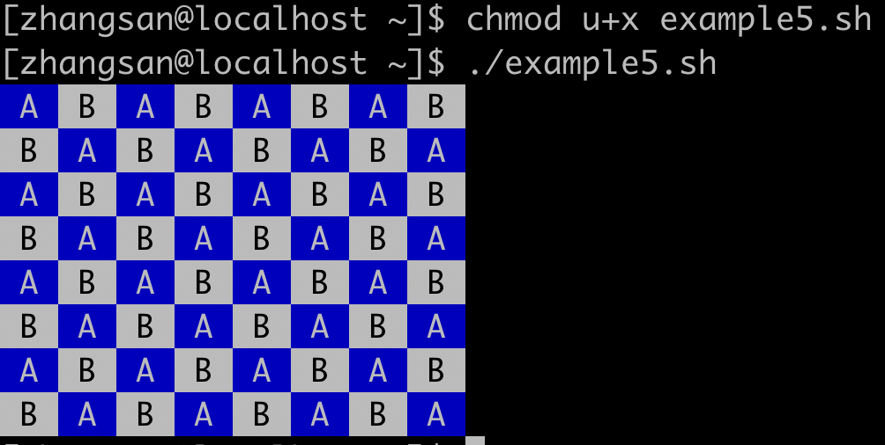
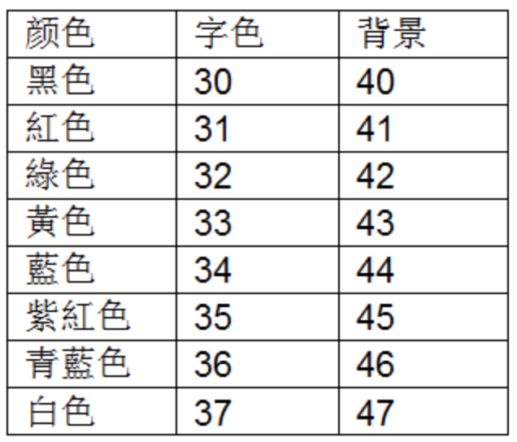
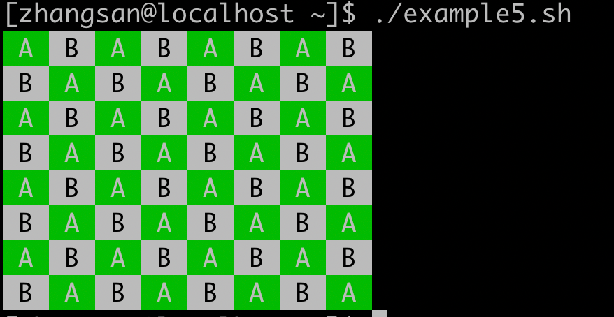

# Linux漫谈系列--shell 编程（2）

本节主要介绍流程控制语句、循环控制语句、函数等编程知识。并在最后给出了一些实践应用的示例。

## 1、判断语句 if

三种判断语句：

例题：嵌套举例

## 2、多分支选择

一个比较复杂的例子：/root/examplesh/example30.sh

统计内存中出于各种状态的进程分别有多少个？使用了多分支选择。

运行结果如下：

## 3、for 循环

### 例题 

常见的两种循环：

再举两个循环的例子：

用数值列表循环。

## 4、while 循环

## 5、until 循环

## 6、三种无限循环

## 7、continue和break语句

## 8、函数

### （1）不带返回值的函数

### （2）带返回值的函数

提示：返回值通过 $? 变量返回。

### （3）向函数内部传递参数

通过位置参数向子函数传递参数。

### （4）文件引用

在一个文件中定义变量和函数，在另一个文件中引用。

## 9、有趣的程序

### （1）fork 炸弹

### （2）汉诺塔游戏

### （3）单词练习小游戏

### （4）窃取用户的密码

该程序运行过程为：

## 10、企业面试实战项目

### （1）探测主机信息

运行结果如下：

### （2）测试局域网里面有多少台主机

- 第一个例子，用单线程扫描，速度慢

- 第二个例子，用多线程扫描，速度快

### （3）从网络获取天气预报

运行结果为：

## 11、实践项目（实验报告参考）

### （1）实验参考 第一题

### （2）实验参考 第二题

### （3）实验参考 第三题

### （4）实验参考 第四题

### （5）实验参考 第五题

运行结果如下：

字符背景色和前景色的设置的解释：

例如把这里的背景色44更改为42，那么程序运行如下所示：

### （6）实验参考 第 六题

### （7）实验参考 第七题

例

运行结果如下：

## 12、推荐两个学习 Linux的网站

- [Bash 脚本教程 - 网道 (wangdoc.com)](https://wangdoc.com/bash/)  阮一峰的shell教程，值得一看。
- [菜鸟教程](https://www.runoob.com/linux/linux-tutorial.html)  Linux 基础和 shell 编程基础

## 随堂测试

