# Linux漫谈系列--用户管理

## 0、用户分类

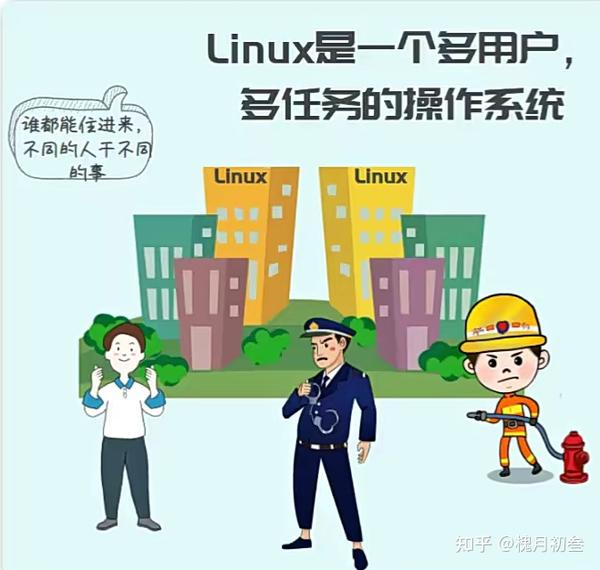

用户可以分三类：

- 超级用户: 拥有一切权限。
- 系统用户或者叫伪用户：这类用户只有用户名，没有密码，不能登录系统，一般是各类服务使用。
- 普通用户：需要配置密码后，可以登录系统，但是权限受限制。

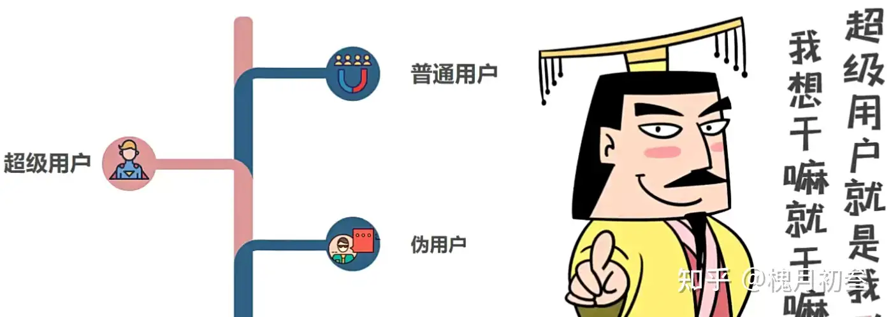

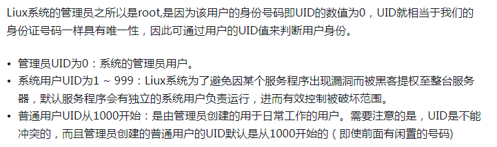

识别用户的唯一依据是用户 ID，称为 UID。每个用户的 UID 都是唯一的，是用户身份的唯一标识，而不是用户名字。

那么系统里面的用户究竟有多少个，每个用户的信息都有啥？

和用户相关的信息都保存在/etc/passwd 文件中。

## 1、用户相关信息有哪些？

认识一下 Linux 系统中一个重要的文件/etc/passwd.

以root 用户为例：

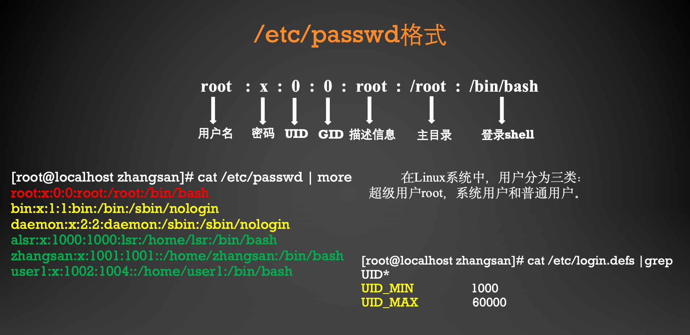

上图中不同的颜色表示不同的用户分类。

结合一下 shell 编程的知识，可以编写一个 shell 程序，按照三种不同用户分类，统计一下每个类别的用户有几个，怎么写呢？

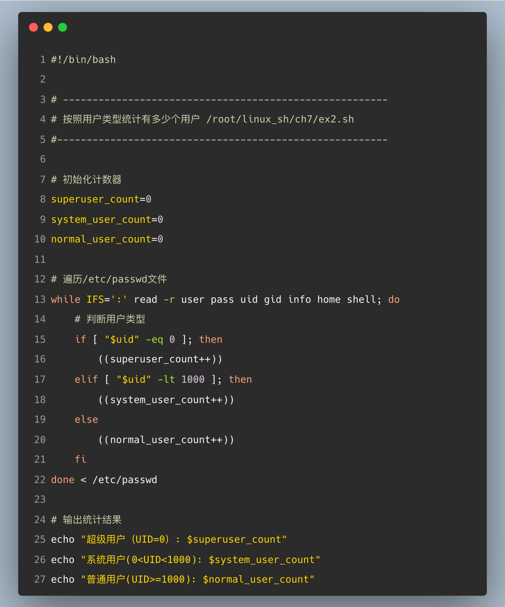

上述程序运行结果如下：

## 2、密码是如何加密及存储的呢？

### （1）密码放在哪儿了？

另外一个重要的文件/etc/shadow，放的是所有用户的密码。

以zhangsan 用户为例说明密码存在哪里？

咱们使用deepseek 来解读一下：

------

以下是 ‌**/etc/shadow**‌ 文件格式的详细说明，基于Linux系统中用户账户安全管理的核心设计。

------

#### 1. ‌**文件结构与字段说明**‌

每行对应一个用户账户，由9个冒号分隔的字段组成，格式如下：
`username:password:last_change:min_days:max_days:warn_days:inactive_days:expire_date:reserved`‌

| 字段序号 | 字段名称        | 描述                                                         |
| -------- | --------------- | ------------------------------------------------------------ |
| 1        | `username`      | 用户名，与`/etc/passwd`中的用户名一致‌。                      |
| 2        | `password`      | ‌**加密后的密码**‌：使用哈希算法（如SHA-256、SHA-512）加密的字符串；`!`或`*`表示账户被锁定；空字段表示无密码。 |
| 3        | `last_change`   | 密码最后修改时间，以距离1970-01-01的天数表示‌。               |
| 4        | `min_days`      | 密码修改最小间隔天数（0表示可随时修改）‌37。                  |
| 5        | `max_days`      | 密码有效期（如99999表示永不过期）‌。                          |
| 6        | `warn_days`     | 密码过期前警告天数（提醒用户修改密码）‌。                     |
| 7        | `inactive_days` | 密码过期后账户宽限天数（超时则锁定账户）‌。                   |
| 8        | `expire_date`   | 账户绝对过期时间（距离1970-01-01的天数，超时后账户失效）‌。   |
| 9        | `reserved`      | 保留字段，未使用‌。                                           |

------

#### 2. ‌**时间字段的计算规则**‌

- ‌**last_change**‌、‌**expire_date**‌ 等时间字段均以‌**Unix纪元（1970-01-01）为起点**‌的天数表示‌。
- 例如：`last_change=19300` 表示密码最后一次修改时间为1970年后的第19300天（约2023年）‌。

------

***<u>Unix 纪元（1970年1月1日世界协调时UTC零点）</u>***

例如：

**举例：密码过期时间的计算(1970年1月1日以来的天数)**

**/root/linux_sh/ch7/user_ex4.sh**

那么如何计算unix 纪元开始的秒和日期的计算呢？

接着上图，计算如下：

看懂了么？

#### 3. ‌**有趣的chage 命令**‌

- ‌第一种方式：**锁定账户**‌：在密码字段前添加`!`或`*`（如`!$6$...`）‌。
- ‌第二种方式：**强制密码过期**‌：设置`max_days`为有限天数，并配合`warn_days`提醒用户‌。

可以使用chage命令设置用户密码的过期时间。一种特殊情况是设置立刻过期。用户必须立刻修改密码。

chage -d 0 username  

这种情况适合管理员管理用户的密码。

比如，管理一个班级的学生，每一个同学的初始密码都是123456，然后通过这样的设置后，每个同学第一次登录后，必须修改自己的密码，这样便于管理，并且增强了用户安全和隐私。

/etc/shadow文件实现了用户密码的安全存储与生命周期管理，是Linux系统账户安全的核心机制‌。

### （2）Linux 用户口令加密详解

玩一玩Linux 如何加密的！

#### 0、有趣的密码

猜一猜：这里的密码都是哪些诗句？

**答案：参见最后一节**

#### 1、详解密码字段

比如zhangsan 用户的密码在注册时候，明文是123456，Linux 在存储到/etc/shadow 文件的时候，是明文存储的？还是加密存储的？我们怎么知道采用了什么加密算法呢？

以前的Linux 采用的是这种方式：加盐哈希（分为三个字段）

现在新版本的 Linux 采用的是这种方式：（分为四个字段，进行多轮次哈希）

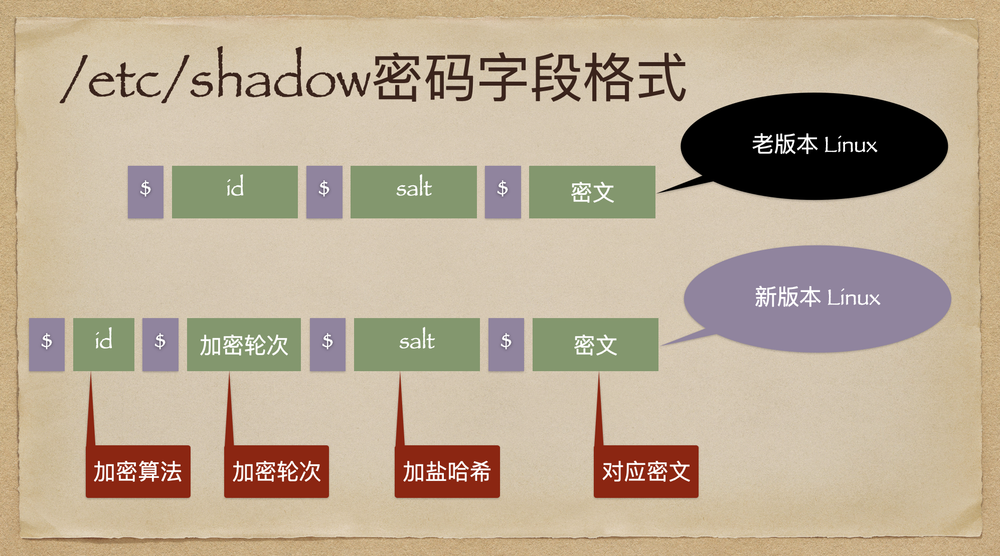

解释三个疑惑：

第一个：如何知道是哪种加密算法？如下图所示：

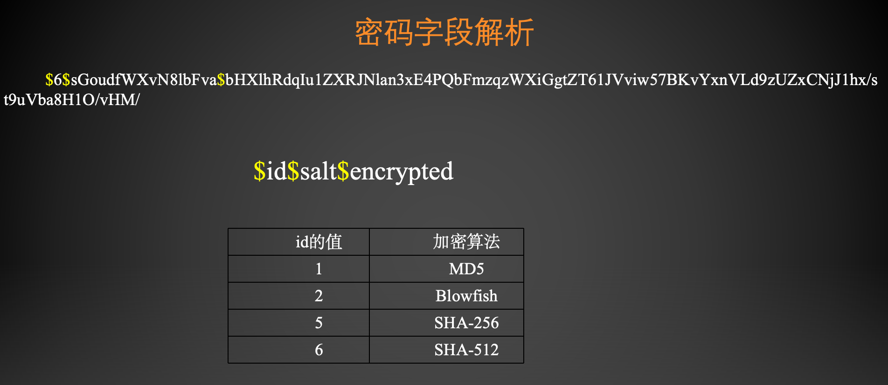

第二个：啥是加盐哈希？

第三个：为啥新版本 Linux 要多轮次哈希？

在密码学中，**轮次（rounds）** 是指哈希算法重复执行的次数。这是现代密码存储中的重要安全机制。

实战一下：

实战之前，讲点基础知识：

#### 2、OpenSSL 介绍

OpenSSL 是一套开源的、跨平台的密码学库和工具集，广泛应用于各种网络服务和应用程序中，以实现安全的网络通信。以下是关于 OpenSSL 的详细解析： 

核心功能如下：

- 加密算法支持 OpenSSL 提供了丰富的对称、非对称加密算法实现，包括但不限于： 对称加密：AES（不同模式）、Blowfish、CAST、DES、IDEA、RC2、RC4、Triple DES等。 非对称加密：RSA、DSA、ECDSA、Ed25519、Ed448等。 哈希函数：MD5、SHA-1、SHA-2（SHA-224、SHA-256、SHA-384、SHA-512）、SHA-3、RIPEMD等。 消息认证码（MACs）：HMAC、CMAC等。 
- SSL/TLS 支持 协议实现：OpenSSL 实现了 SSLv3、TLS 1.0、TLS 1.1、TLS 1.2、TLS 1.3 等多个版本的协议，用于在互联网上建立安全的、加密的数据传输通道。 证书管理：支持证书的生成、签署、验证、吊销、转换格式等操作。 密钥交换：支持多种密钥交换算法，如 RSA、Diffie-Hellman、ECDH、FFDHE、PSK等。 密码套件：组合使用上述加密、认证和密钥交换算法，形成可供 SSL/TLS 协商的密码套件列表。
- 工具集 OpenSSL 提供了一系列命令行工具，用于执行各种密码学相关任务，如： openssl：多功能工具，能够生成密钥、证书请求、自签名证书，进行加密解密、哈希计算、数字签名验证、证书链验证、协议握手模拟等。

#### 3、实战简单加密

Linux 对于明文 123456 的加密分为三种情况：

- 第一种是直接加密linux_sh/ch7/jiami01.sh

运行结果为：

可以看出hash加密算法的特点是:明文一样，密文就一样，这样黑客就可以采用暴力破解的方法来进行攻击。

这也是不加盐哈希加密算法的最大的弱点。

#### 4、破解一下

常用的暴力破解的方法有：字典攻击，查表法。

好玩的破解：自己动手试一试，打开下面的网站，把生成的密文输入进行，破解出对应的明文。

https://www.dcode.fr/sha512-hash?#f0  sha512破解  知道了密文反过来查询明文的网站。

#### 5、实战加盐哈希

- 第二种是采用加盐哈希的方式加密/root/linux_sh/ch7/jiami02.sh

运行结果如下：

#### 6、实战多轮次加盐

- 第三种是采用多轮次加盐哈希的方式加密

程序运行结果为：

这里指定了盐，指定了加密的轮次。这也是最新版的Linux默认的加密方式。

## 3、多用户如何管理

### （1）用户组的概念

使用分组的方式进行管理。也就是系统里面有很多组，你可以选择加入哪个组？加入不同的组意味着权限不同。

当我们在系统里面新建一个用户的时候，默认加入哪个组呢？

规则是这样的：当新建一个用户zhangsan 的时候，默认加入的是随着新建的zhangsan用户，会自动新建一个名字叫做zhangsan 的用户组，默认该用户加入的是和自己名字一样的用户组。

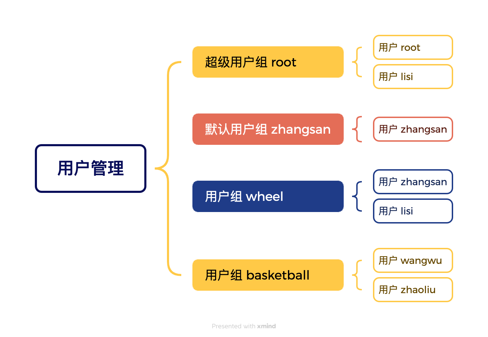

识别用户组的唯一标识是 GID。

那么如何查看系统里面有多少个组，以及组的 GID 都是啥呢？

所有有关组的详细的信息都保存在/etc/group 文件中。

### （2）用户组的信息在哪里？

/etc/group

### （3）有个疑问？当一个用户属于多个用户组时？究竟有什么用？

当一个用户属于多个用户组时，同时拥有了多个用户组的权限。

初始组和有效组的概念。

初始组：新建用户的时候，添加的同名的组。

可以使用： usermod  -aG  新组   用户名，把用户添加进行新的组。这样一个用户就属于多个组。但这是只有一个组称为有效组，其影响是当该用户新建文件的时候，该文件的所属组是哪一个。

可以使用命令： newgrp 命令来改变用户的有效组。

### （4）用户组也可以设置密码

/etc/gshadow 文件格式：

用户组密码实际中较少使用。

## 4、小结一下

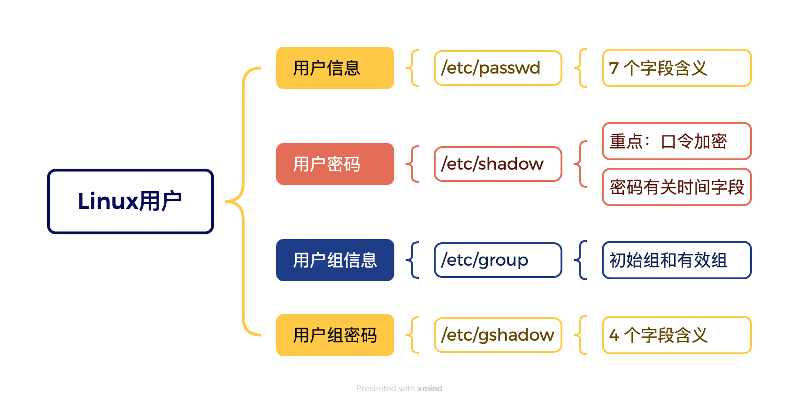

## 5、深入探究一下背后的秘密

影响用户及用户组默认行为的三个文件。

- **/etc/default/useradd     **
- **/etc/login.defs   **
- **/etc/skel/***

### （1）第一个/etc/default/useradd 

### （2）第二个 /etc/login.defs 

**该文件规定了用户和用户组的各种默认设置。**

/etc/login.defs 是一个在类 Unix 系统（如 Linux、Unix 或 BSD）中用于定义系统范围内的 用户账户和密码管理策略的配置文件。

它包含了创建新用户时的默认设置， 以及一些全局性的账户和密码相关限制。 

以下是对 /etc/login.defs 文件中常见配置选项的详细说明： 

- 用户ID和用户组ID UID_MIN: 最小用户 ID（User ID），新创建的非特权用户账户的 UID 应该在这个值以上。 

- UID_MAX: 最大用户 ID，非特权用户账户的 UID 应该在这个值以下。
-  GID_MIN: 最小组 ID（Group ID），新建的非特权组的 GID 应该在这个值以上。
- GID_MAX: 最大组 ID，非特权组的 GID 应该在这个值以下。 
- 密码策略 PASS_MAX_DAYS: 密码有效期的最大天数。超过这个天数后，系统会要求用户更改密码。 

- PASS_MIN_DAYS: 密码更改后，必须等待的最小天数才能再次更改密码。 
- PASS_MIN_LEN: 密码的最小长度。设置此值可以强制用户选择足够复杂的密码。 
- PASS_WARN_AGE: 在密码到期前多少天开始提醒用户更改密码。 
- 账户管理 CREATE_HOME: 是否在创建新用户时自动为其建立家目录。值为 yes 或 no。 
- USERGROUPS_ENAB: 是否启用用户私有初始组（用户名与组名相同）。值为 yes 或 no。 如果启用，新用户创建时会自动创建与其同名的组，并将其设为主组。 
- 账户过期和锁定 ENCRYPT_METHOD: 指定系统使用的密码加密算法，如 DES、MD5、SHA-256、SHA-512 或 bcrypt。 
- INACTIVE: 用户密码过期后，账户在多少天内仍可登录但必须更改密码，超期后账户将被锁定。 
- MAX_MEMBERS_PER_GROUP: 一个组中允许的最大成员数量。 
- 其他设置 UMASK: 新建用户时默认的 umask 值，影响用户创建文件和目录时的默认权限。

**比如Linux用户密码加密为什么采用sha512算法，就在这个文件中指定。**

### （3）第三个**/etc/skel/***

主要是三个文件。

当在系统中新建一个用户的时候，系统会自动把/etc/skel/目录在的文件复制到/home/新用户名/目录下。以便每个用户都可以自定义自己的环境。

## 6、需要掌握的命令

### （1）和用户管理有关的 4 个

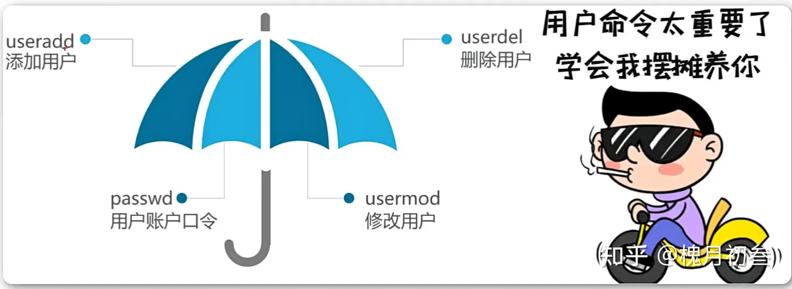

### （2）和用户组管理有关的6个

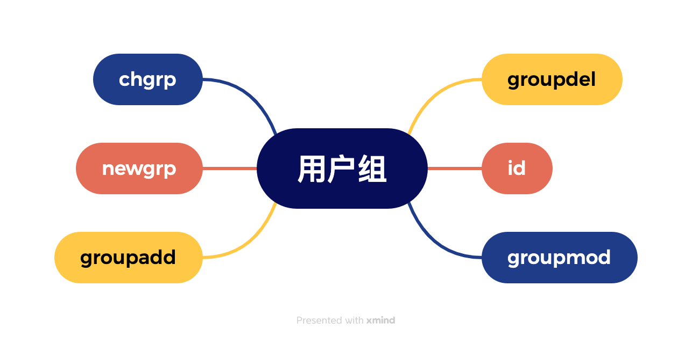

## 7、用户提权方法

提权三种方法：

（1）su   

（2）sudo

（3）加入wheel组

### 第一种：直接使用su 命令

缺点是切换为root 用户时，必须要知道 root 用户的密码才可以。不安全，也不现实。

### 第二种：修改/etc/sudoers 文件

一但一个用户拥有的sudo 权限，就可以执行超出其权限范围以外的事情了。并且此时他不需要知道 root 用户的密码。但是要注意一定要合理的赋予用户权限。

### 第三种：让用户加入 wheel 组。

该用户加入 wheel 组以后，就拥有了 wheel 组的权限。

### **历史背景**

wheel组名称起源于BSD系统，原意为"big wheel"（大人物），现成为类Unix系统中管理权限分配的标准化机制。现代Linux系统通过PAM模块和sudoers文件实现该功能。

*在一些Linux发行版中，如Red Hat、CentOS和Fedora，wheel组的成员默认可以获得管理员权限。*

明白三种提权方式的区别了么？

## 8、对于爱捣乱的用户，如何禁止登录

学废了么？

## 9、来个综合实战

### 例题1：批量创建用户

user1.txt  sh07.sh程序会依据user1.txt里面提供的用户名和密码批量创建用户。

user1.txt 是一个普通文本文件。保存了你想要批量创建的用户名和密码。（用户名和密码之间有空格）

test_user1 123456
test_user2 123456

sh07 程序的内容如下：

程序运行结果如下：

### 例题 2：批量删除用户

user1.txt   sh08.sh 依据user1.txt里面提供的用户名批量清除上面创建的用户。

sh08.sh程序的源码如下：

运行结果如下：

上述程序就是一个用户管理的典型的应用。

## 10、总结

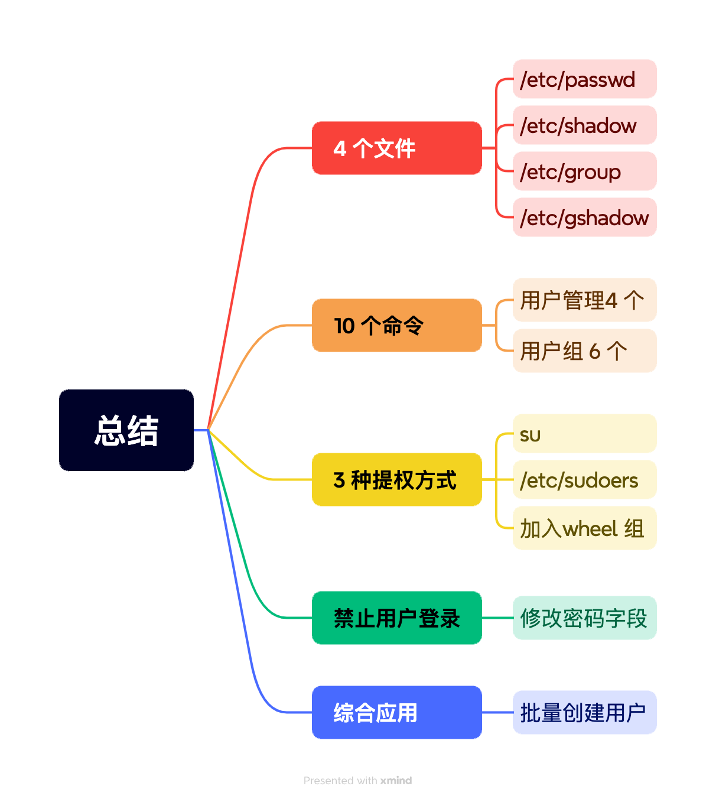

## **谜语答案**

答案：

（1）清明时节雨纷纷，路上行人欲断魂

（2）会当凌绝顶，一览众山小

（3）竹外桃花三两只，春江水暖鸭先知

（4）窗前明月光，疑是地上霜

## 随堂测试

