# Linux 漫谈系列--权限管理

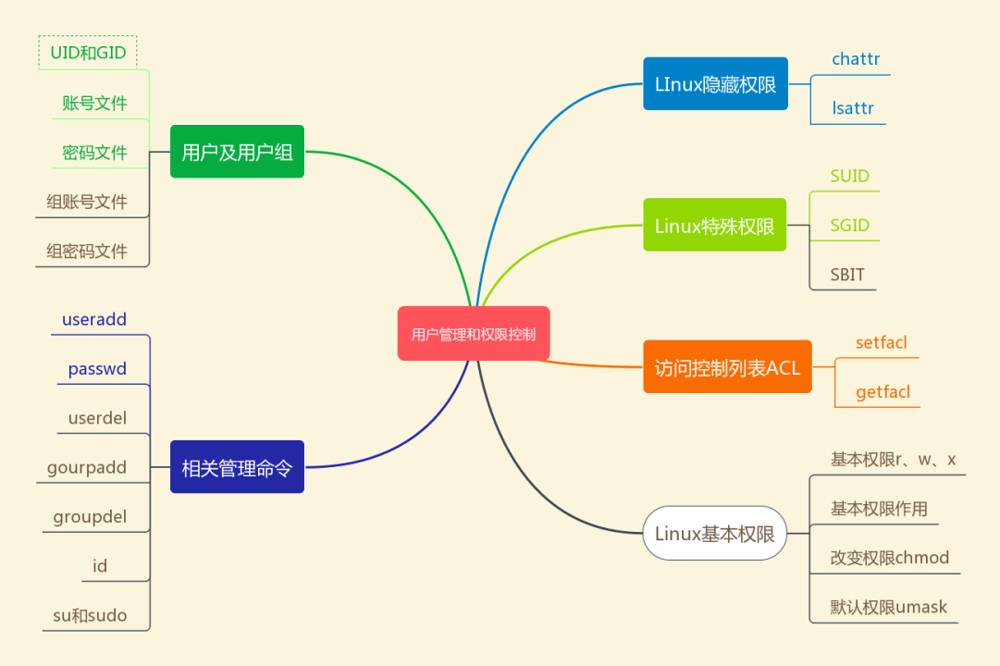

## 0、Linux 基本权限

回忆一下，Linux 存储在 inode 中的属性有哪些？

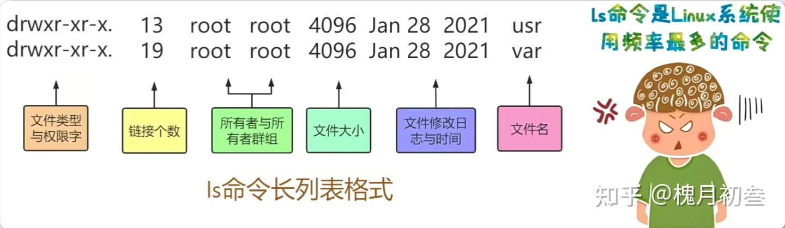

那么这些属性中第一个字段的是什么意思呢？

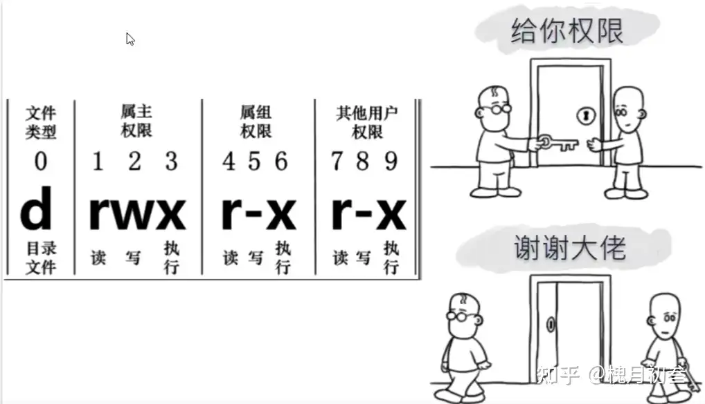

权限的作用是是啥？

举例说明权限的意义：

分析下面的两个文件的权限是什么？为啥要这样设置？

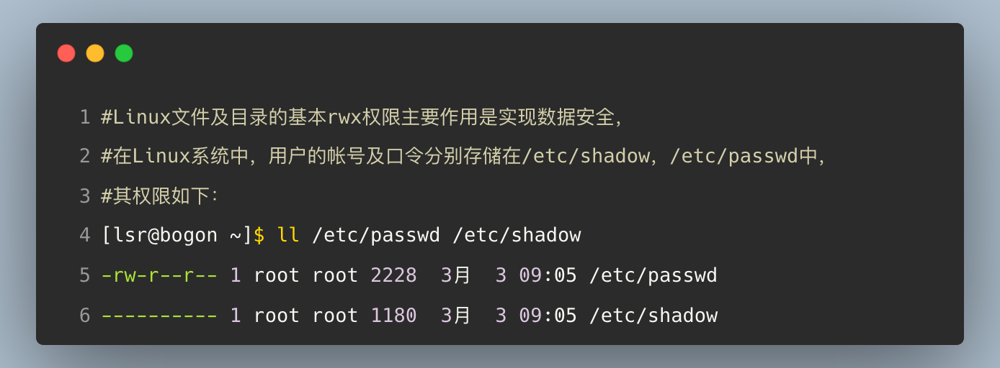

在举一个例子：

.png)

## 1、权限对于文件的意义

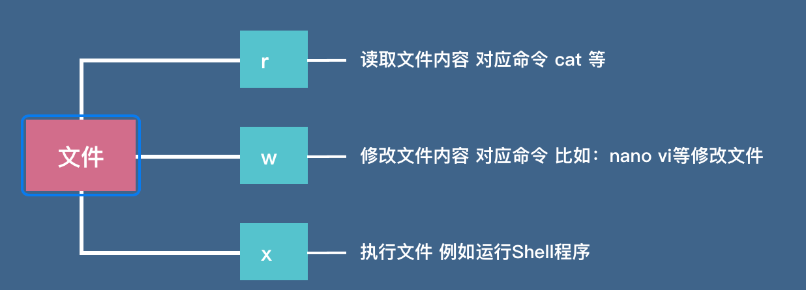

例如，对于可执行权限想x的理解，当新建一个 shell 脚本的时候，默认是不具有可执行权限的。

.png)

## 2、权限对于目录的意义

.png)

用三个实战演示一下目录了的权限问题：

- 实战 1：目录的r 权限

------

如果用户对于目录来说，没有r 权限，就不能使用ls 命令查看该目录下的内容。

- 实战 2：目录的x 权限

------

例题：

**一个用户可以进入一个目录（cd    目录），取决于什么？**

.png)

小小实战一下：

.png)

上述实战说明，一个用户只有拥有了r-x 权限后，才可以进入该目录。

- 实战 3：目录的w 权限

------

例题：

仔细观察下面的例题，分析一下lsr 用户是否可以删除teuser.txt 文件？

.png)

看懂了么？理解为啥不能删除了么？

上述例题说明，用户只有对目录拥有了w 权限，才能删除该目录在的文件。

在来举一个新建文件的例子：

.png)

看懂了，没有w 权限，无法新建文件。

## 3、改变权限 chmod

**如果一个文件和目录的权限不符合实际需求，需要如何改变呢？**

**在Linux系统中，使用chmod命令可以改变权限。**

**使用chmod命令改变文件权限的方法有两种，一种是字符法，一种是数字法。**

### （1）字符法

**在字符法中，使用u表示拥有者，g表示同组用户，o来表示其他用户，a表示所有用户。**

**如下所示：**

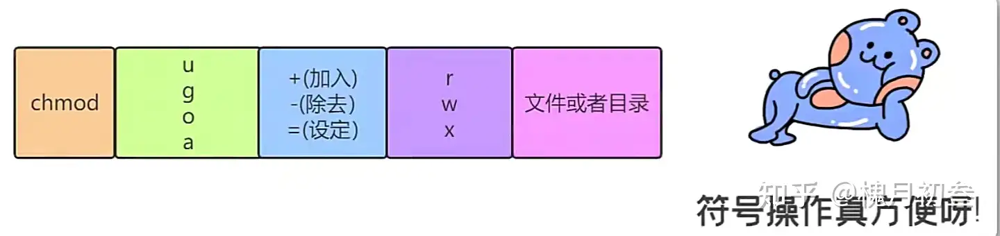

例题：

- 在Linux系统，用户想要设置teuser.txt文件的权限为rwxrw-r--，应该如何设置呢？

.png)

- 对于teuser.txt文件，如果想要所有的用户都具有x的权限，那么应该如何设置呢？

.png)

- 那如果想要去掉同组用户的w权限，同时给其他用户增加w权限，该如何设置呢？

.png)

是不是很简单？

### （2）数字法

**第二种设置权限的方法是用数字法进行设置，在前面学习到，Linux的基本全权限包括9位，每三个表示一组，在数字法中，需要记住如下的对应关系，其中，每个数字表示对应位置的权限。**

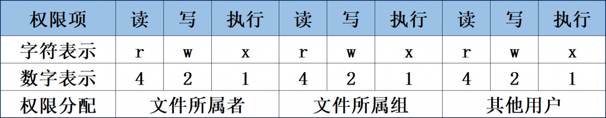

一图胜千言：

每一组的三个权限需要加在一起，这样的话9位的权限就变成了一个3位数字来表达。

比如一个文件的9位权限是rwxr-xr--，那么如何计算数字呢？ 

- 第一组rwx=4+2+1=7 

- 第二组r-x=4+0+1=5 

- 第三组r--=4+0+0=4 

这样的话9位的权限如果用数字表示就是754。

同样的道理，比如一个文件的权限用数字表示是777，那么换算过来9位权限就是rwxrwxrwx。

可以使用chmod命令来设置其权限。 

chmod命令用法： chmod [选项]... 3位权限数字 文件或目录 

选项： 常用的是-R，递归修改文件和目录，也就是连同子目录下的所有文件权限都修改。

再来解释一下权限和数字之间的换算关系：

**420401020进一步简化为652**

其转换过程为：9 个权限位：rw-r-x-w-   对应的 9 个数字为：420401020  每 3 个一组，相加后得到 652

- 权限转换为数字

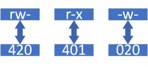

- 数字转换为权限

例题：用数字法修改文件权限

.png)

数字法是不是也很简单？

最不安全的权限配置方法：

.png)

相当于所有用户拥有了所有的权限。

## 4、默认权限 umask

### （1）什么是 umask

.png)

umask值的含义。

在Linux系统中，新建一个文件或者目录的时候，如果不指定权限，默认的权限是什么呢？

这个默认的权限和umask的值有关系。

如下所示： 

umask的值是一个四位的数字，第一位是表示特殊权限的，与基本权限有关的是后三位。

umask的值表示的含义是在新建文件或目录的时默认最大权限基础上需要去掉的权限。

那么新建文件或目录时最大的默认权限是多少呢？

.png)

### （2）默认权限如何计算？

------

实战一下：

.png)

### （3）如何修改 umask 的值

.png)

大多数情况下，不需要修改 umask 的默认值。

## 5、改变拥有者chown

以下是使用 chown 命令更改文件或目录所有权的几个具体示例：

.png)

再来两个：

-3347158.png)

## 6、漫画：chmod于chown的区别

chown ： 

Linux 中用来改变某个文件的属主的命令，如漫画中所示，将某个“资源”（门）的访问权限给予别人。 

chmod ：

 Linux 中用来改变某个文件的访问模式的命令，如漫画中所示，chmod 777 会将“大门”敞开，谁都可以进出了。

## 7、改变所属组chgrp

.png)

## 8、隐藏权限

Linux系统中，除了基本的r、w、x权限之外，还有一些隐藏的权限，这些隐藏的权限只有root用户可以设置，普通用户是不能设置的。

设置隐藏权限的命令是chattr。

具体语法格式如下所示： chattr [+-=] [属性] 文件或目录名 

解释： 

+ 表示在原有的基础上增加某种隐藏权限； 
+ 表示在原有的基础上去掉某种隐藏权限；
+ = 仅仅设置=后面的隐藏权限；

举例：

### （1）chattr命令给文件添加i隐藏权限

.png)

一个文件拥有了i 权限以后，该文件不能被删除。

### （2）给一个目录添加上i隐藏权限

【例题】给一个目录添加上i隐藏权限，并进行测试。

只能修改该目录下文件，但是不能新建和删除文件。

.png)

可以看出，dteuser目录拥有了i 权限以后，用户就不能在该目录内新建文件。

那么是否可以修改和删除文件呢？

.png)

不影响修改文件的权限，但是不能删除文件。

### （3）给一个文件添加上a隐藏权限

【例题】给一个文件添加a隐藏权限，并进行测试。

.png)

通过上述例子可以看到，文件的i、a隐藏权限都非常有用，如果一个文件或者目录很重要，需要加强安全保护，就可以考虑给其设置这样的保护措施，从而实现数据安全。

### （4）给一个文件添加上u 或者s隐藏权限

在美剧《越狱》的第一季中，主人公迈克尔·斯科菲尔德把装有越狱计划的硬盘开窗扔进了湖中，结果在第二季被警探打捞出来恢复了数据，然后就有了第二季、第三季、第四季、第五季，他和哥哥的逃亡故事。所以，要想彻底删除某个文件，可以使用+s参数来保证其被删除后不可恢复—硬盘上的文件数据会被用零块重新填充，那就更保险了。

u 权限：文件可恢复

s 权限：文件彻底删除

## 9、特殊权限

### （1）SUID

.png)

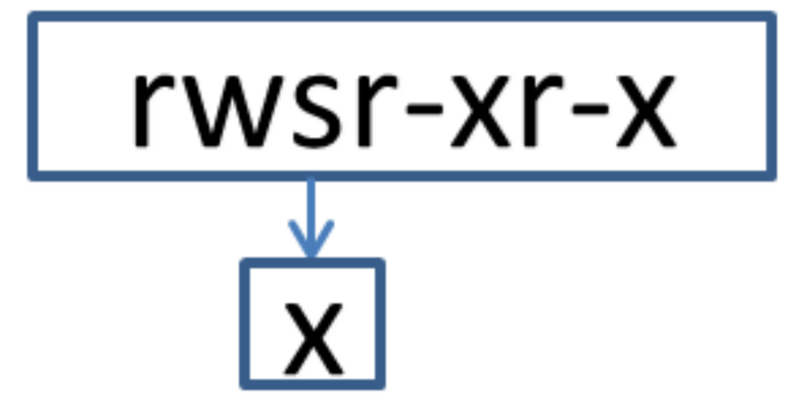

如图所示：本来应该是文件拥有者占据的x权限位置，现在被一个字符s所替代，那么这个字符表示的含义是什么呢？

在Linux系统中，这样的权限是一种特殊的权限，称为SUID。

在给一个文件设置SUID的时候，需要注意以下几个地方： 

（1）只有二进制可执行程序文件才能设置SUID； 

（2）运行程序的用户对于该程序要有x的可执行权限； 

（3）s权限仅在程序运行的过程中有效； 

（4）运行程序的用户将临时具有该程序拥有者的权限。

.png)

在用户管理的章节中，应该可以知道，修改后的口令其实就是存储在/etc/shadow文件中了。

那么看到这里，很多人应该就很疑惑了。

按照道理来说，普通用户zhangsan是没有权限对文件/etc/shadow文件进行写入操作的，

但是在这里为什么zhangsan这个用户可以通过passwd命令来修改口令文件呢？

**这就是SUID的作用。**

> 因为命令文件/usr/bin/passwd有了rwsr-xr-x这样的权限，就可以实现一些特殊的功能，也就是说当一个普通用户zhangsan去运行/usr/bin/passwd这个程序的时候，在程序运行的过程中，zhangsan用户就临时的具备了程序/usr/bin/passwd的拥有者的权限，而程序/usr/bin/passwd的拥有者是root，也就是说这个时候的zhangsan就拥有了root的权限，那么自然地也就可以对口令文件/etc/shadow进行写入操作了。

如图所示，作为zhangsan这个用户，本来是没有权限去对文件/etc/shadow写入的，但是由于程序/usr/bin/passwd被赋予了SUID权限，所以zhangsan这个用户去运行该程序时，就临时取得了root的身份，从而能够对文件/etc/shadow进行写入操作。

对于zhangsan用户来说，由于/bin/cat没有设置SUID权限，所以运行该程序时其身份不会发生改变，因此不能查看/etc/shadow文件。

.png)

也可以这么来理解，拥有了SUID特殊权限的程序，在运行的过程中可以让用户临时转变身份，从而进行提权操作，完成一些本来没有权限完成的操作。需要注意的是SUID权限只在文件执行过程中有效，一旦执行完毕，身份的切换也随之消失。

------

------

特别需要提醒的是，不要轻易地给一个二进制的可执行程序设置SUID权限.

如果SUID权限设置不当，会给Linux系统造成重大安全隐患。

#### 举例 1：取消 passwd 命令的SUID 权限

【例题】如果取消掉/usr/bin/passwd的SUID权限，会有什么后果呢？

.png)

可以看到当取消掉/usr/bin/passwd的SUID权限后，所有的普通用户都不能通过passwd来更改自己的口令了。

千万要记得使用如下命令把权限改回来：

.png)

#### 举例 2：赋予vi 编辑器SUID 权限

【例题】如果赋予了一些不该拥有SUID权限的程序拥有了该权限，会有什么后果呢？

比如Linux系统中经常使用vim编辑器来修改文件。如果给/usr/bin/vim这个程序赋予了SUID权限，那么就带来很多意想不到的问题。

.png)

该例题表明，赋予/usr/bin/vim这个程序SUID权限以后，任何一个普通用户在运行vim命令的时候，都临时的具备了root的权限，也就是说这个时候，任何一个普通用户都变成了超级用户，可以对系统当中重要的资料和文件以root的身份进行删改，对系统可以造成严重的安全问题。

> 这样的权限配置漏洞也经常会被黑客利用，对系统进行提权攻击。比如普通用户可以使用vim修改/etc/paawd、/etc/shadow文件，把自己的uid修改为0，这样普通用户就变成了超级用户，那么这个普通用户就可以随时关闭系统的服务，随时修改任何数据文件，向网络发送数据，随时添加各种类型的用户，做任何想做的事情，那么后果是难以想象的，对于Linux系统来说，就没有安全性可言了。

.png)

### （2）SGID

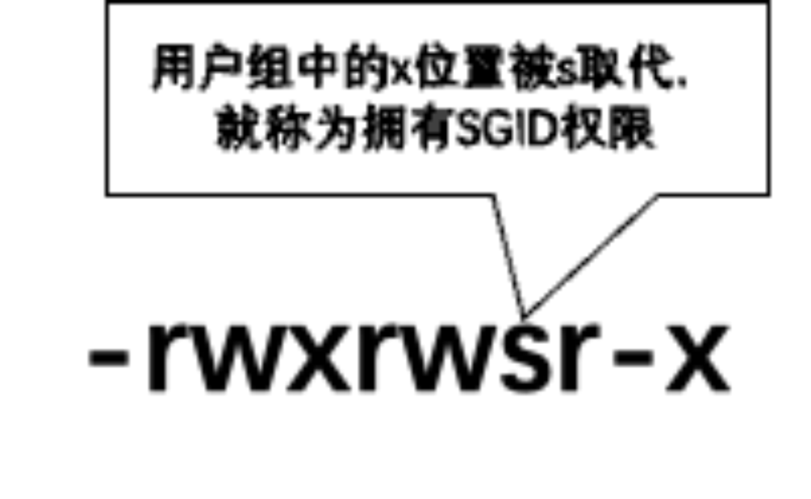

一个目录具有SGID权限，并且该目录的所属的组是zhangsan，意味着在该目录下新建的文件file，会继承该目录的群组。 

 也就是说，该目录下所有新建的文件的组群都是zhangsan。

SGID特殊权限有两种应用场景：

（1）当对二进制程序进行设置时，能够让执行者临时获取文件所属组的权限；

SGID的第一种功能是参考SUID而设计的，不同点在于执行程序的用户获取的不再是文件所有者的临时权限，而是获取到文件所属组的权限。

（2）当对目录进行设置时，则是让目录内新创建的文件自动继承该目录原有用户组的名称。

每个文件都有其归属的所有者和所属组，当创建或传送一个文件后，这个文件就会自动归属于执行这个操作的用户（即该用户是文件的所有者）。如果现在需要在一个部门内设置共享目录，让部门内的所有人员都能够读取目录中的内容，那么就可以在创建部门共享目录后，在该目录上设置SGID特殊权限位。这样，部门内的任何人员在里面创建的任何文件都会归属于该目录的所属组，而不再是自己的基本用户组。此时，用到的就是SGID的第二个功能，即在某个目录中创建的文件自动继承该目录的用户组（只可以对目录进行设置）。

主要作用：便于多个用户共享一个目录内的资源。

【例题】首先添加两个用户user1和user2，两者都属于teusergroup组

.png)

然后，创建共同的工作目录/srv/teuserhome，并修改该目录的所属组为teusergroup，权限配置为rwxrwx---。

 新建一个目录/srv/teuserhome，作为user1和user2的共同的工作目录。

.png)

以user1的身份登录，并在/srv/teuserhome目录中新建一个文件a.txt

.png)

接上题，赋予/srv/teuserhome目录SGID特殊权限，然后再进行测试

.png)

通过查看新建的文件和目录发现，它们的所属组都是teusergroup，原因是其上层目录/srv/tesuerhome被赋予了SGID权限，在其下面新建的文件或者子目录都会继承上层目录的所属组。

解释如下图：

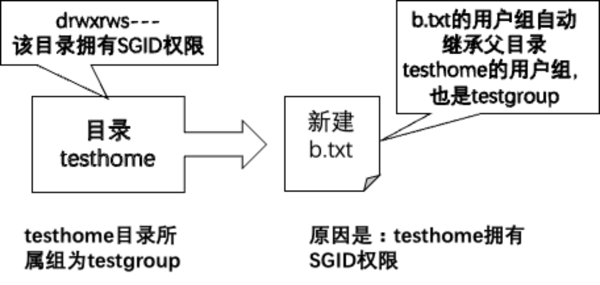

#### 注意

SGID特殊权限使用说明，一般情况下，SGID权限是针对目录来说的，当一个目录配置了SGID权限后：

（1）如果用户对于该目录具有r与x的权限，那么该用户可以进入此目录；

（2）用户在该目录下的用户组将会变成该目录的用户组；

（3）如果用户对此目录有w权限，则用户所创建的新文件的用户组与该目录的用户组相同。

### （3）SBIT

现在，大学里的很多老师都要求学生将作业上传到服务器的特定共享目录中，但总是有几个“破坏分子”喜欢删除其他同学的作业，这时就要设置SBIT（Sticky Bit）特殊权限位了（也可以称之为特殊权限位之粘滞位）。

SBIT特殊权限位可确保用户只能删除自己的文件，而不能删除其他用户的文件。

换句话说，当对某个目录设置了SBIT粘滞位权限后，那么该目录中的文件就只能被其所有者执行删除操作了。

Linux统中的/tmp作为一个共享文件的目录，默认已经设置了SBIT特殊权限位，因此除非是该目录的所有者，否则无法删除这里面的文件。

\为了说明SBIT特殊权限的作用，首先来分析一个例题：

如下所示，首先查看Linux系统中/tmp目录的权限，发现一个特殊的标志，在第10位上的权限x位置被一个t字符所代替。

这里的t就是所讲的SBIT特殊权限，那么该权限有什么作用呢？ 

先解释SBIT权限的含义： 

（1）首先SBIT权限只针对目录有效，对文件无效； 

（2）一个目录设置SBIT权限后，用户对于该目录具有w、x权限的情况下，当用户在该目录下创建文件获目录时，只有自己与root才有权利删除该文件。

.png)

虽然这里的用户zhangsan 拥有可以删除文件的权限，但是因为该目录设置了 SBIT，所以实际上无法删除teuser.txt 文件。

其实，一个用户是否能删除一个文件，并不取决于该用户对该文件的权限，而是看该用户是否对该文件所在的目录是否有写入权限。

> 分析：zhangsan用户为什么不能删除/tmp/teuser.txt，按照正常来理解/tmp的权限为rwxrwxrwt，也就意味着，zhangsan用户是可以删除/tmp/teuser.txt文件的，但是正是因为/tmp具有SBIT特殊权限，导致zhangsan用户的不能删除其他用户创建的文件。这也就是SBIT权限的特殊作用。

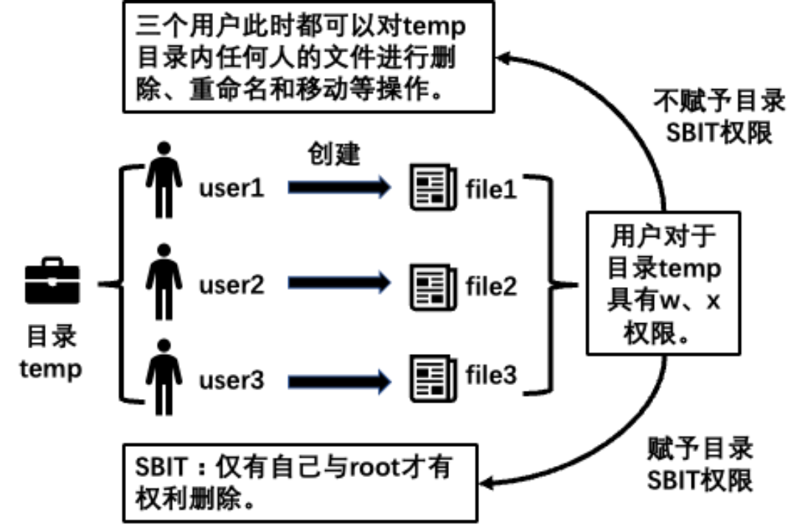

所以SBIT特殊权限又称为粘滞位，防删除位。SBIT 权限仅对目录有效，一旦目录设定了 SBIT 权限，则用户在此目录下创建的文件或目录，就只有自己和 root 才有权利修改或删除该文件。

### （4）特殊权限设置方法

SUID、SGID和SBIT这三种特殊权限的设置方法和Linux的基本权限设置方法一样，也分为两种方式：一种是数字法，一种是字符法。

#### （1）数字法

Linux的基本权限的数字法是用3位数字来设置，而特殊权限是在三位的数字的最前面再加上一位数字，变为4位数字。4位数字的第一位就是特殊权限的位置。这三种特殊权限对应的权限分别是：

SUID--4

SGID--2

SBIT--1

例题 1：同时设置SUID 和SGID

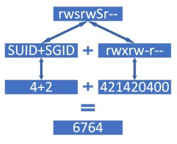

例题 2：同时设置SUID 和SBIT

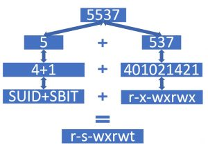

实战：

.png)

数字法总结如下：

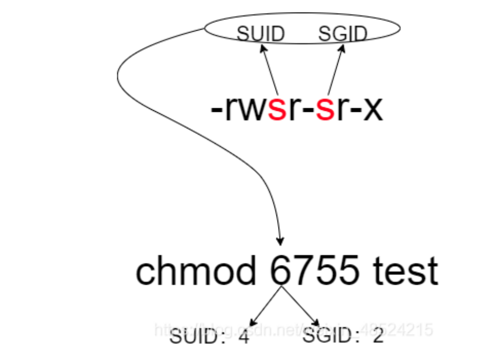

#### （2）字符法

第二种设置特殊权限的方法是字符法。

- 设置SUID使用u+s，设置SGID使用g+s，设置SIBT使用o+t。

- 去掉特殊权限的方法分别是u-s，g-s，o-s。

.png)

基本权限总结：

## 10、访问控制列表 ACL

ACL是访问控制列表（Access Control List）的意思，在Linux系统，ACL可以提供更加精准的权限控制方法。Linux基本的权限配置只能针对拥有者、用户组和其他人三类人进行权限划分，而ACL可以对单个用户、单个文件或目录进行r、w、x的权限设置，权限划分更加细化。

如下图所示，文件file.db的权限是rwxrwxr--，如果这个时候，来了一位新用户，这位新用户的权限配置要求是rw-，那么按照前面讲过的配置方法，应该如何来配置呢？无论是把这位新用户设为文件的拥有者，或者是用户组，或者其他人都不能满足这个权限配置要求。那么针对类似于这样的权限要求，需要单独针对新用户一个人进行配置权限，传统的Linux权限配置方法是无法实现的。

针对上述情况，当需要单独为一个用户进行专门的权限设置时，就可以使用ACL来进行权限配置。

目前绝大多数的文件系统都支持ACL功能，包括JFS、XFS、EXT3、EXT4等。

红帽企业版9.1默认的文件系统就是XFS，默认是可以支持ACL功能的。 

设置ACL权限需要使用setfacl，getfacl两个命令，

用法如下： 

getfacl 文件名  

setfacl [-bkRdmx] 参数 文件名 

各个选项的具体含义如下表所示：

| **选项** | **功能**                                                     |
| -------- | :----------------------------------------------------------- |
| **-m**   | 设定ACL权限。如果是给用户设置ACL权限，参数则使用 "u:用户名:权限" 的格式，例如 setfacl -m u:user:rx /temp表示设定user用户对temp目录具有rx权限；如果是给予组ACL权限，参数则使用“g:组名:权限”格式，例如setfacl -m g:tgroup:rx /temp表示设定群tgroup对temp目录具有rx权限。 |
| **-x**   | **删除指定用户（参数使用 u:用户名）或群组（参数使用g:群组名）的ACL权限，例如setfacl -x u:user /temp表示删除user用户对temp目录的ACL权限。** |
| **-b**   | **删除所有的 ACL 权限，例如 setfacl -b /temp表示删除有关temp目录的所有 ACL 权限。** |
| **-d**   | **设定默认ACL权限，命令格式为”setfacl -m d:u:用户名:权限 文件名”（如果是群组，则使用d:g:群组名:权限），只对目录生效，指目录中新建立的文件拥有此默认权限，例如 setfacl -m d:u:user:rx /temp 表示 user 用户对temp目录中新建立的文件拥有rx权限。** |
| **-R**   | 递归设定ACL权限，指设定的ACL权限会对目录下的所有子文件生效，命令格式为”setfacl -m u:用户名:权限 -R 文件名”（群组使用g:群组名:权限），例如setfacl -m u:user:rx -R /temp表示user用户对已存在于temp目录中的子文件和子目录拥有rx权限。 |
| **-k**   | **删除默认 ACL 权限。**                                      |

实战：

### （1）例题 1

针对单个用户设置acl 权限，如上图所示，假设有一个文件file.db权限为rwxrwxr--，那么针对新用户zhangsan的rw-权限要求，如何使用setfacl进行设置呢？

.png)

### （2）例题 2

针对用户组设置acl 权限

【例题】setfacl也可以针对特定的用户组进行ACL权限配置。

 语法格式：setfacl -m g:用户组名:rwx 文件名

.png)

### （3）mask 值的作用？

【例题】首先设置mask的值，然后查看文件的真正的权限。

语法格式：setfacl -m m:rwx 文件名

.png)

上述题目中，虽然对于zhangsan用户来说，虽然其权限是user:zhangsan:rw-，但是因为mask的值为mask::r--，所以zhangsan的真正有效的权限只能是r--。

这就是mask值的作用，也就是说，可以通过设置mask的值，从而规定最大允许的权限，就能够避免不小心设置权限过大的问题。

但是在日常使用中，一般情况下，不需要修改mask的值。

### （4）删除acl 权限

.png)

上述例题分别演示如何针对某个用户删除acl 权限及删除一个文件的所有acl 权限。

## 总结

### （1）权限总结

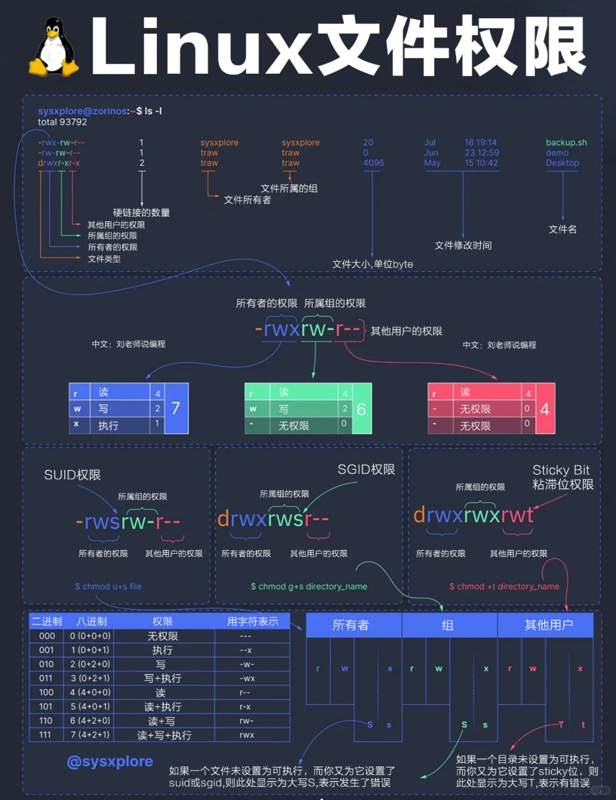

### （2）用户及权限总结

## 随堂测试

