# Linux漫谈系列--磁盘管理

## 一、原理

### 1、磁盘结构

#### （1）物理结构


[机械硬盘储物理拆解](https://www.bilibili.com/video/BV1kf4y137Zd/?spm_id_from=333.337.search-card.all.click&vd_source=c7b66582e4bea8e9a772ca334df24fe5)  

[机械硬盘的工作原理](https://www.bilibili.com/video/BV1WF411R7es/?spm_id_from=333.788)（B站）

[固态硬盘的工作原理](https://www.bilibili.com/video/BV1yh4y1j7sg?spm_id_from=333.788.videopod.sections&vd_source=c7b66582e4bea8e9a772ca334df24fe5)（B站）

#### （2）逻辑结构

磁头、柱面和扇区

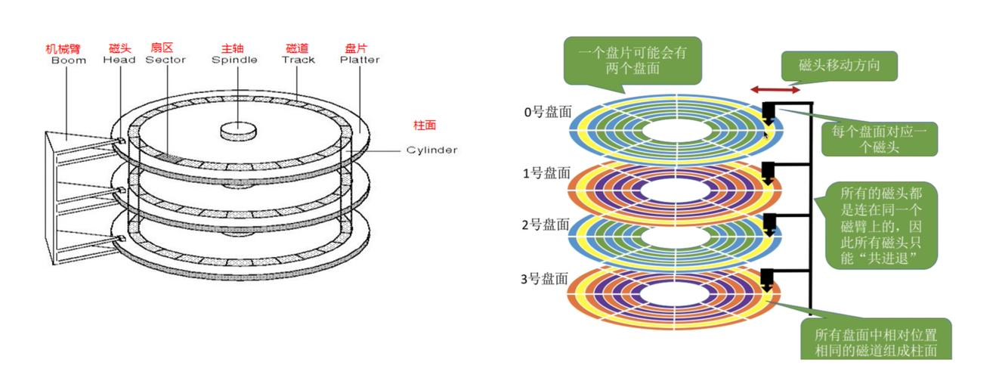

[硬盘就是一个旋转餐桌](https://mp.weixin.qq.com/s/eIU_adzAbOjsytcajhjrNA) **（码农翻身）**

[PPT课件](磁盘管理20241112.pptx)（刘老师整理课件（1--35））

#### （3）经典面试问题

（1）一个磁盘有3个圆盘6个磁头，7个柱面（每个盘片7个磁道） 的磁盘，每条磁道有12个扇区，这里每个扇区是 512 个字节。请计算磁盘的容量？


### 2、磁盘分区

#### （1）Linux 系统硬盘在哪里？

漫画图解unix哲学 Everything is file!

 [上帝托梦给我说：一切皆文件](https://mp.weixin.qq.com/s/oXsL83KcObnUyYc-knaZvQ)

Linux常见设备文件：


不同的硬盘接口

IDE 接口和SATA 接口：

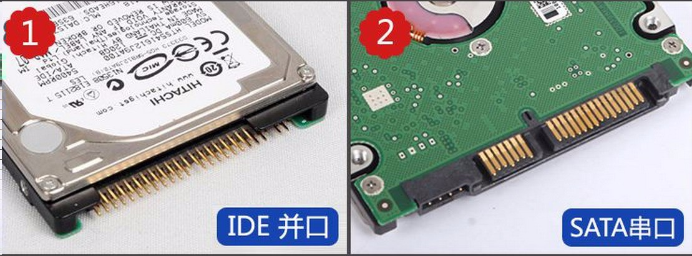

SCSI 接口：


Nvme 接口：


Linux 硬盘究竟在哪里？


可以使用下面的命令查看 Linux 所有的硬盘


从上图张可以看到系统里面有三块硬盘，分别是sda, sdb, sdc。

那么这里的sda1, sda2 有分别是什么含义呢？接着聊。

#### （2）主分区、扩展分区和逻辑分区


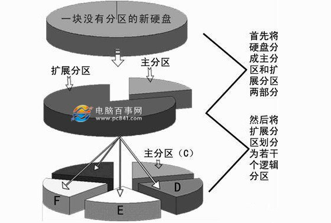


Windows 系统分区

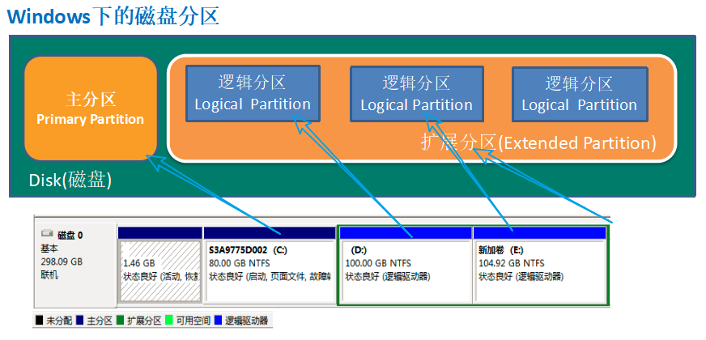

Linux 系统分区（以 MBR 分区为例）

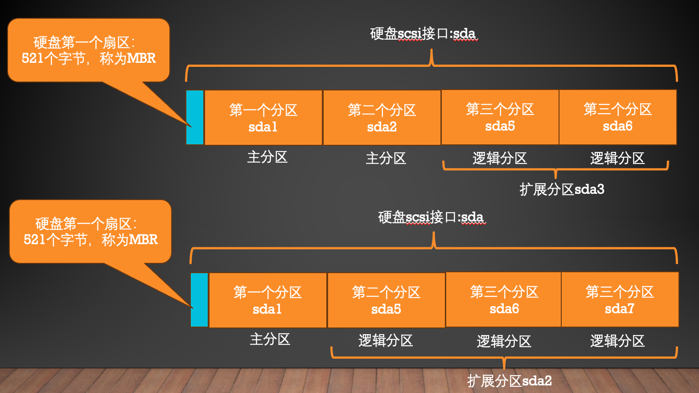


#### （3）主引导记录MBR

[PPT课件](磁盘管理20241112.pptx)（刘老师整理课件）（36--51）


为啥主分区+扩展分区的数量不能超过 4 个？

从硬盘的第一个扇区 512 个字节说起：


换一副图来理解：


再换一幅图来理解一下一张硬盘的分区示意图。

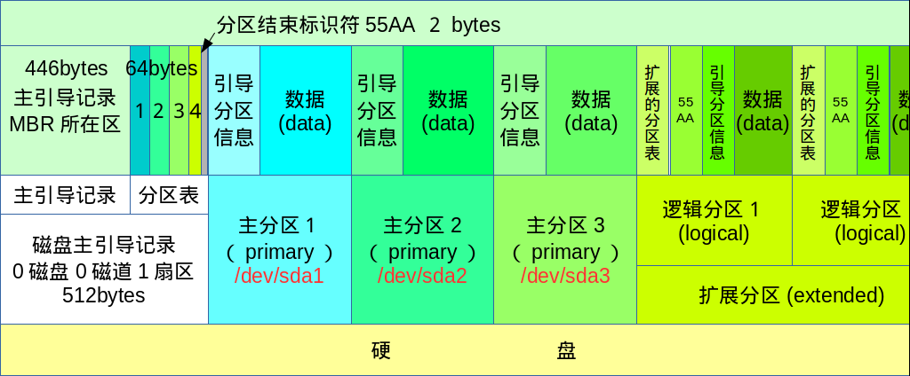

磁盘分区用数字进行表示：其中1--4，这四个数字只能表示主分区和扩展分区

逻辑分区的第一个用5表达，第二个逻辑分区是6，以此类推。

如下图所示：

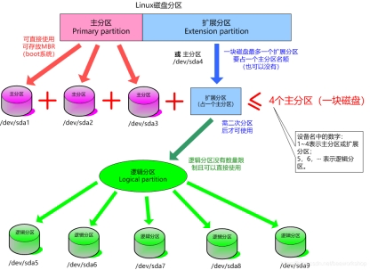


#### （4）<font color="red">**经典面试问题**</font>

问题 1：把 Linux 系统中第二块SATA 接口的硬盘划分为 4 个可用的分区，有几种划分方法？

答：可以分为以下几种情况

4 个主分区； sdb1, sdb2, sdb3, sdb4

1个主分区，3 个逻辑分区；sdb1, sdb5, sdb6, sdb7

2 个主分区，2个逻辑分区；sdb1, sdb2, sdb5, sdb7

3 个主分区，1个逻辑分区；sdb1, sdb2, sdb3, sdb5

那么思考一下，还有没有其他情况？


问题 2：请解释/dev/sda3 是主分区、扩展分区还是逻辑分区？/dev/sda5 呢？


问题 3：Linux 系统主分区+扩展分区数量为什么不能超过 4 个？


问题 4：什么是 MBR，位于硬盘的什么位置？大小是多少？起到什么作用？


### 3、文件系统

[我是一块硬盘（上）](https://mp.weixin.qq.com/s?__biz=MzAxOTc0NzExNg==&mid=2665513289&idx=1&sn=ab19dcad7b1dc217463f155fe106091a&scene=21#wechat_redirect)  

[我是一块硬盘（下）](https://mp.weixin.qq.com/s/1odOmbHJI5kSNI-YegrsPg)

#### （1）为什么要格式化？


为了在该分区上创建文件系统。

那么一个分区为啥要创建文件系统？

汉语字典索引

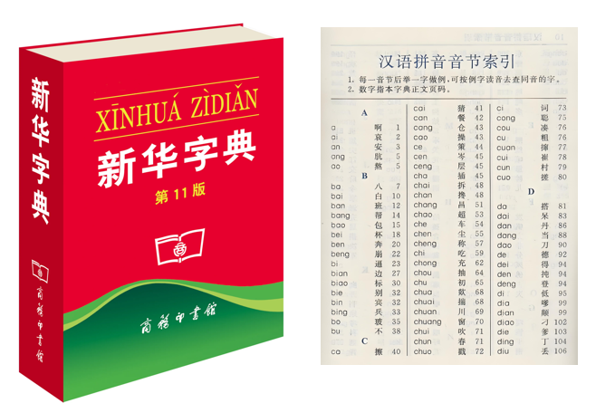

首先解剖一个文件是如何在硬盘上存储的，就明白为啥要创建文件系统了？

#### （2）文件在硬盘上是如何存储的？

在 Linux 系统中，一个名字为 /root/test.sh 的文件在硬盘上是如何存储的？

test.sh 文件在硬盘上存储了两部分内容：

（1）第一部分存储在硬盘分区sda1 的inode区域的一个编号为 18127615 的 inode节点内。

存储的是该文件的属性信息，具体的属性见下图的黄色箭头指示的信息。

（2）第二部分存储在硬盘分区的数据区部分

具体存储内容见下图，也就是该文件的真正的数据。

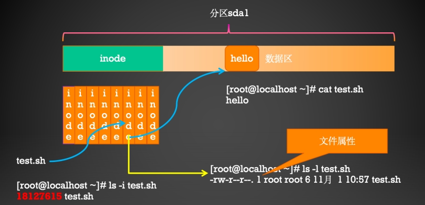

#### （3）目录在硬盘上是如何存储的？

对于目录而言，当我们新建一个目录的时候，文件系统会分配一个inode和一个block给该目录。

- 其中inode记录该目录的相关权限和属性，并记录分配到的那块block号码
- 而block块则是记录在这个目录下的文件名与该文件名对应的inode的号码的对应关系表。

例题：

以访问/root/user1.txt文件为例，来说明目录是如何存储的：

.png)

从上图中可以看出Linux目录是这样的一种结构：


如何从linux的根目录开始一层一层的找到文件的？你理解了吗？

- 首先来查看根目录的inode
- 然后读该目录数据块中存储的对应关系：子目录或者文件和其对应inode的对应表。通过该对应表找到子目录或者文件。
- 一层一层找下去即可。

#### （3）经典面试问题

问题：Linux 系统中，文件的名字存储在哪里？请解释一个用户要想更改一个文件的名字，为何要必须对该文件所在的父目录拥有w 权限？

答：

从上述讲解中，你能看出Linux系统中，一个文件的名字究竟存储在哪里呢？

比如上述的user1.txt这个文件的名字。

是存储在这个文件的自己的inode中吗？

这里就发现了一个有意思的问题，一个文件的名字并没有存储在自己的inode中，而是存储在其上层目录的(block)数据区域里面。

这样就解释了为什么用户在想要新增、删除、重命名文件的时候，该用户必须对其父目录具备w权限。

换句话说：一个用户想要重命名 /root/user1.txt，和用户对user1.txt有什么的权限没有关系，而是取决于该用户对其父目录/root必须要有w权限。

该用户对其父目录/root有w权限，也就是说该用户可以修改/root的(block)数据区域的内容，也就是可以更改文件名和inode的对应关系。从而能够更改文件的名字。

理解了这个问题，你也就理解，为啥一旦该用户拥有了某个文件的父目录的w权限，就能新建、删除、移动、复制、更名文件。


这个问题也是面试的经典话题，你了解了么？

#### （4）一步一步来探寻

那么当我们访问/root/test.sh 文件时，Linux 是具体是如何操作的？

[root@localhost ~]# ls -id /
***128 /***

第一步：用户访问128号inode，如果里面存储的权限允许的话，访问根目录的在数据区域存储的内容；

数据区域内容如下：

[root@localhost ~]# ls -i /
429957 lib    ***16777346 root***       138 usr 

第二步：发现/root目录对应的inode是16777346，用户访问16777346号inode，如果里面存储的权限允许的话，访问/root目录在数据区域存储的内容；

数据区域内容如下：

[root@localhost ~]# ls -i /root
 35123371 图片             34301328 linux_sh      ***18127615 test.sh***

第三步：发现test.sh目录对应的inode是18127615，用户访问18127615号inode，如果里面存储的权限允许的话，访问test.sh在数据区域存储的内容；

数据区域内容如下：

[root@localhost ~]# cat /root/test.sh
hello

一图胜千言：


还不懂？

提示：在每个inode里面存储的都有文件的属性，每个步骤的访问都需要经过权限的允许。

所谓的格式化，也就是在分区上建立文件系统，就是在分区里面创建inode区域，每当新建一个文件，就为其分配一个inode，用来对该文件进行索引。

#### （5）深入inode

Linux文件系统中，文件的inode和文件名是一一对应的关系，真正识别一个文件依靠的是inode编号，而不是文件名。

在Linux操作系统中，将文件系统分为2部分，一部分为数据区，一部分为元数据区。

这里的元数据就是inode， 它存取文件的创建者，文件的创建日期，修改日期，访问日期，文件大小等信息。


使用ls -i命令可以查看文件的inode编号

.png)

一幅图说明inode里面都是存的啥？


如何查看一个分区究竟有多少个inodes

#### （6）一个分区究竟有多少个inode

以/dev/sda1分区为例：

.png)

如何计算一个文件系统支持的最大支持的文件？

例题：

计算ext2类型的文件系统最大支持的文件大小为16GB，参考：[ext2文件系统详解 - 知乎 (zhihu.com)](https://zhuanlan.zhihu.com/p/579567318)

#### （2）Linux主流文件系统

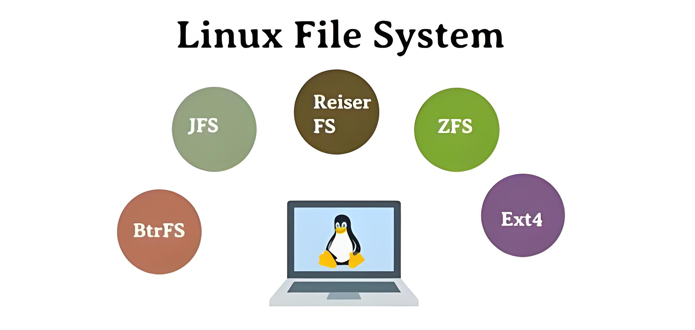

（1）ext  专门为Linux设计的，为linux核心所做的第一个文件系统。

该文件系统最大支持2GB的容量。

（2）ext2  由Rémy Card设计，用以代替ext，是LINUX内核所用的文件系统。单个文件最大限制2TB；

该文件系统最大支持32TB的容量。

（3）ext3  一个日志文件系统。

单个文件最大限制16TB，该文件系统最大支持32TB的容量。 

（4）ext4   Theodore Tso领导的开发团队实现,Linux系统下的日志文件系统。

单个文件最大限制16TB， 该文件系统最大支持1EB的容量。

（5）JFS2  一种字节级日志文件系统,该文件系统主要是为满足服务器的高吞吐量和可靠性需求而设计、 开发的。

单个文件最大限制16TB，该文件系统最大支持1PB的容量。

（6）XFS   是 64 位高性能日志文件系统。对 XFS 的支持大概在 2002 年合并到了 Linux 内核。

对于 64 位文件系统，XFS 支持最大文件系统大小为 8 exbibytes。 

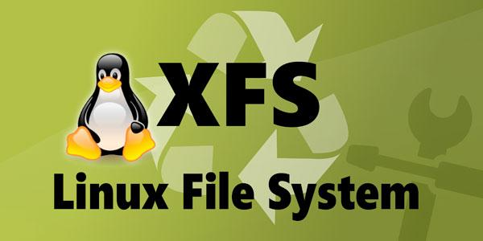

目前RHEL 7.0 文件系统默认使用 XFS。

XFS的文件系统结构如上，不同于Ext4，它通过B+树来索引inode和数据块。用树结构的文件系统通常相比Ext4用表结构，如链表、直接/间接Block以及extent，能更好地支持大文件，如视频/数据库文件等。另外其元数据规模少，使得硬盘可用空间更多，实测XFS、Btrfs多平均至少1.5%以上的可用空间。 

XFS能支持单卷可达 8EiB ，最大文件也到 8EiB ，相比Ext4的16TiB可高了几个数量级。而且是其实动态分配inode的实现机制，只要有空间，就不会耗尽inode。


### 4、有趣的话题，如何销毁硬盘数据

在 Linux 系统中，一个名字为 /root/test.sh 的文件在硬盘上是如何存储的？

test.sh 文件在硬盘上存储了两部分内容：

（1）第一部分存储在硬盘分区sda1 的inode区域的一个编号为 18127615 的 inode节点内。

存储的是该文件的属性信息，具体的属性见下图的黄色箭头指示的信息。

（2）第二部分存储在硬盘分区的数据区部分

具体存储内容见下图，也就是该文件的真正的数据。

删除文件时候，究竟删除了啥？


[销毁硬盘，用这个妙招，美国中央情报局也难以恢复](https://maimai.cn/article/detail?efid=sGRzNWmh3beQYP7__ww7KQ&fid=1816899559)

## 二、实战

### 1、磁盘分区fdisk或gparted

第1步：


第2步：


第3步：从/dev/sdb 硬盘上分出一个200M 的主分区

#### （1）使用fdisk 格式化

`fdisk命令用途：在交互式的操作环境中管理磁盘分区格式：`

`fdisk  [磁盘设备]交互模式中的常用指令`

`m：查看操作指令的帮助信息`

`p：列表查看分区信息`

`n：新建分区`

`d：删除分区`

`t：变更分区类型`

`w：保存分区设置并退出`

`q：放弃分区设置并退出`


第4步：


#### （2）使用gparted 格式化

图形化的分区工具：

安装gparted图形分区工具。

```
[root@bogon ~]# yum install epel-release.noarch
```

```
[root@bogon ~]# yum install gparted
```


### 2、格式化分区

第 5 步：

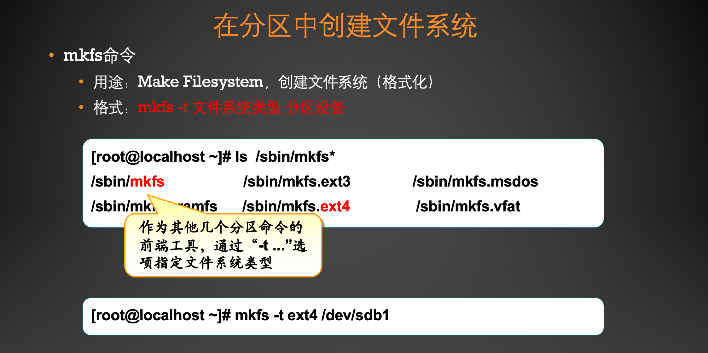


### 3、分区挂载和卸载，自动挂载


#### （1）啥是挂载？

这个问题需要解释一下：

这是Windows分区：


这是Linux打开的样子：


这是Linux 系统中硬盘分区：


那么从哪儿能找到Linux硬盘分区呢？首先理解挂载的含义。


也就是说Linux系统要求硬盘分区和目录必须挂载到一起才能使用，例如：


从上图中可以看出，分区 sda1 和 / 挂载在一起；分区 sda2 和 /home 目录挂载在一起；分区sda3和/local目录挂载在一起。挂载在一起后，使用该目录就是使用该硬盘分区。例如cd /home，这时就是进入了sda2 分区。此时新建的文件，就保存在sda2分区中了。

理解挂载的意义了么？

#### （2）那么啥是卸载？（umount）

当使用卸载命令后：

例如：umount  /dev/sda2

那么此时/home 目录就和分区sda2没有关系了。

思考一下，这时如果在/home 里面新建文件，保存在哪个硬盘分区上了呢？

#### （3）挂载和卸载命令


挂载示例：

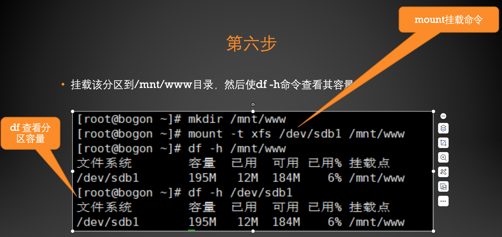

卸载示例：


这种挂载方式只能临时起作用，一旦系统重启后，挂载就失效了。如果想要实现永久挂载的效果，采用下面的方式；

#### （4）开机自动挂载


编辑/etc/fstab 文件，实现开机自动挂载。

格式为：


### 4、交换分区


#### 4.1 交换分区


#### 4.2 交换文件

对于交换分区常见有两种操作，一种是扩展交换分区，另一种是缩小交换分区，这里是采用两种方法进行扩展和缩小的示例。

#### 实践 1：扩充和缩容Swap 分区

第1步：添加一块新的硬盘（20G），切分一个大小为 3G 的主分区。


第 2 步：格式化上述分区


第 3 步：扩展swap 分区


第 4 步：还原Swap 分区


#### 实践 2：使用交换文件

除了上述方式以外，还可以使用交换文件的方式进行Swap 分区的扩展和缩小。

第 1 步：新建一个 2G 大小的文件，格式化，并启用该交换文件，扩容成功


第 2 步：缩容并恢复原有大小


总结

对于 Swap 分区的扩容和缩容，可以有两种实现方式，一种是使用分区的方法，另一种是使用交换文件的方法。自己动手试试！

## 三、随堂测试

