[TOC]

# 逻辑卷LVM实战

## 1、LVM原理

[Lvm 的概念和基本使用详解 - 知乎 (zhihu.com)](https://zhuanlan.zhihu.com/p/581145034?utm_id=0)

LVM可以实现用户不停机的情况下，随意调整分区的大小。

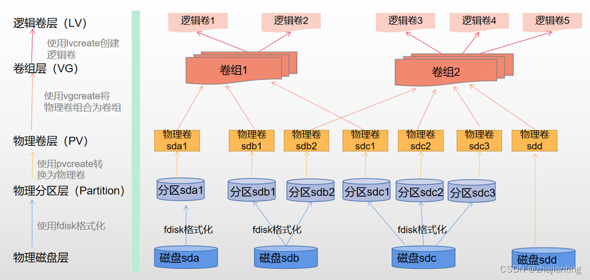

**优点：**

**1、可以在系统运⾏的状态下动态的扩展⽂件系统的⼤⼩。**

**2、⽂件系统可以跨多个磁盘，因此⽂件系统⼤⼩不会受物理磁盘的限制。**

**3、可以增加新的磁盘到LVM的存储池中。**

**4、可以以镜像的⽅式冗余重要的数据到多个物理磁盘。**

**5、可以⽅便的导出整个卷组到另外⼀台机器。**

**缺点：**

**1、因为加⼊了额外的操作，存取性能受到影响。**

**2、当卷组中的⼀个磁盘损坏时，整个卷组都会受到影响。**

**解释：LVM如果有⼀个磁盘损坏,整个lvm都坏了，lvm只有动态扩展作⽤，**

**⽅案：底层⽤RAID + 上层LVM = 既有冗余⼜有动态扩展**

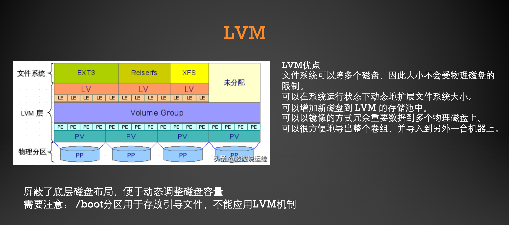

LVM 机制

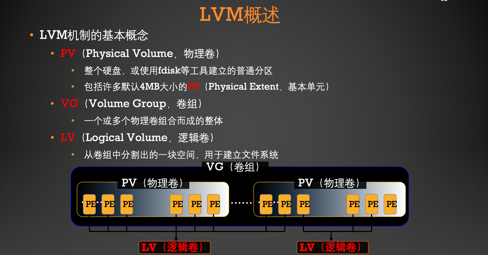

LVM 相关命令

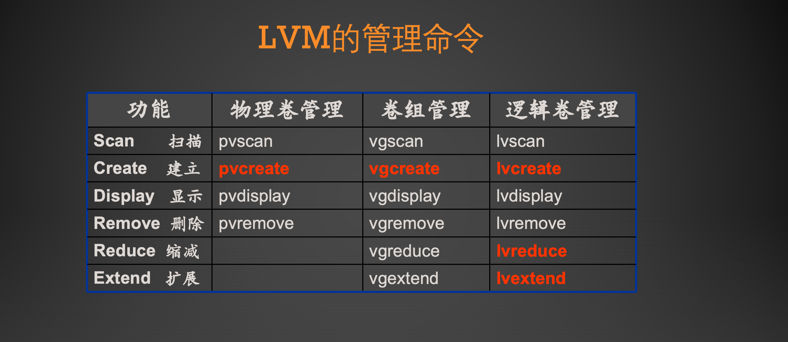

LVM应用


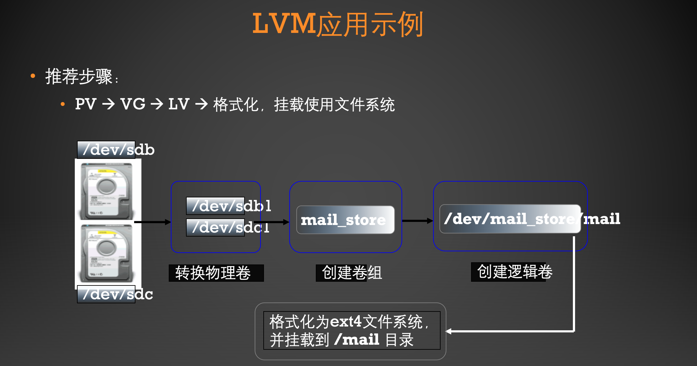


### （1）磁盘管理准备

按照[RAID实战](project02.md)中的方法在虚拟机中添加两块新硬盘。这里以新硬盘的设备文件名为sdb，sdc为例进行讲解。

### （2）硬盘分区：主分区、扩展分区和逻辑分区

接下来，对上述两块硬盘进行分区。

提示：本次实战的环境都需要以root身份登录Linux服务器。另外要求安装虚拟机的Windows系统能够连接网络。

#### 第一种方法：使用gparted图形工具分区，比较直观。

```
# 能够连接外网的情况下，
# 在本次实验中，虚拟机用的是NAT，所以只要Windows能连接外网，Linux就能够连接外网。
# 安装gparted图形分区工具。
[root@bogon ~]# yum install epel-release.noarch
[root@bogon ~]# yum install gparted
```

安装完成后，如下图，在“应用程序”->"系统工具"->"GParted".

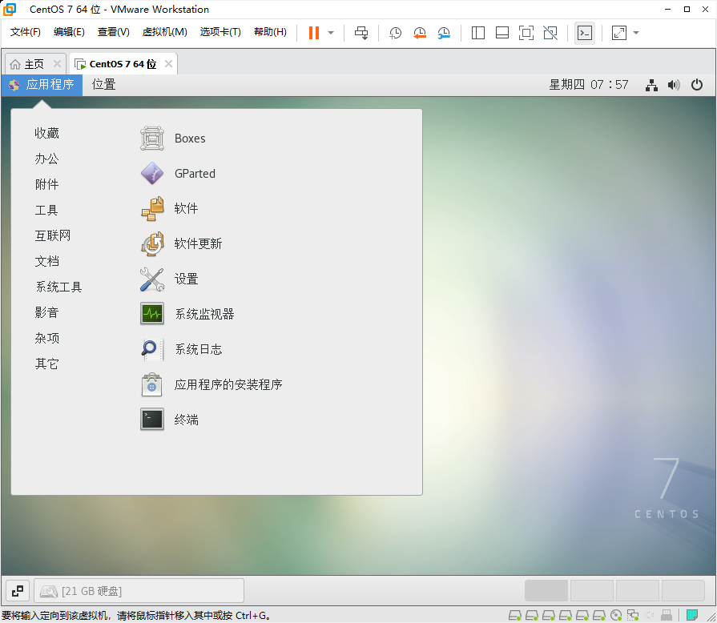

打开该工具：

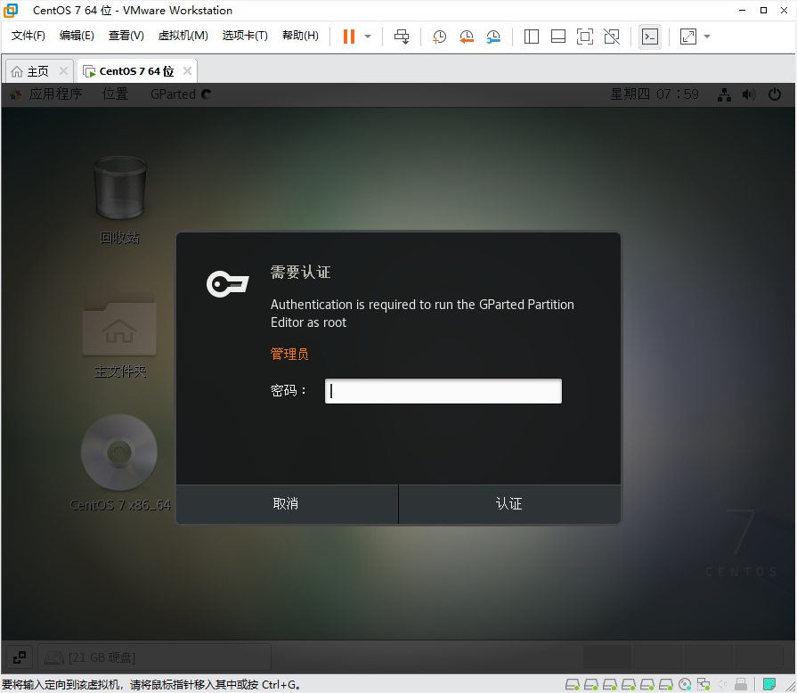

如果是普通用户，需要输入超级用户root的密码进行认证。

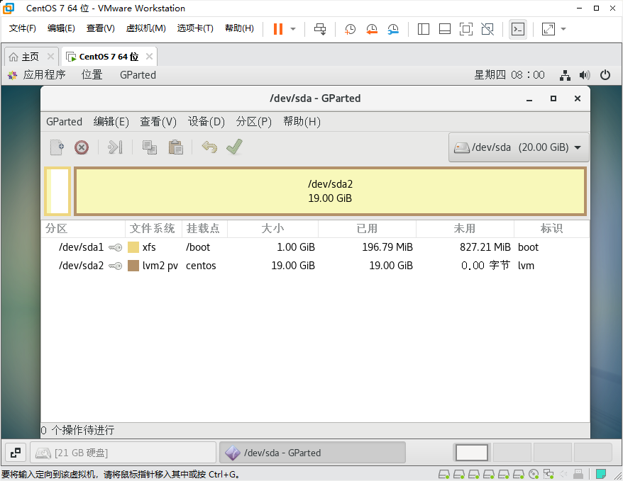

该工具的界面如上图所示。

下面具体介绍如何使用该工具对一块硬盘进行分区。点击右上角的下拉菜单选择“/dev/sdb”这块硬盘。如下图所示：

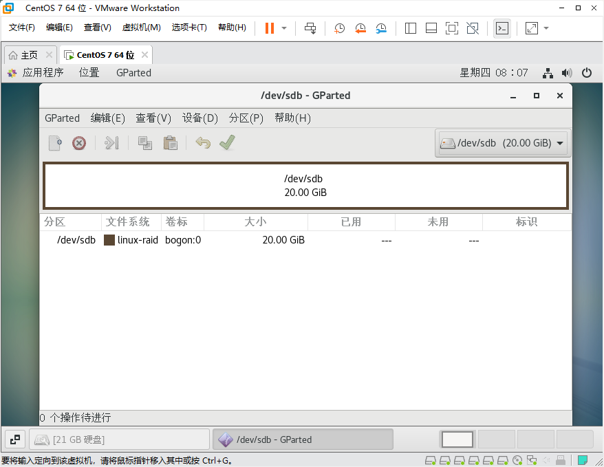

点击菜单中“设备”->"创建分区表"，如下图所示，选择新分区表类型，这里默认即可，点击“应用”。

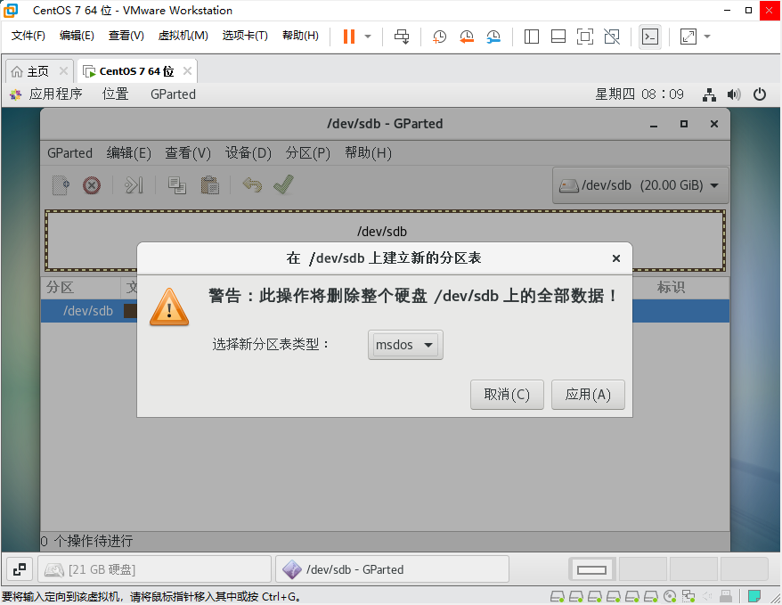

完成后，如下所示：

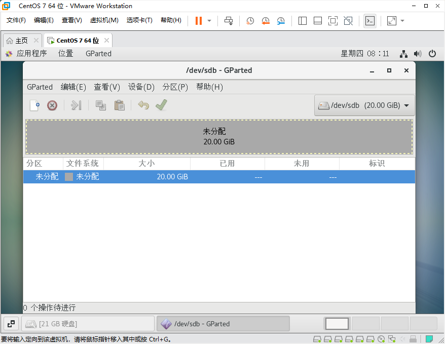

选中中间的灰色的“未分配”区域，点击右键，选择“新建”，

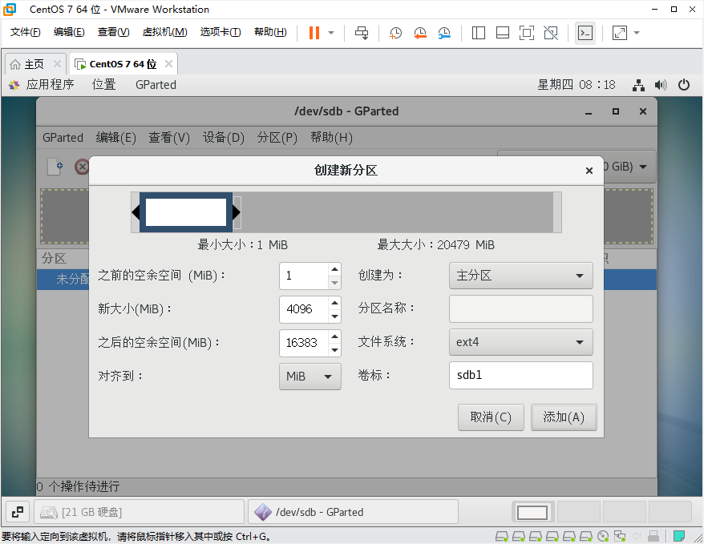

各个选项设置为如上图所示。点击“添加”。就可以完成了第一个主分区的创建。

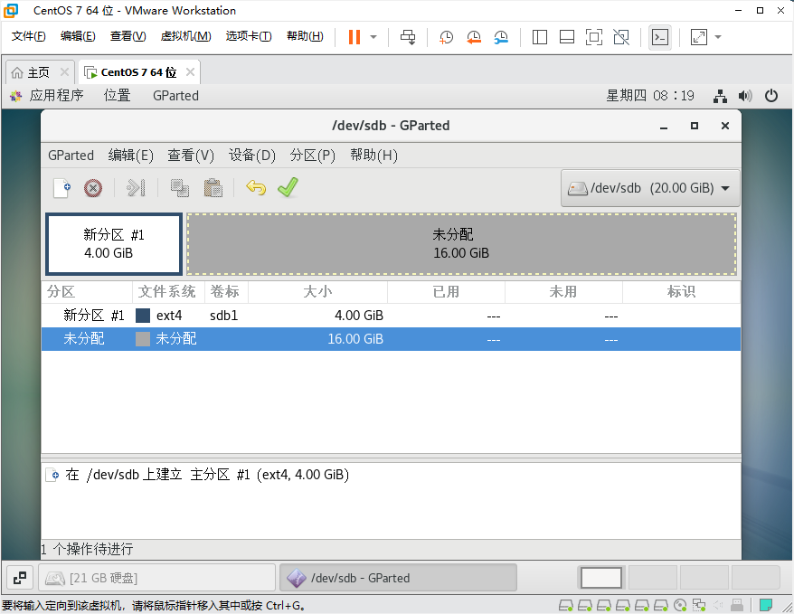

同样的方法，再创建第二个主分区。两个分区创建完成后，如下图所示。

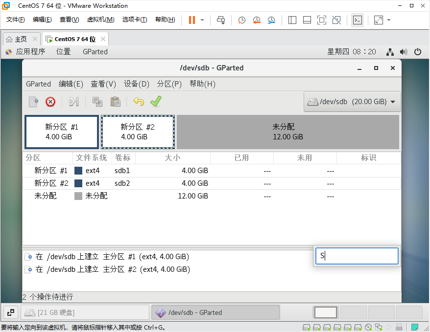

同理，在/dev/sdb这块硬盘上一共创建4个主分区。

==创建完成后，点击工具栏中的绿色的“对号”按钮。让分区设置真正的生效。==

最终结果如下所示：


这样就完成了4个主分区的创建。

```bash
# 在命令行下，确认/dev/sdb的分区情况，应该如下所示：
[root@bogon ~]# lsblk /dev/sdb
NAME   MAJ:MIN RM SIZE RO TYPE MOUNTPOINT
sdb      8:16   0  20G  0 disk
├─sdb1   8:17   0   4G  0 part
├─sdb2   8:18   0   4G  0 part
├─sdb3   8:19   0   4G  0 part
└─sdb4   8:20   0   8G  0 part

```

#### 第二种方法：使用fdisk命令分区，使用mkfs进行格式化

这两个命令的具体用法，可以参考如下的文章：

[【linux】循序渐进学运维-基础篇-分区命令fdisk - 知乎 (zhihu.com)](https://zhuanlan.zhihu.com/p/422401820)

[陈涛•笨办法学Linux-磁盘分区_哔哩哔哩_bilibili](https://www.bilibili.com/cheese/play/ep462560?query_from=0&search_id=1401569720790088842&search_query=linux怎么使用fdisk命令创建磁盘分区&csource=common_hpsearch_null_null&spm_id_from=333.337.search-card.all.click)

[linux操作系统硬盘分区fdisk实战_哔哩哔哩_bilibili](https://www.bilibili.com/video/BV14E411V7pE/?spm_id_from=333.337.search-card.all.click&vd_source=c7b66582e4bea8e9a772ca334df24fe5)

## 2、LVM实战

### 实战1：创建卷组vg

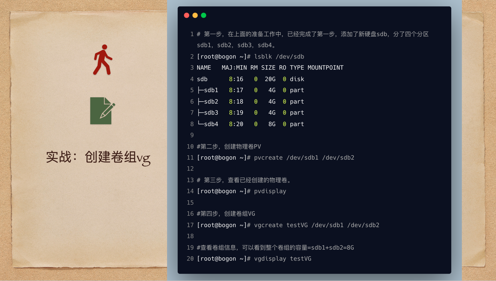

详细步骤如下所示：

- 首先创建物理卷pv

```bash
#----------------------------------------------------------
#实战1：创建卷组
#----------------------------------------------------------

# 第一步，在上面的准备工作中，已经完成了第一步，添加了新硬盘sdb，分了四个分区sdb1，sdb2，sdb3，sdb4。
[root@bogon ~]# lsblk /dev/sdb
NAME   MAJ:MIN RM SIZE RO TYPE MOUNTPOINT
sdb      8:16   0  20G  0 disk
├─sdb1   8:17   0   4G  0 part
├─sdb2   8:18   0   4G  0 part
├─sdb3   8:19   0   4G  0 part
└─sdb4   8:20   0   8G  0 part


#第二步，创建物理卷PV
[root@bogon ~]# pvcreate /dev/sdb1 /dev/sdb2
WARNING: ext4 signature detected on /dev/sdb1 at offset 1080. Wipe it? [y/n]: y
  Wiping ext4 signature on /dev/sdb1.
WARNING: ext4 signature detected on /dev/sdb2 at offset 1080. Wipe it? [y/n]: y
  Wiping ext4 signature on /dev/sdb2.
  Physical volume "/dev/sdb1" successfully created.
  Physical volume "/dev/sdb2" successfully created.
 
# 第三步，查看已经创建的物理卷，应该可以看到如下所示的信息。
[root@bogon ~]# pvdisplay /dev/sdb1
  "/dev/sdb1" is a new physical volume of "4.00 GiB"
  --- NEW Physical volume ---
  PV Name               /dev/sdb1
  VG Name
  PV Size               4.00 GiB
  Allocatable           NO
  PE Size               0
  Total PE              0
  Free PE               0
  Allocated PE          0
  PV UUID               v3j5vh-CZZp-8F6h-s2tP-3QTV-QOTR-sGahad

[root@bogon ~]# pvdisplay /dev/sdb2
  "/dev/sdb2" is a new physical volume of "4.00 GiB"
  --- NEW Physical volume ---
  PV Name               /dev/sdb2
  VG Name
  PV Size               4.00 GiB
  Allocatable           NO
  PE Size               0
  Total PE              0
  Free PE               0
  Allocated PE          0
  PV UUID               BS4Zf6-vMvy-2yZo-dFry-cBz9-bFFz-GOwifz
```

- 创建卷组vg

```bash
#第四步，创建卷组VG
[root@bogon ~]# vgcreate testVG /dev/sdb1 /dev/sdb2
  Volume group "testVG" successfully created
  
#查看卷组信息，可以看到整个卷组的容量=sdb1+sdb2=8G
[root@bogon ~]# vgdisplay testVG
  --- Volume group ---
  VG Name               testVG
  System ID
  Format                lvm2
  Metadata Areas        2
  Metadata Sequence No  1
  VG Access             read/write
  VG Status             resizable
  MAX LV                0
  Cur LV                0
  Open LV               0
  Max PV                0
  Cur PV                2
  Act PV                2
  VG Size               7.99 GiB
  PE Size               4.00 MiB
  Total PE              2046
  Alloc PE / Size       0 / 0
  Free  PE / Size       2046 / 7.99 GiB
  VG UUID               byVbZ2-p0h4-etQK-ue39-kt3x-Fx3E-sRrg3h

```

至此，已经卷组testVG已经创建成功了。

### 实战2：动态扩充卷组vg的容量

在服务器的实用过程中，经常遇到，随着数据的增多。当初规划的卷组容量不够的情况。

那么，我们可以按照如下的方式对卷组的容量实施动态扩充。例如刚才创建的testVG卷组的容量为8G，现在需要对其进行扩充4G，使其容量为12G。

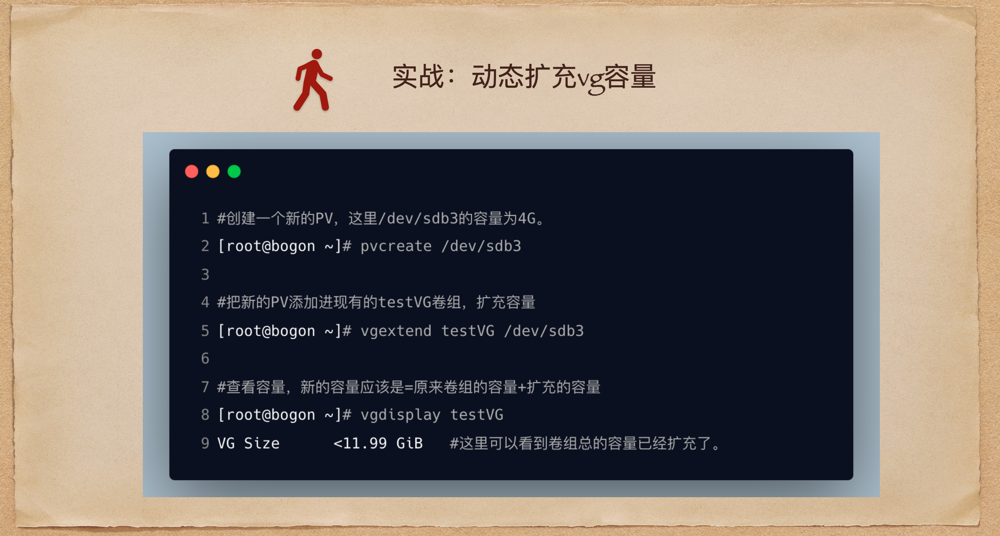

具体的扩充过程如下所示：

```
#----------------------------------------------------------
#实战2：动态扩充卷组的容量
#----------------------------------------------------------
#创建一个新的PV，这里/dev/sdb3的容量为4G。
[root@bogon ~]# pvcreate /dev/sdb3
WARNING: ext4 signature detected on /dev/sdb3 at offset 1080. Wipe it? [y/n]: y
  Wiping ext4 signature on /dev/sdb3.
  Physical volume "/dev/sdb3" successfully created. 
  
#把新的PV添加进现有的testVG卷组，扩充容量
[root@bogon ~]# vgextend testVG /dev/sdb3
  Volume group "testVG" successfully extended

  
#查看容量，新的容量应该是=原来卷组的容量+扩充的容量
[root@bogon ~]# vgdisplay testVG
  --- Volume group ---
  VG Name               testVG
  System ID
  Format                lvm2
  Metadata Areas        3
  Metadata Sequence No  2
  VG Access             read/write
  VG Status             resizable
  MAX LV                0
  Cur LV                0
  Open LV               0
  Max PV                0
  Cur PV                3
  Act PV                3
  VG Size               <11.99 GiB                      #这里可以看到卷组总的容量已经扩充了。
  PE Size               4.00 MiB
  Total PE              3069
  Alloc PE / Size       0 / 0
  Free  PE / Size       3069 / <11.99 GiB
  VG UUID               byVbZ2-p0h4-etQK-ue39-kt3x-Fx3E-sRrg3h
```

同样的方法，在服务器使用的过程中，可以随时按照这种方式添加新的pv，扩充卷组的大小。

那么创建出来的卷组testVG ，如何去使用它呢？接下来通过下面的实战进行演示：

### 实战3：创建逻辑卷并格式化，挂载到一个指定的目录

比如，服务器想要规划一个目录/root/test_lv，将来在该目录中存放客户端上传的文件，并且随着系统的运行，客户端存放的文件越来越多，那么应该怎么来做呢？

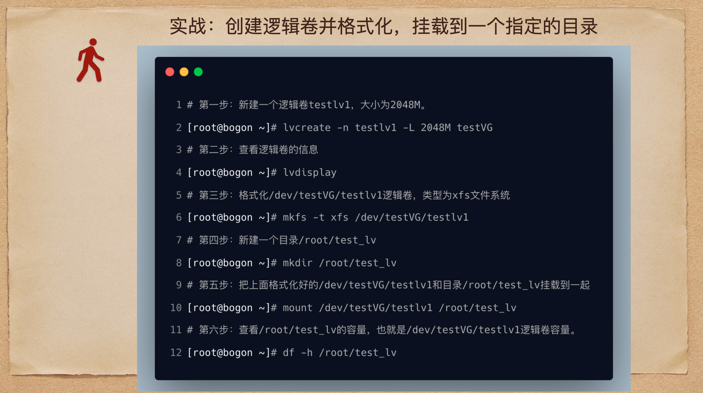

接下来通过实战3和实战4，进行演示说明。

具体步骤如下：

```bash
#----------------------------------------------------------
#实战3：从卷组testVG中创建逻辑卷testlv1并格式化，挂载到一个指定的目录
#----------------------------------------------------------
# 第一步：新建一个逻辑卷testlv1，大小为2048M。
[root@bogon ~]# lvcreate -n testlv1 -L 2048M testVG
  Logical volume "testlv1" created.
  
# 第二步：查看逻辑卷的信息
[root@bogon ~]# lvdisplay
  --- Logical volume ---
  LV Path                /dev/testVG/testlv1
  LV Name                testlv1                  # testlv1的逻辑卷
  VG Name                testVG                   # 从testVG卷组中新建
  LV UUID                jqluQt-fdNd-rxf3-yEmA-r7NU-UEwP-Lzay6n
  LV Write Access        read/write
  LV Creation host, time bogon, 2024-05-30 16:32:22 +0800
  LV Status              available
  # open                 0
  LV Size                2.00 GiB                # 大小为2048M
  Current LE             512
  Segments               1
  Allocation             inherit
  Read ahead sectors     auto
  - currently set to     8192
  Block device           253:2

# 第三步：格式化/dev/testVG/testlv1逻辑卷，类型为xfs文件系统
[root@bogon ~]# mkfs -t xfs /dev/testVG/testlv1
meta-data=/dev/testVG/testlv1    isize=512    agcount=4, agsize=131072 blks
         =                       sectsz=512   attr=2, projid32bit=1
         =                       crc=1        finobt=0, sparse=0
data     =                       bsize=4096   blocks=524288, imaxpct=25
         =                       sunit=0      swidth=0 blks
naming   =version 2              bsize=4096   ascii-ci=0 ftype=1
log      =internal log           bsize=4096   blocks=2560, version=2
         =                       sectsz=512   sunit=0 blks, lazy-count=1
realtime =none                   extsz=4096   blocks=0, rtextents=0

# 第四步：新建一个目录/root/test_lv
[root@bogon ~]# mkdir /root/test_lv

# 第五步：把上面格式化好的/dev/testVG/testlv1和目录/root/test_lv挂载到一起
[root@bogon ~]# mount /dev/testVG/testlv1 /root/test_lv

# 第六步：查看/root/test_lv的容量，其实也就是/dev/testVG/testlv1逻辑卷的容量。
[root@bogon ~]# df -h /root/test_lv
文件系统                    容量  已用  可用 已用% 挂载点
/dev/mapper/testVG-testlv1  2.0G   33M  2.0G    2% /root/test_lv
```

到这里，我们把新建的逻辑卷和目录/root/test_lv挂载后，就可以作为服务器的一个存储区域来使用，例如，该目录规划为客户端上传文件的使用，但是随着客户端上传的文件越来越多，2G的容量不够用，怎么办呢？

==LVM的机制的最大的好处就是可以支持在线的动态的扩充容量，而且不影响原有的服务器上的业务和数据。==

下面的实战4，来说明如何动态的扩充逻辑卷的容量。

### 实战4：动态扩充逻辑卷

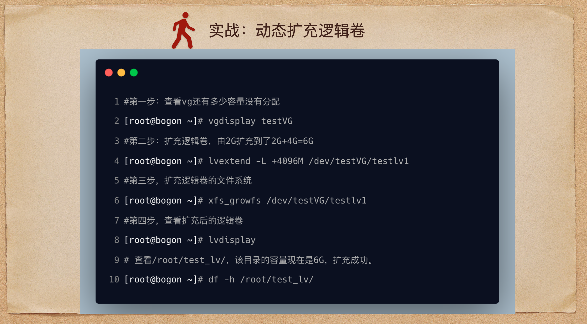

具体步骤如下：

```bash
#----------------------------------------------------------
#实战4： 动态扩充逻辑卷
#---------------------------------------------------------- 
#LVM支持在线对逻辑卷进行扩充，而且在线扩充不需要卸载正在使用的文件系统
#第一步：查看vg还有多少容量没有分配
[root@bogon ~]# vgdisplay testVG
  --- Volume group ---
  VG Name               testVG
 ...
  Alloc PE / Size       512 / 2.00 GiB    # 已经分配的空间
  Free  PE / Size       2557 / <9.99 GiB  # 剩余的可以分配的空间


#第二步：扩充逻辑卷，由2G扩充到了2G+4G=6G
[root@bogon ~]# lvextend -L +4096M /dev/testVG/testlv1
  Size of logical volume testVG/testlv1 changed from 2.00 GiB (512 extents) to 6.00 GiB (1536 extents).
  Logical volume testVG/testlv1 successfully resized.
  
#逻辑卷的容量扩充以后，还需要对扩展该逻辑卷的文件系统，如果是EXT类型的文件系统，使用
#resize2fs命令，XFS类型的文件系统使用xfs_growfs命令。
#第三步，扩充逻辑卷的文件系统
[root@bogon ~]# xfs_growfs /dev/testVG/testlv1
meta-data=/dev/mapper/testVG-testlv1 isize=512    agcount=4, agsize=131072 blks
...
data blocks changed from 524288 to 1572864

#第四步，查看扩充后的逻辑卷
[root@bogon ~]# lvdisplay
  --- Logical volume ---
  LV Path                /dev/testVG/testlv1
  LV Name                testlv1
  VG Name                testVG
  ...
  LV Size                6.00 GiB     #可以看出已经扩充为6G
  
# 查看/root/test_lv/，该目录的容量现在是6G，扩充成功。
[root@bogon ~]# df -h /root/test_lv/
文件系统                    容量  已用  可用 已用% 挂载点
/dev/mapper/testVG-testlv1  6.0G   33M  6.0G    1% /root/test_lv
```

按照此方法，可以随时扩充容量，更重要的是在扩充容量的时候，不需要停止服务器业务的运营。非常方便。

### 实战6：删除lvm

如果不想使用LVM的方式进行磁盘管理了。那么可以删除LVM，在删除的过程中，一定要遵循下面的顺序。

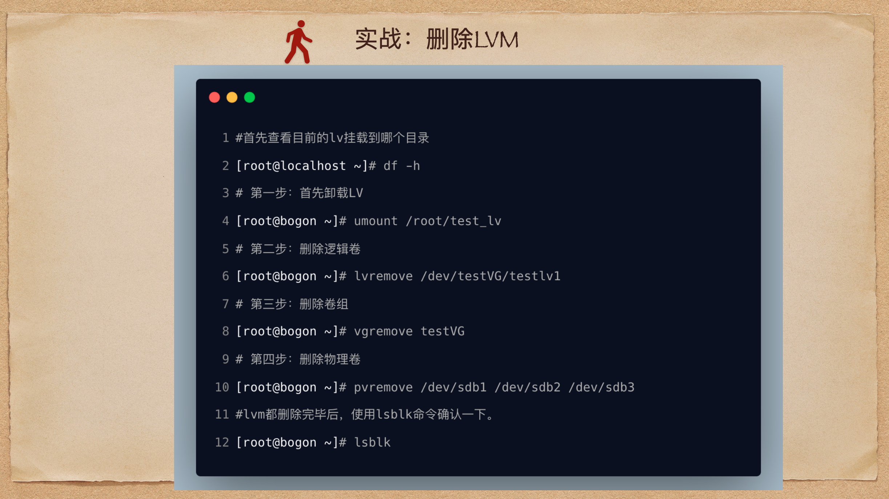

```
#----------------------------------------------------------
#实战6：删除lvm
#----------------------------------------------------------
#首先查看目前的lv挂载到哪个目录
[root@localhost ~]# df -h
/dev/mapper/testVG-testlv1  6.0G   33M  6.0G    1% /root/test_lv    # 可以看到目前的逻辑卷挂载到了/root/test_lv目录

# 第一步：首先卸载LV
[root@bogon ~]# umount /root/test_lv


# 第二步：删除逻辑卷
[root@bogon ~]# lvremove /dev/testVG/testlv1
Do you really want to remove active logical volume testVG/testlv1? [y/n]: y
  Logical volume "testlv1" successfully removed
# 第三步：删除卷组
[root@bogon ~]# vgremove testVG
  Volume group "testVG" successfully removed
  
# 第四步：删除物理卷
[root@bogon ~]# pvremove /dev/sdb1 /dev/sdb2 /dev/sdb3
  Labels on physical volume "/dev/sdb1" successfully wiped.
  Labels on physical volume "/dev/sdb2" successfully wiped.
  Labels on physical volume "/dev/sdb3" successfully wiped.


#lvm都删除完毕后，使用lsblk命令确认一下，可以看到所有的磁盘已经恢复到没有建立逻辑卷之前的状态。
[root@bogon ~]# lsblk
NAME            MAJ:MIN RM  SIZE RO TYPE MOUNTPOINT
sda               8:0    0   20G  0 disk
├─sda1            8:1    0    1G  0 part /boot
└─sda2            8:2    0   19G  0 part
  ├─centos-root 253:0    0   17G  0 lvm  /
  └─centos-swap 253:1    0    2G  0 lvm  [SWAP]
sdb               8:16   0   20G  0 disk
├─sdb1            8:17   0    4G  0 part
├─sdb2            8:18   0    4G  0 part
├─sdb3            8:19   0    4G  0 part
└─sdb4            8:20   0    8G  0 part
sdc               8:32   0   20G  0 disk
sdd               8:48   0   20G  0 disk
sde               8:64   0   20G  0 disk
sdf               8:80   0   20G  0 disk
sr0              11:0    1  9.6G  0 rom  /run/media/lsr/CentOS 7 x86_64

```

## 3、总结

- 建立逻辑卷过程如下：
  - （1）添加硬盘，并分区
  - （2）pvcreate 创建物理卷pv
  - （3）vgcreate 创建卷组vg
  - （4）lvcreate 创建逻辑卷lv
  - （5）格式化lv，并挂载到指定的目录即可使用
- 删除逻辑卷的过程相反：
  - （1）卸载逻辑卷lv
  - （2）删除逻辑卷lvremove
  - （3）删除卷组vgremove
  - （4）删除物理卷pvcreate
- 扩充卷组使用vgextend
- 扩充逻辑卷使用lvextend
- 提示：扩充逻辑卷后，还需要扩充逻辑卷的文件系统。（如果是ext类型的文件系统，使用resize2fs命令，xfs类型的文件系统使用xfs_growfs命令。）


[TOC]

 