# 磁盘阵列实战:

[TOC]

### 一、RAID磁盘阵列原理

数据存储在服务器

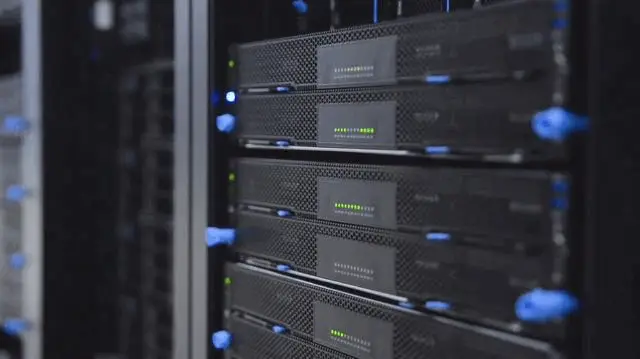

放在“水”中的硬盘


RAID 不但具有数据存储的功能，还有数据保护的作用。[什么是Raid？服务器大厂都用的Raid-10是什么？](https://www.bilibili.com/video/BV19e411Q7NF/?vd_source=c7b66582e4bea8e9a772ca334df24fe5)

**RAID-0**：只要有一块硬盘损坏，数据就会丢失。 把连续的数据分散存储，可以并行读写，性能较好。适合大规模并发读写，对数据安全性要求不高的场景。


**RAID-1**：优点在于数据备份，整体容量减少了50%。

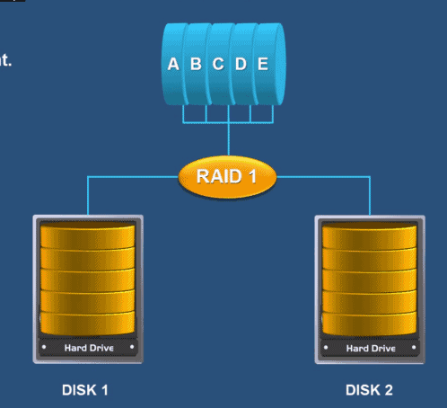

**RAID-5**：性能和数据备份的均衡考虑 。例如：如下图所示，容量=4-1，其中一块硬盘存储的是校验码。如果同时损毁2块以上的硬盘，数据就会丢失。也就是说仅支持1块硬盘损毁。

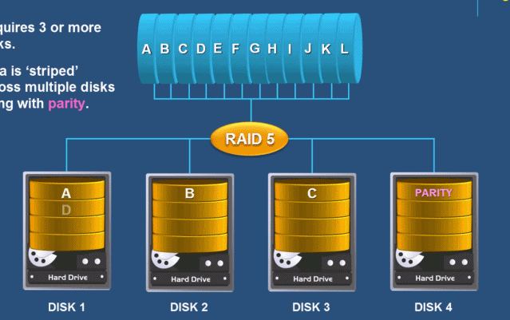

**RAID-10**： 先用两块硬盘组成RAID-1，然后把两组硬盘组成RAID-0。这样就能够既能利用RAID-0读写性能的好的优点，又能利用RAID-1的数据安全的特点。综合了两者优点。

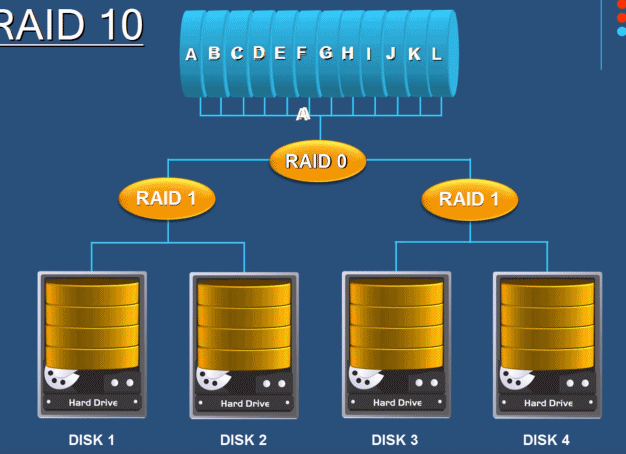

RAID10 演示精简版：

[磁盘阵列实战精简版](磁盘阵列RAID实战.txt)

`RAID磁盘阵列实战：`

`1、准备工作：`

`（1）在虚拟机中添加一块硬盘（sdc）。`
`（2）使用  gparted （ fdsik）分区工具把分成5个100M的分区。格式化为xfs类型 mkfs -t xfs 分区。`

`2、创建RAID10磁盘阵列：`

`（3）使用  mdadm -Cv /dev/md1 -n 4 -l 10 /dev/sdc1 /dev/sdc2 /dev/sdc3 /dev/sdc5   创建一个名为md1的磁盘阵列`
`（4）查看该磁盘阵列的详细信息  mdadm -Q /dev/md1`
`（5）也可以使用  lsblk -f  命令查看磁盘阵列`

`3、使用该磁盘阵列：`

`（6）然后格式化该磁盘阵列  mkfs -t xfs /dev/md1`
`（7）新建一个目录  mkdir /root/raid`
`（8）挂载该磁盘阵列  mount -t xfs /dev/md1 /root/raid`
`（9）使用 df -i /root/raid 查看此磁盘已经使用inode是多少`
`（10）使用 touch /root/raid/hello{1..10} 创建10个文件`
`（11）再次使用 df -i /root/raid 查看此磁盘已经使用inode，发现可用的inode少了10个`

`4、模拟磁盘损坏情况：`

`（12）使用mdadm /dev/md1 -f /dev/sdc3 来模拟/dev/sdc3磁盘已经损坏`
`（13）使用mdadm /dev/md1 -r /dev/sdc3 来移除该损坏的硬盘`
`（14）使用[root@localhost ~]# ls /root/raid 查看发现该磁盘阵列还能正常使用`
`（15）使用[root@localhost ~]# mdadm -D /dev/md1 查看发现只有3块硬盘可以工作了。`

`5、用新的硬盘进行热替换：`

`（16）使用[root@localhost ~]# mdadm /dev/md1 -a /dev/sdc6 新添加一块新的硬盘`
`（17）使用[root@localhost ~]# mdadm -D /dev/md1查看发现该磁盘阵列会自动完成数据重建工作`

`6、删除磁盘阵列：`

`（18）使用umount /dev/md1卸载该磁盘阵列`
`（19）使用mdadm --stop /dev/md1 删除该磁盘阵列`
`（20）使用lsblk -f 命令查看硬盘情况，看是否完成磁盘阵列的删除工作`


### 二、实战：创建一个磁盘阵列并挂载使用

#### 1、在虚拟机中添加4块新的硬盘

**步骤如下：**

首先虚拟机处于关机状态下，点击编辑虚拟机设置：

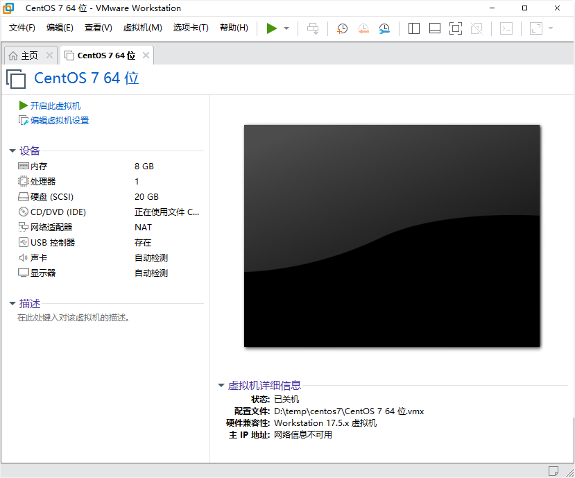

选中“硬盘”：


点击上图中的“添加”：


点击“下一步”：


选择虚拟磁盘类型，这里选择“SCSI”，下一步：

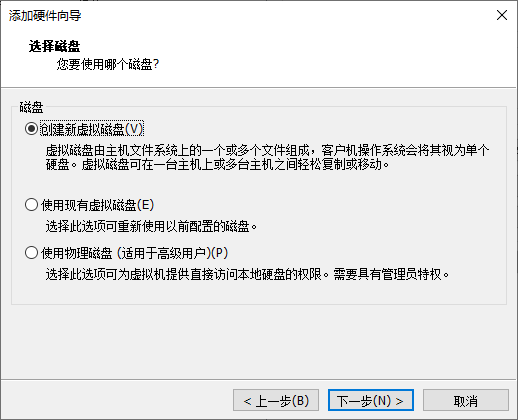

选中“创建新虚拟硬盘”，点击下一步：


设置磁盘大小，这里一起是默认即可。

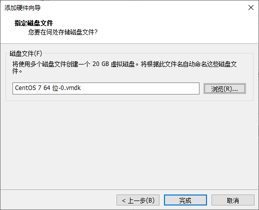

点击“完成”：

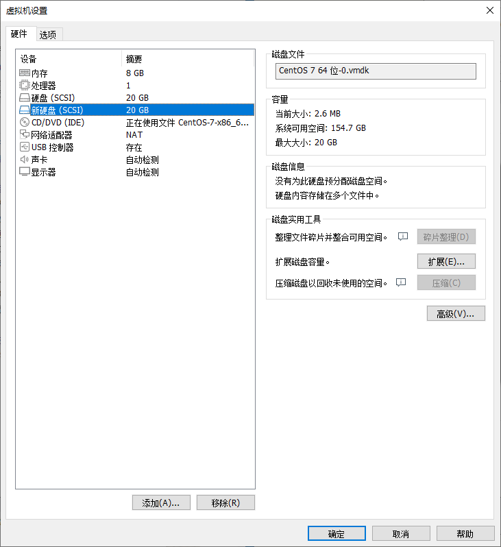

点击“确定”，如下图所示，就出现了一块新的硬盘。

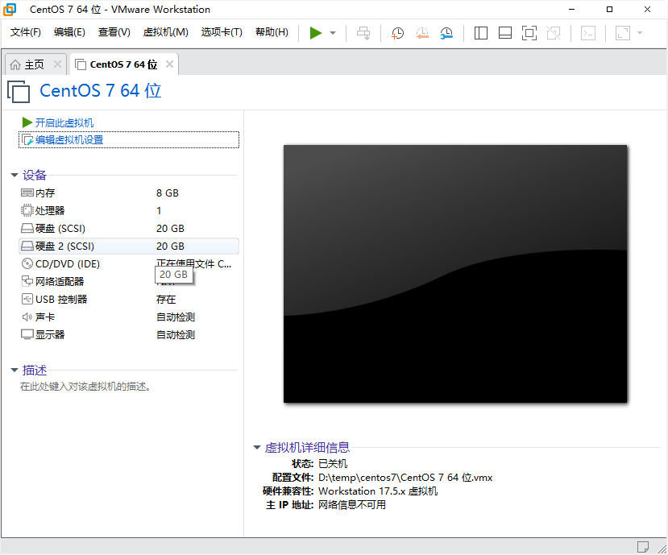

**重复上述过程，再添加3块硬盘。**也就是说一共添加了4块硬盘。

全部添加完成后，结果如下图所示：


可以看到，新添加的硬盘2，3，4，5。添加完成后，启动Linux。

然后按照如下步骤，给虚拟机拍摄快照。以便将来遇到问题可以迅速的恢复到现在这个状态。

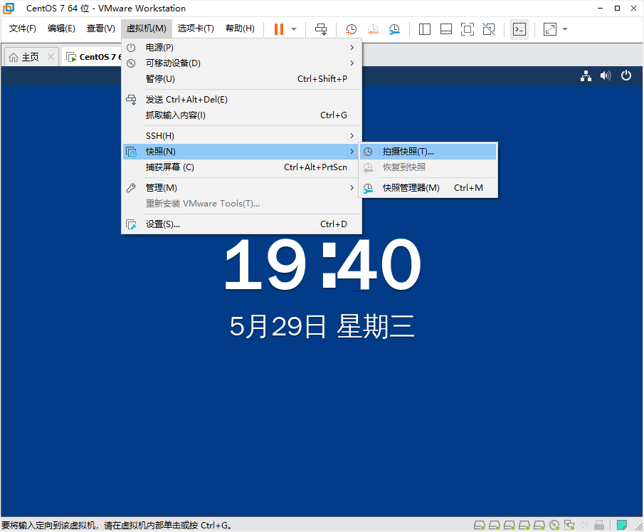


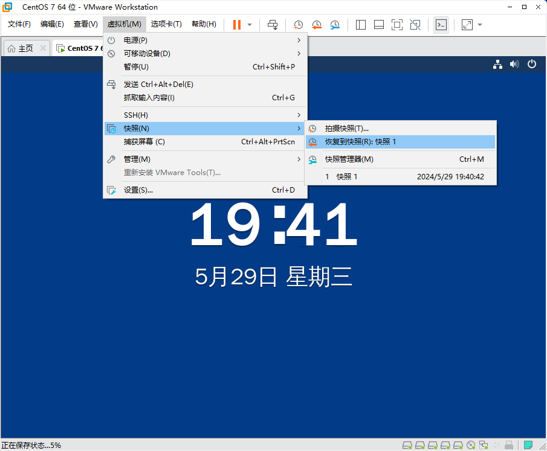

#### 2、创建磁盘阵列

第一步：查看4块硬盘

```bash
# 使用lsblk命令查看系统所有硬盘，这里应该看到如下所示的sdb,sdc,sdd,sde四块新添加的硬盘。
# 这里sda是系统盘，Linux操作系统安装在这块硬盘上。sr0是光盘。
[root@bogon ~]# lsblk
NAME            MAJ:MIN RM  SIZE RO TYPE MOUNTPOINT
sda               8:0    0   20G  0 disk
├─sda1            8:1    0    1G  0 part /boot
└─sda2            8:2    0   19G  0 part
  ├─centos-root 253:0    0   17G  0 lvm  /
  └─centos-swap 253:1    0    2G  0 lvm  [SWAP]
sdb               8:16   0   20G  0 disk
sdc               8:32   0   20G  0 disk
sdd               8:48   0   20G  0 disk
sde               8:64   0   20G  0 disk
sr0              11:0    1  9.6G  0 rom  /run/media/lsr/CentOS 7 x86_64

```

第二步：创建磁盘阵列RAID-10

```bash
# 创建RAID的命令是mdadm，首先查看帮助，了解该命令的详细用法。
[root@bogon ~]# mdadm --help
mdadm is used for building, managing, and monitoring
Linux md devices (aka RAID arrays)
...


# 使用mdadm创建RAID。这里创建的是RAID-10，所以需要4块硬盘。
# 用法详解：
#     -C 创建磁盘阵列  -v 显示创建的过程  /dev/md0 磁盘阵列的名称  -n 4 使用4块硬盘   -l 10 创建raid-10阵列
[root@bogon ~]# mdadm -Cv /dev/md0 -n 4 -l 10 /dev/sdb /dev/sdc /dev/sdd /dev/sde
mdadm: layout defaults to n2
mdadm: layout defaults to n2
mdadm: chunk size defaults to 512K
mdadm: size set to 20954112K
mdadm: Defaulting to version 1.2 metadata
mdadm: array /dev/md0 started.

# 查看是否创建成功
[root@bogon ~]# mdadm -Q /dev/md0
/dev/md0: 39.97GiB raid10 4 devices, 0 spares. Use mdadm --detail for more detail.
#RAID 10技术的原理。它通过两两一组硬盘组成的RAID 1磁盘阵列保证了数据的可靠性，
#其中每一份数据都会被保存两次，因此导致硬盘存在50%的使用率和50%的冗余率。
#这样一来，80GB的硬盘容量也就只有一半了。

# 如果想要更加详细的查看磁盘阵列的信息，可以使用如下命令
[root@bogon ~]# mdadm -D /dev/md0
/dev/md0:
           Version : 1.2
     Creation Time : Wed May 29 19:58:42 2024
        Raid Level : raid10                          # 磁盘阵列类型
        Array Size : 41908224 (39.97 GiB 42.91 GB)
     Used Dev Size : 20954112 (19.98 GiB 21.46 GB)
      Raid Devices : 4                               # 硬盘数量
     Total Devices : 4
       Persistence : Superblock is persistent

       Update Time : Wed May 29 20:02:13 2024
             State : clean
    Active Devices : 4                              # 活动的设备数量
   Working Devices : 4
    Failed Devices : 0
     Spare Devices : 0

            Layout : near=2
        Chunk Size : 512K

Consistency Policy : resync

              Name : bogon:0  (local to host bogon)
              UUID : de5a01ef:927c1b67:a07b1432:cd0f520d
            Events : 17
# 四块硬盘的具体信息
    Number   Major   Minor   RaidDevice State
       0       8       16        0      active sync set-A   /dev/sdb
       1       8       32        1      active sync set-B   /dev/sdc
       2       8       48        2      active sync set-A   /dev/sdd
       3       8       64        3      active sync set-B   /dev/sde

```

第三步：使用该磁盘阵列

```bash
# 使用lsblk -f 查看Linux硬盘及分区的详细信息。
[root@bogon ~]# lsblk -f
NAME            FSTYPE            LABEL           UUID                                   MOUNTPOINT
sda
├─sda1          xfs                               ef97badb-0869-49b1-b78e-8099f64f6baa   /boot
└─sda2          LVM2_member                       FBLD4g-kJuw-e6CF-UyRd-qHnH-Xc0C-lQ9ofP
  ├─centos-root xfs                               c902f40d-94a0-41ac-9c47-27d5e7c0e039   /
  └─centos-swap swap                              5663d949-c0d2-4a06-99fb-12455c5bda0c   [SWAP]
sdb             linux_raid_member bogon:0         de5a01ef-927c-1b67-a07b-1432cd0f520d
└─md0
sdc             linux_raid_member bogon:0         de5a01ef-927c-1b67-a07b-1432cd0f520d
└─md0
sdd             linux_raid_member bogon:0         de5a01ef-927c-1b67-a07b-1432cd0f520d
└─md0
sde             linux_raid_member bogon:0         de5a01ef-927c-1b67-a07b-1432cd0f520d
└─md0
sr0             iso9660           CentOS 7 x86_64 2022-07-26-18-09-05-00                 /run/media/lsr/CentOS 7 x86_64


# 格式化该磁盘阵列，类型为xfs文件系统
[root@bogon ~]# mkfs -t xfs /dev/md0
meta-data=/dev/md0               isize=512    agcount=16, agsize=654720 blks
         =                       sectsz=512   attr=2, projid32bit=1
         =                       crc=1        finobt=0, sparse=0
data     =                       bsize=4096   blocks=10475520, imaxpct=25
         =                       sunit=128    swidth=256 blks
naming   =version 2              bsize=4096   ascii-ci=0 ftype=1
log      =internal log           bsize=4096   blocks=5120, version=2
         =                       sectsz=512   sunit=8 blks, lazy-count=1
realtime =none                   extsz=4096   blocks=0, rtextents=0

#新建一个目录
[root@bogon ~]# mkdir raid
#把格式化以后得磁盘阵列挂载到/root/raid目录上。
[root@bogon ~]# mount -t xfs /dev/md0 /root/raid/

#再次查看分区信息，可以看到/dev/md0已经挂载到了/root/raid目录
[root@bogon ~]# lsblk -f
NAME            FSTYPE            LABEL           UUID                                   MOUNTPOINT
sda
├─sda1          xfs                               ef97badb-0869-49b1-b78e-8099f64f6baa   /boot
└─sda2          LVM2_member                       FBLD4g-kJuw-e6CF-UyRd-qHnH-Xc0C-lQ9ofP
  ├─centos-root xfs                               c902f40d-94a0-41ac-9c47-27d5e7c0e039   /
  └─centos-swap swap                              5663d949-c0d2-4a06-99fb-12455c5bda0c   [SWAP]
sdb             linux_raid_member bogon:0         de5a01ef-927c-1b67-a07b-1432cd0f520d
└─md0           xfs                               3ac217d8-5bf1-41dc-ad52-40c08def23d4   /root/raid
sdc             linux_raid_member bogon:0         de5a01ef-927c-1b67-a07b-1432cd0f520d
└─md0           xfs                               3ac217d8-5bf1-41dc-ad52-40c08def23d4   /root/raid
sdd             linux_raid_member bogon:0         de5a01ef-927c-1b67-a07b-1432cd0f520d
└─md0           xfs                               3ac217d8-5bf1-41dc-ad52-40c08def23d4   /root/raid
sde             linux_raid_member bogon:0         de5a01ef-927c-1b67-a07b-1432cd0f520d
└─md0           xfs                               3ac217d8-5bf1-41dc-ad52-40c08def23d4   /root/raid
sr0             iso9660           CentOS 7 x86_64 2022-07-26-18-09-05-00                 /run/media/lsr/CentOS 7 x86_64

# 查看磁盘阵列的索引节点使用情况
[root@bogon raid]# df -i /root/raid
文件系统          Inode 已用(I)  可用(I) 已用(I)% 挂载点
/dev/md0       20951040       3 20951037       1% /root/raid
#在该磁盘阵列上，新建10个文件
[root@bogon raid]# touch /root/raid/hello{1..10}
[root@bogon raid]# ls /root/raid
hello1  hello10  hello2  hello3  hello4  hello5  hello6  hello7  hello8  hello9

#再次查看索引节点，发现可以用节点从20951037变成了20951027。也就是说这10个文件占用了磁盘阵列10个索引节点。
[root@bogon raid]# df -i /root/raid
文件系统          Inode 已用(I)  可用(I) 已用(I)% 挂载点
/dev/md0       20951040      13 20951027       1% /root/raid

```

#### 3、磁盘阵列损坏不影响数据安全

```bash
# 当上述的磁盘阵列中损坏一块硬盘时，不影响数据安全性。
# 现在使用如下命令来模拟一块硬盘损坏的情况:  -f 模拟磁盘损坏的情况
[root@bogon raid]# mdadm /dev/md0 -f /dev/sdb
mdadm: set /dev/sdb faulty in /dev/md0

# 查看磁盘阵列，发现只有3块可以工作了。
[root@bogon raid]# mdadm -D /dev/md0
/dev/md0:
           Version : 1.2
     Creation Time : Wed May 29 19:58:42 2024
        Raid Level : raid10
        Array Size : 41908224 (39.97 GiB 42.91 GB)
     Used Dev Size : 20954112 (19.98 GiB 21.46 GB)
      Raid Devices : 4
     Total Devices : 4
       Persistence : Superblock is persistent

       Update Time : Wed May 29 20:48:17 2024
             State : clean, degraded
    Active Devices : 3                           # 工作的硬盘只有3块了
   Working Devices : 3
    Failed Devices : 1                           # 损坏了一块硬盘
     Spare Devices : 0

            Layout : near=2
        Chunk Size : 512K

Consistency Policy : resync

              Name : bogon:0  (local to host bogon)
              UUID : de5a01ef:927c1b67:a07b1432:cd0f520d
            Events : 19

    Number   Major   Minor   RaidDevice State
       -       0        0        0      removed
       1       8       32        1      active sync set-B   /dev/sdc
       2       8       48        2      active sync set-A   /dev/sdd
       3       8       64        3      active sync set-B   /dev/sde

       0       8       16        -      faulty   /dev/sdb              #这块硬盘已经损坏
  
# 把该块损坏的硬盘从磁盘阵列中移除。
[root@bogon raid]# mdadm /dev/md0 -r /dev/sdb
# 再次查看磁盘阵列
mdadm: hot removed /dev/sdb from /dev/md0
[root@bogon raid]# mdadm -D /dev/md0
/dev/md0:
           Version : 1.2
     Creation Time : Wed May 29 19:58:42 2024
        Raid Level : raid10
        Array Size : 41908224 (39.97 GiB 42.91 GB)
     Used Dev Size : 20954112 (19.98 GiB 21.46 GB)
      Raid Devices : 4
     Total Devices : 3
       Persistence : Superblock is persistent

       Update Time : Wed May 29 20:56:02 2024
             State : clean, degraded
    Active Devices : 3
   Working Devices : 3
    Failed Devices : 0
     Spare Devices : 0

            Layout : near=2
        Chunk Size : 512K

Consistency Policy : resync

              Name : bogon:0  (local to host bogon)
              UUID : de5a01ef:927c1b67:a07b1432:cd0f520d
            Events : 20

    Number   Major   Minor   RaidDevice State
       -       0        0        0      removed
       1       8       32        1      active sync set-B   /dev/sdc
       2       8       48        2      active sync set-A   /dev/sdd
       3       8       64        3      active sync set-B   /dev/sde
```

#### 4、替换新的硬盘并重建磁盘阵列

把虚拟机关机，然后按照上述的步骤，在虚拟机中再新添加一块硬盘。

```
# 查看Linux中硬盘，可以看到新添加的硬盘sdf
[root@bogon ~]# lsblk -f
NAME            FSTYPE            LABEL           UUID                                   MOUNTPOINT
sda
├─sda1          xfs                               ef97badb-0869-49b1-b78e-8099f64f6baa   /boot
└─sda2          LVM2_member                       FBLD4g-kJuw-e6CF-UyRd-qHnH-Xc0C-lQ9ofP
  ├─centos-root xfs                               c902f40d-94a0-41ac-9c47-27d5e7c0e039   /
  └─centos-swap swap                              5663d949-c0d2-4a06-99fb-12455c5bda0c   [SWAP]
sdb             linux_raid_member bogon:0         de5a01ef-927c-1b67-a07b-1432cd0f520d
sdc             linux_raid_member bogon:0         de5a01ef-927c-1b67-a07b-1432cd0f520d
└─md127         xfs                               3ac217d8-5bf1-41dc-ad52-40c08def23d4
sdd             linux_raid_member bogon:0         de5a01ef-927c-1b67-a07b-1432cd0f520d
└─md127         xfs                               3ac217d8-5bf1-41dc-ad52-40c08def23d4
sde             linux_raid_member bogon:0         de5a01ef-927c-1b67-a07b-1432cd0f520d
└─md127         xfs                               3ac217d8-5bf1-41dc-ad52-40c08def23d4
sdf                                                                                         #新添加的硬盘
sr0             iso9660           CentOS 7 x86_64 2022-07-26-18-09-05-00


#原来的/dev/md0磁盘阵列名称变成了/dev/md127

#把上面的sdf这块新的硬盘，就可以使用-a选项添加新的硬盘到阵列中。
[root@bogon ~]# mdadm /dev/md127 -a /dev/sdf
mdadm: added /dev/sdf

# 查看阵列信息，添加了硬盘以后，会需要一个时间进行数据重建，时间长短依据数据量的大小。
[root@bogon ~]# mdadm -D /dev/md127
/dev/md127:
           Version : 1.2
     Creation Time : Wed May 29 19:58:42 2024
        Raid Level : raid10
        Array Size : 41908224 (39.97 GiB 42.91 GB)
     Used Dev Size : 20954112 (19.98 GiB 21.46 GB)
      Raid Devices : 4
     Total Devices : 4
       Persistence : Superblock is persistent

       Update Time : Wed May 29 21:09:00 2024
             State : clean, degraded, recovering
    Active Devices : 3
   Working Devices : 4
    Failed Devices : 0
     Spare Devices : 1

            Layout : near=2
        Chunk Size : 512K

Consistency Policy : resync

    Rebuild Status : 14% complete                          # 数据重建完成了14%

              Name : bogon:0  (local to host bogon)
              UUID : de5a01ef:927c1b67:a07b1432:cd0f520d
            Events : 27

    Number   Major   Minor   RaidDevice State
       4       8       80        0      spare rebuilding   /dev/sdf
       1       8       32        1      active sync set-B   /dev/sdc
       2       8       48        2      active sync set-A   /dev/sdd
       3       8       64        3      active sync set-B   /dev/sde
       
#过一段时间后，再次查询阵列信息，发现数据重建已经完成。
[root@bogon ~]# mdadm -D /dev/md127
/dev/md127:
           Version : 1.2
     Creation Time : Wed May 29 19:58:42 2024
        Raid Level : raid10
        Array Size : 41908224 (39.97 GiB 42.91 GB)
     Used Dev Size : 20954112 (19.98 GiB 21.46 GB)
      Raid Devices : 4
     Total Devices : 4
       Persistence : Superblock is persistent

       Update Time : Wed May 29 21:10:32 2024
             State : clean
    Active Devices : 4                             #活动的设备是4块硬盘
   Working Devices : 4
    Failed Devices : 0
     Spare Devices : 0

            Layout : near=2
        Chunk Size : 512K

Consistency Policy : resync

              Name : bogon:0  (local to host bogon)
              UUID : de5a01ef:927c1b67:a07b1432:cd0f520d
            Events : 42

    Number   Major   Minor   RaidDevice State
       4       8       80        0      active sync set-A   /dev/sdf       #原有的sdb硬盘被替换成sdf
       1       8       32        1      active sync set-B   /dev/sdc
       2       8       48        2      active sync set-A   /dev/sdd
       3       8       64        3      active sync set-B   /dev/sde

# 数据并没有丢失
# 重新挂载该磁盘阵列
[root@bogon ~]# mount -t xfs /dev/md127 /root/raid
# 查看阵列中的文件，发现原来创建的10个文件仍然存在，并没有因为一块硬盘损坏出现数据丢失的情况。
[root@bogon ~]# ls /root/raid
hello1  hello10  hello2  hello3  hello4  hello5  hello6  hello7  hello8  hello9


```


#### 5、删除磁盘阵列

```bash
# 首先卸载磁盘阵列
[root@bogon ~]# umount /dev/md127

# 删除磁盘阵列
[root@bogon ~]# mdadm --stop /dev/md127
mdadm: stopped /dev/md127

# 查看磁盘信息，发现磁盘阵列已经删除。
[root@bogon ~]# lsblk
NAME            MAJ:MIN RM  SIZE RO TYPE MOUNTPOINT
sda               8:0    0   20G  0 disk
├─sda1            8:1    0    1G  0 part /boot
└─sda2            8:2    0   19G  0 part
  ├─centos-root 253:0    0   17G  0 lvm  /
  └─centos-swap 253:1    0    2G  0 lvm  [SWAP]
sdb               8:16   0   20G  0 disk
sdc               8:32   0   20G  0 disk
sdd               8:48   0   20G  0 disk
sde               8:64   0   20G  0 disk
sdf               8:80   0   20G  0 disk
sr0              11:0    1  9.6G  0 rom
```

### 三、实战小结

本次实战完成了以下任务：

- 磁盘阵列原理
- 添加4块新硬盘
- 创建RAID-10
- 损坏一块硬盘
- 替换新的硬盘（可以利用原来的三块硬盘，重建好恢复数据）
- 重建后，发现阵列中的原有数据是并没有丢失
- 删除磁盘阵列

[TOC]


