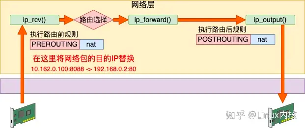

# 漫谈 Linux 系列--iptables防火墙


## 一、硬件防火墙


- [业界首款T级设备，华为最高端防火墙的排面——USG9500系列 - 西瓜视频 (ixigua.com)](https://www.ixigua.com/6862655469459243528?logTag=ed3c7911a44550285b6d)

- [聊聊下一代防火墙的前列厂商和选购的正确姿势 - 西瓜视频 (ixigua.com)](https://www.ixigua.com/6938007317803860517?logTag=7574995d7ec71f79e589)

- [选购高端防火墙有哪些注意事项？以20万价位的飞塔1101E为例 - 西瓜视频 (ixigua.com)](https://www.ixigua.com/6945398352301261348?logTag=14a9f82cce8a19ea9afc)

- [人工智能加持的下一代防火墙有多强？既挡外敌，又防内鬼 - 西瓜视频 (ixigua.com)](https://www.ixigua.com/6849263432039039496?logTag=cd18e21f8249455ab929)

## 二、软件防火墙

### 1、iptables 静态防火墙


IPtables 的原理：

IPtables是基于netfilter来实现的。

Linux下的netfilter在内核协议栈的各个重要关卡埋下了五个钩子。

每一个钩子都对应是一些列规则，以链表的形式存在，所以俗称五链。

当网络包在协议栈中流转到这些关卡的时候，就会一次执行在这些钩子上注册的规则，进而实现对网络包的处理。

（1）网卡接收数据包的过程


Linux 在网络包接收在 IP 层的入口函数是 ip_rcv。网络在这里包碰到的第一个 HOOK 就是 PREROUTING。当该钩子上的规则都处理完后，会进行路由选择。如果发现是本设备的网络包，进入 ip_local_deliver 中，在这里又会遇到 INPUT 钩子。

接收数据的处理流程是：PREROUTING链 -> 路由判断（是本机）-> INPUT链 -> ...

（2）发送数据包的过程


Linux 在网络包发送的过程中，首先是发送的路由选择，然后碰到的第一个 HOOK 就是 OUTPUT，然后接着进入 POSTROUTING 链。

发送数据包流程是：路由选择 -> OUTPUT链 -> POSTROUTING链 -> ...

（3）转发数据包流程


其实除了接收和发送过程以外，Linux 内核还可以像路由器一样来工作。它将接收到网络包（不属于自己的），然后根据路由表选到合适的网卡设备将其转发出去。

这个过程中，先是经历接收数据的前半段。在 ip_rcv 中经过 PREROUTING 链，然后路由后发现不是本设备的包，那就进入 ip_forward 函数进行转发，在这里又会遇到 FORWARD 链。最后还会进入 ip_output 进行真正的发送，遇到 POSTROUTING 链。

转发数据过程：PREROUTING链 -> 路由判断（不是本设备，找到下一跳） -> FORWARD链 -> POSTROUTING链 -> ...

（4）三个过程总结


理解了接收、发送和转发三个过程以后，让我们把上面三个流程汇总起来。

- 数据接收过程走的是 1 和 2

- 发送过程走的是 4 、5

- 转发过程是 1、3、5

有了这张图，我们能更清楚地理解 iptables 和内核的关系。

（5）iptables 的四表


在上一节中，我们介绍了 iptables 中的五个链。在每一个链上都可能是由许多个规则组成的。在 NF_HOOK 执行到这个链的时候，就会把规则按照优先级挨个过一遍。如果有符合条件的规则，则执行规则对应的动作。

而这些规则根据用途的不同，又可以raw、mangle、nat 和 filter。

- raw 表的作用是将命中规则的包，跳过其它表的处理，它的优先级最高。
- mangle 表的作用是根据规则修改数据包的一些标志位，比如 TTL
- nat 表的作用是实现网络地址转换
- filter 表的作用是过滤某些包，这是防火墙工作的基础

例如在 PREROUTING 链中的规则中，分别可以执行 raw、mangle 和 nat 三种功能。


我们再来聊聊，为什么不是全部四个表呢。这是由于功能的不同，不是所有功能都会完全使用到五个链。

Raw 表目的是跳过其它表，所以只需要在接收和发送两大过程的最开头处把关，所以只需要用到 PREROUTING 和 OUTPUT 两个钩子。

Mangle 表有可能会在任意位置都有可能会修改网络包，所以它是用到了全部的钩子位置。

NAT 分为 SNAT（Source NAT）和 DNAT（Destination NAT）两种，可能会工作在 PREROUTING、INPUT、OUTPUT、POSTROUTING 四个位置。

Filter 只在 INPUT、OUTPUT 和 FORWARD 这三步中工作就够了。

从整体上看，四链五表的关系如下图。


### 2、例题

#### 例题1：使用iptables 实现snat 功能

假如说我们有一台 Linux，它的 eth0 的 IP 是10.162.0.100，通过这个 IP 可以访问另外其它服务器。现在我们在这台机器上创建了个 Docker 虚拟网络环境 net1 出来，它的网卡 veth1 的 IP 是 192.168.0.2。

如果想让 192.168.0.2 能访问外部网络，则需要宿主网络命名空间下的设备工作帮其进行网络包转发。由于这是个私有的地址，只有这台 Linux 认识，所以它是无法访问外部的服务器的。这个时候如果想要让 net1 正常访问 10.162.0.101，就必须在转发时执行 SNAT - 源地址替换。


SNAT 工作在路由之后，网络包发送之前，也就是 POSTROUTING 链。我们在宿主机的命名空间里增加如下这条 iptables 规则。这条规则判断如果源是 192.168.0 网段，且目的不是 br0 的，统统执行源 IP 替换判断。

```bash
iptables -t nat -A POSTROUTING -s 192.168.0.0/24 ! -o br0 -j MASQUERADE
```

有了这条规则，我们来看下整个发包过程。

当数据包发出来的时候，先从 veth 发送到 br0。由于 br0 在宿主机的命名空间中，这样会执行到 POSTROUTING 链。在这个链有我们刚配置的 snat 规则。根据这条规则，内核将网络包中 192.168.0.2（外界不认识） 替换成母机的 IP 10.162.0.100（外界都认识）。同时还要跟踪记录链接状态。


#### 例题 2：使用iptables 实现DNAT

接着上面小节里的例子，假设我们想在 192.168.0.2 上提供 80 端口的服务。同样，外面的服务器是无法访问这个地址的。这个时候要用到 DNAT 目的地址替换。需要在数据包进来的时候，将其目的地址替换成 192.168.0.2:80 才行。


DNAT 工作在内核接收到网络包的第一个链中，也就是 PREROUTING。我们增加一条 DNAT 规则，具体的配置如下。

```bash
iptables -t nat -A PREROUTING  ! -i br0 -p tcp -m tcp --dport 8088 -j DNAT --to-destination 192.168.0.2:80
```

当有外界来的网络包到达 eth0 的时候。由于 eth0 在母机的命名空间中，所以会执行到 PREROUTING 链。

该规则判断如果端口是 8088 的 TCP 请求，则将目的地址替换为 192.168.0.2:80。再通过 br0（192.168.0.1）转发数据包，数据包将到达真正提供服务的 192.168.0.2:80 上。



同样在 DNAT 中也会有链接跟踪记录，所以 192.168.0.2 给 10.162.0.101 的返回包中的源地址会被替换成 10.162.0.100:8088。之后 10.162.0.101 收到包，它一直都以为自己是真的和 10.162.0.100:8088通信。这样 net1 环境中的 veth1 也可以提供服务给外网使用了。

事实上，单机的 Docker 就是通过这两小节介绍的 SNAT 和 DNAT 配置来进行网络通信的。

#### 例题 3：使用iptables 实现filter 包过滤

filter 表主要实现网络包的过滤。

假如我们发现了一个恶意 IP 疯狂请求我们的服务器，对服务造成了影响。那么我们就可以用 filter 把它禁掉。其工作原理就是在接收包的 INPUT 链位置处进行判断，发现是恶意请求就尽早干掉不处理。避免进入到更上层继续浪费 CPU 开销。


具体的配置方法细节如下：

```bash
iptables -I INPUT -s 1.2.3.4 -j DROP         //封禁 

iptables -D INPUT -s 1.2.3.4 -j DROP        //解封
```

当然也可以封禁某个 IP 段。

```bash
iptables -I INPUT -s 121.0.0.0/8 -j DROP //封禁

iptables -I INPUT -s 121.0.0.0/8 -j DROP //解封
```

再比如说假设你不想让别人任意 ssh 登录你的服务器，只允许你的 IP 访问。那就只放开你自己的 IP，其它的都禁用掉就好了。

```bash
iptables -t filter -I INPUT -s 1.2.3.4 -p tcp --dport 22 -j ACCEPT   

iptables -t filter -I INPUT -p tcp --dport 22 -j DROP
```

#### 例题 4：raw 表

raw 表中的规则可以绕开其它表的处理。在 nat 表中，为了保证双向的流量都能正常完成地址替换，会跟踪并且记录链接状态。每一条连接都会有对应的记录生成。使用以下两个命令可以查看。

```bash
conntrack -L  

cat /proc/net/ip_conntrack
```

但在高流量的情况下，可能会有连接跟踪记录满的问题发生。我就遇到过一次在测试单机百万并发连接的时候，发生因连接数超过了 nf_conntrack_max 而导致新连接无法建立的问题。

```bash
ip_conntrack: table full, dropping packet
```

但其实如果不使用 NAT 功能的话，链接跟踪功能是可以关闭的，例如。

```bash
iptables -t raw -A PREROUTING -d 1.2.3.4 -p tcp --dport 80 -j NOTRACK 

iptables -A FORWARD -m state --state UNTRACKED -j ACCEPT
```

#### 例题 5：mangle 表

路由器在转发网络包的时候，ttl 值会减 1 ，该值为 0 时，最后一个路由就会停止再转发这个数据包。如若不想让本次路由影响 ttl，便可以在 mangel 表中加个 1，把它给补回来。

```bash
iptables -t mangle -A PREROUTING -i eth0 -j TTL --ttl-inc 
```

  所有从 eth0 接口进来的数据包的 ttl 值加 1，以抵消路由转发默认减的 1。

### 3、iptables总结

iptables 是一个非常常用，也非常重要的工具。Linux 上的防火墙、nat 等基础功能都是基于它实现的。还有现如今流行的的 Docker、Kubernets、Istio 项目中也经常能见着对它的身影。正因为如此，所以深入理解 iptables 工作原理是非常有价值的事情。

今天我们先是在第一节里从内核接收、发送、转发三个不同的过程理解了五链的位置。


接着又根据描述了 iptables 从功能上看的另外一个维度，表。每个表都是在多个钩子位置处注册自己的规则。当处理包的时候触发规则，并执行。从整体上看，四链五表的关系如下图。


最后我们又分别在 raw、mangle、nat、filter 几个表上举了简单的应用例子。希望通过今天的学习，你能将 iptables 彻底融会贯通。相信这一定会对你的工作有很大的帮助的！

### 4、iptables 语法

清空及查询规则


实用的命令


## 三、firewalld 动态防火墙


**什么是动态防火墙？**

为了解答这个问题，**先来回忆一下iptables service管理防火墙规则的模式：**

用户将新的防火墙规则添加进 /etc/sysconfig/iptables配置文件当中，再执行命令service iptables reload使变更的规则生效；

在这整个过程的背后，iptables service首先对旧的防火墙规则进行了清空，然后重新完整地加载所有新的防火墙规则；

而如果配置了需要reload内核模块的话，过程背后还会包含卸载和重新加载内核模块的动作；

而不幸的是，这个动作很可能对运行中的系统产生额外的不良影响，特别是在网络非常繁忙的系统中。

如果我们把这种哪怕只修改一条规则也要进行所有规则的重新载入的模式称为静态防火墙的话，那么firewalld所提供的模式就可以叫做动态防火墙，它的出现就是为了解决这一问题；

任何规则的变更都不需要对整个防火墙规则列表进行重新加载，只需要将变更部分保存并更新到运行中的 iptables即可。


如果开启Firewalld防火墙，默认情况会阻止流量流入，但允许流量流出。


### 1、防火墙 zone

相比于传统的防火墙管理工具还支持了动态更新技术并加入了“zone区域”的概念。

简单来说就是为用户预先准备了几套防火墙策略集合（策略模板），然后可以根据生产场景的不同而选择合适的策略集合，实现了防火墙策略之间的快速切换。


firewalld将所有网络流量划分为多个区域，从而简化防火墙管理。

根据数据包源IP地址或传入网络接口等条件，流量将转入相应区域的防火墙规则。

每个区域都可以具有自己要打开或者关闭的端口和服务列表。

### 2、区域类型

通过将网络划分成不同的区域，制定出不同区域之间的访问控制策略来控制不同程序区域间传送的数据流。例如，互联网是不可信任的区域，而内部网络是高度信任的区域。网络安全模型可以在安装，初次启动和首次建立网络连接时选择初始化。该模型描述了主机所连接的整个网络环境的可信级别，并定义了新连接的处理方式。有如下几种不同的初始化区域：

- 阻塞区域（block）：任何传入的网络数据包都将被阻止。

- 工作区域（work）：相信网络上的其他计算机，不会损害你的计算机。

- 家庭区域（home）：相信网络上的其他计算机，不会损害你的计算机。

- 公共区域（public）：不相信网络上的任何计算机，只有选择接受传入的网络连接。

- 隔离区域（DMZ）：隔离区域也称为非军事区域，内外网络之间增加的一层网络，起到缓冲作用。对于隔离区域，只有选择接受传入的网络连接。

- 信任区域（trusted）：所有的网络连接都可以接受。

- 丢弃区域（drop）：任何传入的网络连接都被拒绝。

- 内部区域（internal）：信任网络上的其他计算机，不会损害你的计算机。只有选择接受传入的网络连接。

- 外部区域（external）：不相信网络上的其他计算机，不会损害你的计算机。只有选择接受传入的网络连接。


### 3、firewalld 命令

将网络划分为9个初始化区域，制定出不同区域之间的访问控制策略，从而控制不同程序之间传输的数据流。可通过下述命令查看有哪些区域？

```bash
[root@localhost ~]# ls /usr/lib/firewalld/zones/ 

block.xml  drop.xml      home.xml      libvirt-routed.xml  nm-shared.xml  trusted.xml dmz.xml    external.xml  internal.xml  libvirt.xml         public.xml     work.xml
```

默认情况下Firewalld采用公共区域作为默认区域。

常用命令：


防火墙的两种配置模式：

- 运行时模式：在系统或者防火墙重启，重载后，配置会失效。平时练习或测试使用。
- 永久模式：重启或者重载防火墙时所读取的规则配置，是永久存储在配置文件中的。生产环境使用 

可以使用下述命令查看防火墙的状态：

```bash
[root@localhost ~]# firewall-cmd --state 

running

[root@localhost ~]# systemctl status firewalld.service 
```


### 4、例题

#### 例题1：开放指定端口


#### 例题2：开放指定服务


#### 例题3：端口转发

防火墙端口转发：

端口转发是指传统的目标地址映射，实现外网访问内网资源，流量转发命令格式：

```bash
firewall-cmd --permanent --zone=<区域> --add-forward-port=port=<源端口号>:proto=<协议>：toport=<目标端口号>:toaddr=<目标IP地址>
```

如果需要将当前的10.0.0.61:5555端口转发至后端172.16.1.9:22端口


**01. 开启masquerade，实现地址转换功能**

```bash
firewall-cmd --add-masquerade --permanent
```

**02. 配置转发规则信息**

```bash
firewall-cmd --permanent --zone=public --add-forward-port=port=6666:proto=tcp:toport=22:toaddr=172.16.1.9 

firewall-cmd --reload
```


### 5、使用图形化界面配置防火墙

```bash
[root@localhost ~]# dnf install firewall-config
```


## 小结

本讲主要讲解了iptables静态防火墙和firewalld动态防火墙的原理及应用。