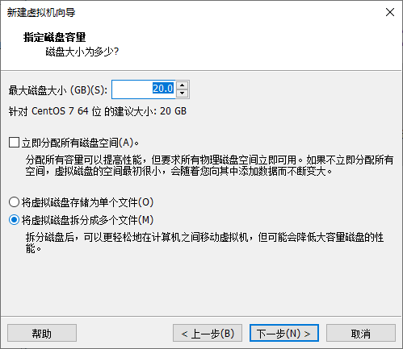
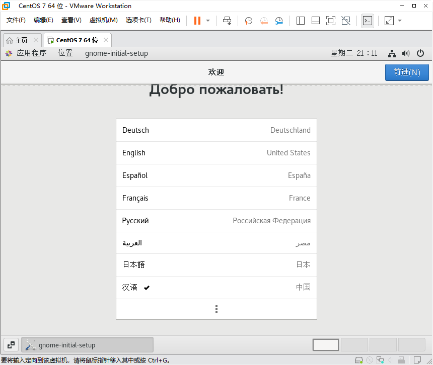

[TOC]

# 项目1：Linux基础环境配置

## 第一步：新建虚拟机

- 下载并安装vmware workstation（通过博通官网，注册账号后可以下载，对个人用户免费）[下载VMware17 视频教程](https://www.bilibili.com/video/BV1o7421o7Vt/?spm_id_from=333.788.recommend_more_video.1&vd_source=c7b66582e4bea8e9a772ca334df24fe5)
- vmware 三种网络模式详解       [VMware虚拟机三种网络模式](https://www.toutiao.com/article/7301587787995038245/)     [三种网络模式图解2](https://www.toutiao.com/article/7147892994501493285/?channel=&source=search_tab)
- 按照如下的步骤新建一个虚拟机：


如下图所示，选择自定义：


默认即可：


这里选择“稍后安装操作系统”：


这里选择“Linux”->“版本：Centos7 64位”


给虚拟机起个名称，在“位置”中选择一个目录存放虚拟机。


处理器的数量和内核数量可以随意调整：


根据实际物理机的内存大小，设置虚拟机内存的大小。为保证运行流畅，选择大于4G即可。


网络类型，这里有四种选择，默认是NAT，一般默认即可。如果想要了解详细的每种网络设置有什么区别，应用在什么场合，可以参考：  [三种网络模式图解2](https://www.toutiao.com/article/7147892994501493285/?channel=&source=search_tab)


I/O控制器的类型，按照默认的推荐即可。


这里选择磁盘的接口类型，需要注意的是，选择的磁盘接口类型不同，将来Linux识别硬盘的名称是不同的，比如IDE接口为hda，SCSI接口为sda等。这里默认选择SCSI接口即可。


有“创建新虚拟硬盘”、“使用现有虚拟硬盘”、“使用物理磁盘”三种选项。这里选择第一种即可。


设置虚拟磁盘的容量，默认是20G，将虚拟磁盘拆分成多个文件，便于移动虚拟机：



选择一个路径，用来放置虚拟磁盘，和上面的虚拟机放置在同一个目录即可。


这里就完成了整个虚拟机的配置。


进入如下的界面中，接下来就可以在这台虚拟机中安装你想要的Linux操作系统了。


## 第二步：安装Linux

下载喜欢的Linux发行版：

> 国内常用Linux开源镜像站：
>
> 清华大学开源镜像站　　
>
> https://mirrors.tuna.tsinghua.edu.cn/
>
> 网易开源镜像站
>
> http://mirrors.163.com/
>
> 阿里巴巴开源镜像站
>
> https://opsx.alibaba.com/mirror/

这里以下载centos7.9版本为例。地址：[centos-7.9.2009-isos-x86_64安装包下载_开源镜像站-阿里云 (aliyun.com)](https://mirrors.aliyun.com/centos/7.9.2009/isos/x86_64/?spm=a2c6h.25603864.0.0.1f64f5adCnsNRv)


下载这里的Centos-7-x86-Everything-2207-02.iso。保存至电脑的D:/temp/centos7目录内。

下面开始安装Linux。


点击上图中的“编辑虚拟机设置”，如下图所示，选择“硬件”选项卡中的光驱，然后在右边的“连接”中选择“使用ISO映像文件”，点击浏览，找到刚才下载的Linux发行版的D:/temp/centos7目录内Centos-7-x86-Everything-2207-02.iso光盘映像文件。


如下图，启动客户机。也就是打开虚拟机的电源。


系统会自动从光盘引导，开始安装程序，如下图所示，把鼠标点击进入虚拟机中，按键盘向上的箭头，选择第一项，然后回车。开始安装：


选择中文->简体中文


在如下的界面中，进行几个重要的安装配置：


点击上图的“软件选择”，可以选择想要安装什么样的软件，这里选择“带GUI的服务器”：


接下来，在下图中选择“安装位置”。


这里可以看到系统的虚拟磁盘sda，大小是20G，对其进行分区，有两种选择，可以自动分区，也可以手动分区，建议初学者选择“自动配置分区”：


接下来，如下图，选择“网络和主机名”：


这里选择打开网络，打开后，应该会看到如下所示的，系统会自动配置好网络的IP、掩码等各项参数，能够正常的连接网络了。注意这里新建的虚拟机使用的是NAT，在这种模式下，虚拟机可以和物理机进行正常的连网，如果物理机能够连接Internet，那么虚拟机也可以连接Internet。


网络设置完成后，在下图中可以看到有线已经连接的字样：


点击“开始安装”按钮。开始安装过程。


点击“ROOT密码”，给超级用户root设置密码。


点击“完成”，等待安装。


点击“创建用户”，可以设置普通用户账号。


点击“完成”，等待安装。


耐心等待安装过程，可能需要几分钟。


点击上图中“LICENSE INFORMATION”，接受许可协议即可：


完成后，如下所示：


系统自动重启，进入到如下的界面中。这里看到的是上面设置的普通用户，如果想要以其他的用户，比如root账号登录，选择下图中“未列出”即可：


这里以普通用户登录，初学者建议以普通用户登录Linux。


登录后，第一次需要进行一些简单的设置：



选中中文的拼音输入法：


设置隐私，位置服务：


这里选择“跳过”：


完成了所有的设置。


看到Centos7的界面：


## 第三步：远程登录Linux

首先需要保证虚拟机中的Linux的ssh服务正常启动，并且22端口出于监听状态。默认情况下，按照上述步骤安装完成后，sshd服务就是处于启动状态，22号端口也是处于可连接状态。

可以确认一下：


右键，点击打开终端，输入如下的命令：


那么接下来就可以通过22号端口远程登录这台Linux服务器了。在远程连接之前首先查看Linux的IP地址。


上图中的ens33就是Linux服务器的网络接口，其IP地址是192.168.204.128


这里通过物理机的Windows远程登录Linux服务器：

- 首先windows下载并安装MobaXterm   地址： [MobaXterm Xserver with SSH, telnet, RDP, VNC and X11 - Home Edition (mobatek.net)](https://mobaxterm.mobatek.net/download-home-edition.html)

下载解压后，不用安装即可使用。


这里选择“session”按钮，如下图所示，选择SSH，输入Linux的IP地址，用户名，点击“OK”。


如果是第一次连接，Linux会自动发送过来一个密钥，点击“Accept”即可。


在下图中，输入密码，提示：这里输入密码的时候，屏幕没有任何提示。只要输入正确，输入完成回车即可。


会弹出如下所示的界面：


上图中选择“No”就可以。这样就完成了登录Linux。


这里就登录到了Linux服务器。可以通过命令行管理Linux系统了。

## 第四步：关闭selinux

因为CentOS7系统，默认安装完成后，会自动开启Selinux策略，该安全策略较为复杂，初学者容易出错，所以建议初学者先关闭该安全策略。

关闭selinux的方法如下：

```shell
# 查看selinux的状态，这里可以看到默认情况下，selinux是处于enabled的状态，也就是开启的状态。
[root@bogon ~]# sestatus
SELinux status:                 enabled
SELinuxfs mount:                /sys/fs/selinux
SELinux root directory:         /etc/selinux
Loaded policy name:             targeted
Current mode:                   enforcing
Mode from config file:          enforcing
Policy MLS status:              enabled
Policy deny_unknown status:     allowed
Max kernel policy version:      31

```

- 第一种方法：

  使用基于命令行的编辑器vi、nano等，这里使用较为简单的nano编辑器

```shell
# 可以使用nano编辑器修改/etc/selinux/config文件
[root@bogon ~]# nano /etc/selinux/config
找到文件中的这一行  SELINUX=enforcing
修改为 SELINUX=disabled
然后保存即可。

```

- 第二中方法：

这里如果不喜欢使用命令行下的编辑器，也可以通过Mobaxterm远程修改Linux服务器上的文件。
步骤如下所示：在下图的左边的地址栏中输入/etc/selinux/，然后回车：


选中“config”文件，右键，选择“open with default text editor”.


这样就可以使用MobaXterm自动的编辑器，打开远程Linux服务器上的/etc/selinux/config文件，进行修改了。


> 修改方法：
>
> 找到文件中的这一行  SELINUX=enforcing
> 修改为 SELINUX=disabled
>
> 修改完成后，保存即可。
>

- 不管是使用哪种方式，修改完成后，重新启动Linux。


提示：重新启动后，需要重新远程连接Linux服务器。

至此，所有的基础环境准备工作已经完成。


[TOC]

