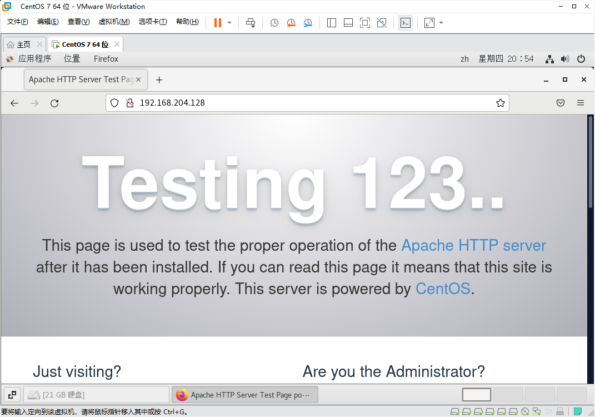
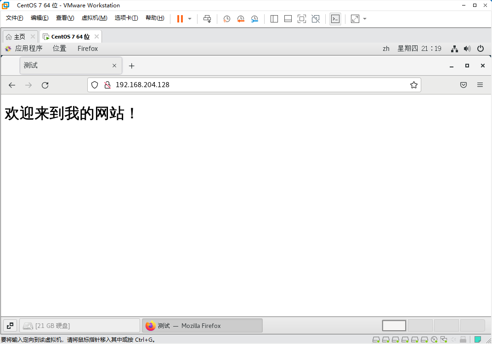
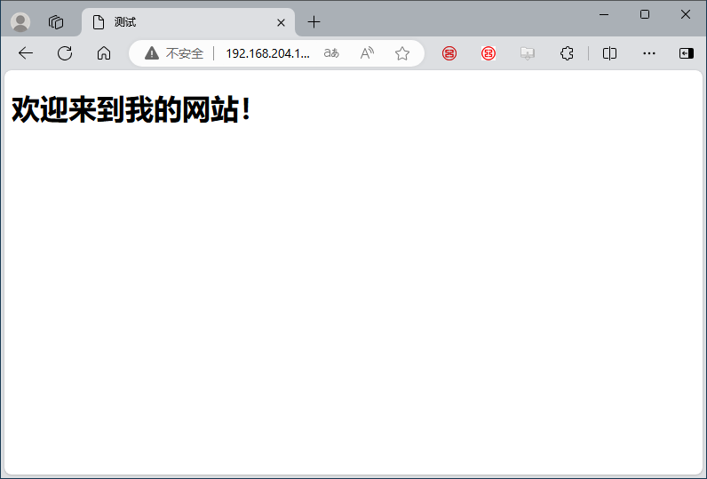
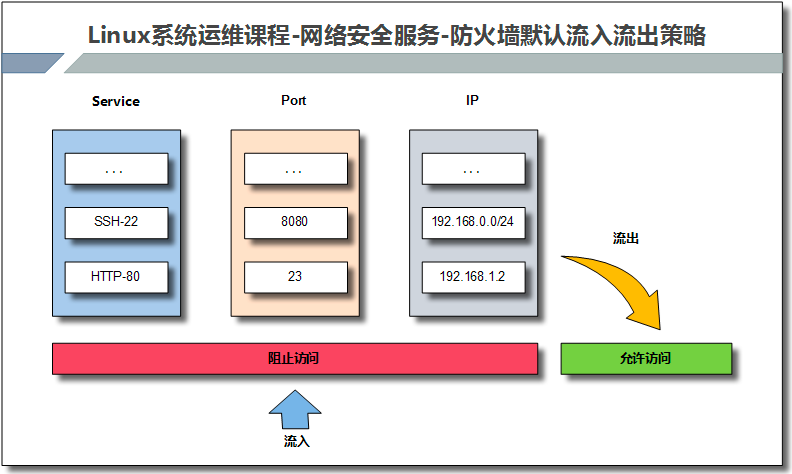
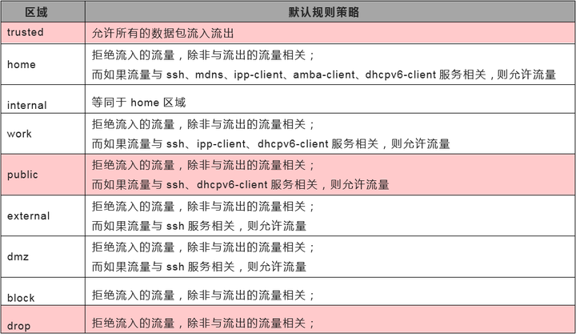
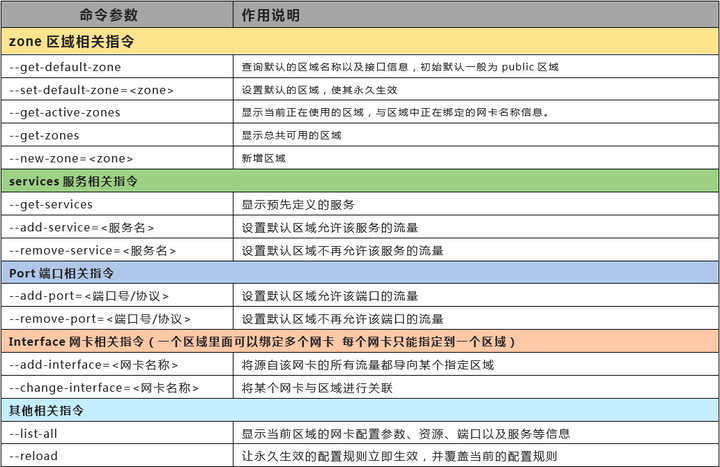
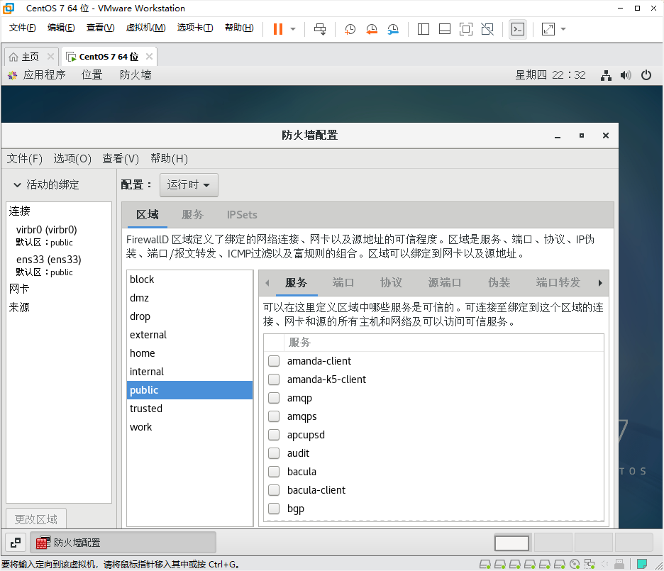

[TOC]


# 任务5：Linux服务器应用

要求：

- ==虚拟主机可选做==

## 一、Apache服务器

### 第1步：安装和测试服务器

```bash
# 安装apache
[root@localhost html]# yum install httpd

# 启动apache
[root@bogon ~]# systemctl start httpd.service

# 查看80端口是否启动
[root@bogon ~]# netstat -atulnp | grep :80
tcp6       0      0 :::80                   :::*                    LISTEN      19325/httpd

#查看Linux服务器的ip地址
[root@bogon ~]# ifconfig | head -n 2
ens33: flags=4163<UP,BROADCAST,RUNNING,MULTICAST>  mtu 1500
        inet 192.168.204.128  netmask 255.255.255.0  broadcast 192.168.204.255

```

在Linux系统里面打开firefox浏览器，输入地址 http://192.168.204.128，会出现如下页面，表明apache服务器运行正常。



### 第2步：如何发布一个网站

配置文件的详解：[第10章 使用Apache服务部署静态网站](https://www.linuxprobe.com/basic-learning-10.html)

```bash
#有关apache服务器需要了解的目录或者文件

# （1）/etc/httpd/conf/httpd.conf 主配置文件，里面有很多有关服务器配置的重要选项
# （2）/etc/httpd/conf.d/*.conf   该目录下的以conf结尾的文件，都会自动读入httpd.conf文件，为了便于管理和维护，如果我们修改配置文件的设置，可以在该目录中新建一个my.conf文件，把配置写入该文件。

# （3）/var/www/html 默认网站根目录，也就是说你的网页应该放置在该目录中。
```

这里在/var/www/html目录内新建一个index.html的网页。然后通过浏览器访问。http://192.168.204.128/index.html



按照这样的方法，你就可以发布自己的网站了。

### 第3步：防火墙开放80端口

经过上面的配置，你的网站此时只能Linux本机浏览器访问，如果想要其他计算机，比如Windows主机访问，还必须配置防火墙，放开80端口。

```bash
# 首先确认防火墙状态，如下所示，Linux防火墙默认是出于开启状态
[root@bogon ~]# systemctl status firewalld
● firewalld.service - firewalld - dynamic firewall daemon
   Loaded: loaded (/usr/lib/systemd/system/firewalld.service; enabled; vendor preset: enabled)
   Active: active (running) since 三 2024-05-29 21:05:39 CST; 24h ago
     Docs: man:firewalld(1)
 Main PID: 847 (firewalld)
    Tasks: 2
   CGroup: /system.slice/firewalld.service
           └─847 /usr/bin/python2 -Es /usr/sbin/firewalld --nofork --nopid

# 放开80端口 
[root@bogon ~]# firewall-cmd --add-port=80/tcp --permanent
success

# 重新加载防火墙
[root@bogon ~]# firewall-cmd --reload
success

# 确认一下防火墙放开的端口，
[root@bogon ~]# firewall-cmd --list-ports
9090/tcp 80/tcp
```

经过这些操作以后，就可以在Windows主机上，通过浏览器访问你的网站了。http://192.168.204.128/index.html




## 二、虚拟主机

虚拟主机：在一台实际的物理主机，可以创建多台http服务器。对于客户来讲，就好像感觉有多台Linux服务器存在一样。

虚拟主机的实现方式主要有三种：

- 基于域名的虚拟主机
- 基于IP的虚拟主机
- 基于端口的虚拟主机

下面以基于域名的虚拟主机为例，进行讲解。

> 这里在一台apache服务器，指定三个域名，分别对应三个目录，每个目录内有一个index.html的网页
>
> /var/www/html   linux.centos.vbird
> /var/www/html2  www.centos.vbird
> /var/www/html3  ftp.centos.vbird
> 这样就可以实现实现三台虚拟主机。

### 第0步：准备工作

```
# /var/www/hmtl 目录已经存在，不用新建
[root@localhost ~]# mkdir /var/www/hmtl2
[root@localhost ~]# mkdir /var/www/hmtl3

# 在这三个目录里面分别新建一个index.html的网页，三个网页内容不同。

```


### 第1步：Linux服务器端配置

```bash
# apache的默认的配置文件的目录在/etc/httpd/conf,大部分的配置都可以写入这个文件。
[root@localhost www]# ls /etc/httpd/conf
httpd.conf  
# 但是apache会自动读取/etc/httpd/conf.d/目录下的所有*.conf结尾的文件。所以可以在这里目录里面新建一个自定义的.conf文件。把添加的配置写入这个文件中。方便维护。


# 这里新建一个virtual-hosts.conf，把虚拟主机的配置都写入该文件。
[root@localhost www]# cd  /etc/httpd/conf.d
[root@localhost www]# touch  /etc/httpd/conf.d/virtual-hosts.conf

# 在virtual-hosts.conf文件中编辑如下内容
[root@localhost www]# nano /etc/httpd/conf.d/virtual-hosts.conf
# 在所有端口上监听80端口
NameVirtualHost *:80

 # 指定/var/www/html2目录的权限
<Directory "/var/www/html2">
    Options FollowSymLinks
    AllowOverride None
    Order allow,deny
    Allow from all
</Directory>
# 指定/var/www/html3目录的权限
<Directory "/var/www/html3">
    Options FollowSymLinks Indexes
    AllowOverride None
    Order allow,deny
    Allow from all
</Directory>

 # 指定三个虚拟主机的域名和目录的绑定关系
<VirtualHost *:80>
    ServerName    linux.centos.vbird
    DocumentRoot  /var/www/html
</VirtualHost>
<VirtualHost *:80>
    ServerName    www.centos.vbird
    DocumentRoot  /var/www/html2
</VirtualHost>
<VirtualHost *:80>
    ServerName    ftp.centos.vbird
    DocumentRoot  /var/www/html3
</VirtualHost>


#重新启动Apache服务器
[root@localhost www]# systemctl restart httpd.service
[root@localhost www]# systemctl status httpd.service
```

### 第2步：客户端访问

- 解决域名解析问题

在客户端的hosts文件中，修改域名解析对应关系。

把下面的内容放在客户端的hosts文件内并保存。

格式为：服务器IP linux.centos.vbird www.centos.vbird ftp.centos.vbird

```bash
# 例如客户端为Windows系统，那么就修改Windows系统的里面的hosts文件内容如下
192.168.204.128 linux.centos.vbird www.centos.vbird ftp.centos.vbird
```

- 客户端浏览器可以通过不同的域名访问Linux服务器不同目录下的网站。 

http://linux.centos.vbird/index.html

http://www.centos.vbird/index.html

http://ftp.centos.vbird/index.html

这样对于客户端来讲，就好像有三台http服务器。至此，就完成了虚拟主机的配置。

## 二、Firewalld防火墙应用

Centos7用的防火墙是Firewalld，如果想要在Linux中安全的使用各种端口和网络连接，必须了解防火墙的原理及使用方法。下面介绍一些常用的使用方法。

### （1）Firewalld防火墙原理

Firewalld是动态防火墙。如果开启Firewalld防火墙，默认情况会阻止流量流入，但允许流量流出。



### （2）区域管理

通过将网络划分成不同的区域，制定出不同区域之间的访问控制策略来控制不同程序区域间传送的数据流。例如，互联网是不可信任的区域，而内部网络是高度信任的区域。网络安全模型可以在安装，初次启动和首次建立网络连接时选择初始化。该模型描述了主机所连接的整个网络环境的可信级别，并定义了新连接的处理方式。有如下几种不同的初始化区域：

阻塞区域（block）：任何传入的网络数据包都将被阻止。

工作区域（work）：相信网络上的其他计算机，不会损害你的计算机。

家庭区域（home）：相信网络上的其他计算机，不会损害你的计算机。

公共区域（public）：不相信网络上的任何计算机，只有选择接受传入的网络连接。

隔离区域（DMZ）：隔离区域也称为非军事区域，内外网络之间增加的一层网络，起到缓冲作用。对于隔离区域，只有选择接受传入的网络连接。

信任区域（trusted）：所有的网络连接都可以接受。

丢弃区域（drop）：任何传入的网络连接都被拒绝。

内部区域（internal）：信任网络上的其他计算机，不会损害你的计算机。只有选择接受传入的网络连接。

外部区域（external）：不相信网络上的其他计算机，不会损害你的计算机。只有选择接受传入的网络连接。



- 9个区域

将网络划分为9个初始化区域，制定出不同区域之间的访问控制策略，从而控制不同程序之间传输的数据流。

```bash
# 查看防火墙的9个初始化区域
[root@localhost ~]# ls /usr/lib/firewalld/zones/
block.xml  drop.xml      home.xml      libvirt-routed.xml  nm-shared.xml  trusted.xml
dmz.xml    external.xml  internal.xml  libvirt.xml         public.xml     work.xml
```

###  （3）防火墙常用命令



```bash
#两种配置模式
#运行时模式：在系统或者防火墙重启，重载后，配置会失效。平时练习或测试使用。
#永久模式：重启或者重载防火墙时所读取的规则配置，是永久存储在配置文件中的。生产环境使用

# 查看防火墙的状态
[root@localhost ~]# systemctl status firewalld.service

[root@localhost ~]# firewall-cmd --state
running

[root@localhost ~]# systemctl start|stop|restart firewalld # 启动、停止、重启防火墙

[root@localhost ~]# systemctl enable|disable firewalld #是否开机自启动

#动态更新防火墙规则，无须重启
[root@localhost ~]# firewall-cmd --reload 

#将当前防火墙运行时所有配置写进规则配置文件中，使之永久生效
[root@localhost ~]# firewall-cmd --runtime-to-permanent 

#查看网络接口ens160对应的区域
[root@localhost ~]# firewall-cmd --get-active-zones
public
  interfaces: ens160
  
#查看区域所对应的网络接口
[root@localhost ~]# firewall-cmd --zone=public --list-all


#可以查看所有的防火墙区域
[root@localhost ~]# firewall-cmd --list-all-zones

#查看防火墙使用的默认区域
[root@localhost ~]# firewall-cmd --get-default-zone
public

#改变默认区域为home
[root@localhost ~]# firewall-cmd --set-default-zone=home
success
[root@localhost ~]# firewall-cmd --get-default-zone
home

# 改变默认区域为public
[root@localhost ~]# firewall-cmd --set-default-zone=public
success
[root@localhost ~]# firewall-cmd --get-default-zone
public
```

### （4）如何开放某个端口

下面以开放和禁止80号端口为例进行说明。

```bash
# 开放80端口
[root@localhost ~]# firewall-cmd --zone=public --add-port=80/tcp
success

# 确认一下是否开放
[root@localhost ~]# firewall-cmd --list-ports
80/tcp  #临时添加进来，重启后就会失效。

#该规则并没有被真正的写入区域文件中
[root@localhost ~]# cat /etc/firewalld/zones/public.xml
<?xml version="1.0" encoding="utf-8"?>
<zone>
  <short>Public</short>
  <description>For use in public areas. You do not trust the other computers on networks to not harm your computer. Only selected incoming connections are accepted.</description>
  <service name="ssh"/>
  <service name="dhcpv6-client"/>
  <service name="cockpit"/>
  <forward/>
</zone>

#如果想要真正的写入区域文件，需要使用如下命令
[root@localhost ~]# firewall-cmd --permanent --zone=public --add-port=80/tcp
success
[root@localhost ~]# cat /etc/firewalld/zones/public.xml
<?xml version="1.0" encoding="utf-8"?>
<zone>
  <short>Public</short>
  <description>For use in public areas. You do not trust the other computers on networks to not harm your computer. Only selected incoming connections are accepted.</description>
  <service name="ssh"/>
  <service name="dhcpv6-client"/>
  <service name="cockpit"/>
  <port port="80" protocol="tcp"/>  #这里80端口已经被写入配置文件中了。
  <forward/>
</zone>

#动态更新防火墙，使规则生效
[root@localhost ~]# firewall-cmd --reload
success

#删除规则，注意删除规则时也需要--permanent，同时还需要更新防火墙规则
[root@localhost ~]# firewall-cmd --permanent --zone=public --remove-port=80/tcp
success
[root@localhost ~]# firewall-cmd --reload
success
[root@localhost ~]# firewall-cmd --list-ports
```


###  （5）如何开放某种服务

```bash
#查看默认区域开放的服务
[root@localhost ~]# firewall-cmd --list-services
cockpit dhcpv6-client ssh

# 查看home区域开放的服务
[root@localhost ~]# firewall-cmd --zone=home --list-services
cockpit dhcpv6-client mdns samba-client ssh

#开放http服务
[root@localhost ~]# firewall-cmd --permanent --add-service=http --zone=public
success

#更新防火墙规则，永久生效
[root@localhost ~]# firewall-cmd --reload
success

#确认该服务是否开放
[root@localhost ~]# firewall-cmd --list-services
cockpit dhcpv6-client http ssh

#一次添加多个服务
[root@localhost ~]# firewall-cmd --permanent --add-service={telnet,mysql} --zone=public
success
[root@localhost ~]# firewall-cmd --reload
success

#删除该服务规则
[root@localhost ~]# firewall-cmd --permanent --remove-service={telnet,mysql} --zone=public
success
[root@localhost ~]# firewall-cmd --reload
success

[root@localhost ~]# firewall-cmd --list-services
cockpit dhcpv6-client ssh
```

### （6）使用图形化界面管理防火墙

Linux系统找到“应用程序”->"杂项"->"防火墙"，如下所示：



关于防火墙图形化管理可以参考：[第8章 使用Iptables与Firewalld防火墙 | 《Linux就该这么学》 (linuxprobe.com)](https://www.linuxprobe.com/basic-learning-08.html#832)


[TOC]

